## 클래스 다이어그램 명세서

본 명세서는 코딩 테스트 플랫폼 백엔드의 핵심 클래스와 클래스 간 관계를 정리한 문서이다. 기준은 현재 구현된 백엔드 코드이며, 채점 기능은 `Code Judge` 가 구현되었다고 가정한 설계 관점까지 포함한다.

## 1. 핵심 클래스 분류

본 시스템의 핵심 클래스는 다음과 같이 구분할 수 있다.

- 사용자 계층 : `Provider`, `User`, `Supervisor`
- 문제 계층 : `Problem`, `Testcase`, `Submission`, `Solution`, `UserProblem`
- 대회/시험 계층 : `Contest`, `ContestProblem`, `Exam`, `ExamProblem`
- 기관 계층 : `Organization`, `OrganizationProblem`
- 서비스 계층 : `ProblemService`, `SubmissionService`, `ContestFacade`, `ExamFacade`
- 채점 계층 : `JudgeService`, `CodeJudgeService`(가정), `JudgeResult`

## 2. 클래스별 명세

### 2.1 Provider

- 역할 : 소셜 로그인 제공자 정보를 관리하는 클래스
- 주요 속성 : `providerId`, `provider`
- 관계 : `User`, `Supervisor` 와 연관된다.
- 설명 : 로그인 주체가 어떤 외부 제공자를 통해 생성되었는지 식별하는 기준 클래스이다.

### 2.2 User

- 역할 : 플랫폼의 일반 사용자를 표현하는 클래스
- 주요 속성 : `userId`, `provider`, `userName`, `userInfo`, `userPoint`, `userRank`
- 주요 연산 : `update()`, `addPoint()`
- 관계 : `Provider` 와 다대일 관계, `Submission`, `Solution`, `UserProblem`, `UserContest`, `UserExam` 과 연관된다.
- 설명 : 문제 풀이, 대회 참가, 시험 응시의 주체가 되는 핵심 사용자 클래스이다.

### 2.3 Supervisor

- 역할 : 대회와 시험의 감독자를 표현하는 클래스
- 주요 속성 : `supervisorId`, `provider`, `supervisorName`
- 관계 : `Provider` 와 다대일 관계, `ContestSupervisor`, `ExamSupervisor` 와 연관된다.
- 설명 : 운영과 관리 책임을 가지는 사용자 유형이다.

### 2.4 Problem

- 역할 : 문제 정보를 저장하는 핵심 클래스
- 주요 속성 : `problemId`, `problemTitle`, `problemContent`, `problemGrade`, `problemPoint`, `problemLanguage`
- 주요 연산 : `update()`
- 관계 : `Submission`, `Solution`, `Testcase`, `UserProblem`, `ContestProblem`, `ExamProblem`, `OrganizationProblem` 과 연관된다.
- 설명 : 문제 도메인의 중심 클래스이며, 여러 하위 기록 클래스가 이 클래스를 참조한다.

### 2.5 Testcase

- 역할 : 문제별 입출력 테스트케이스를 저장하는 클래스
- 주요 속성 : `testcaseId`, `problem`, `inputData`, `outputData`
- 주요 연산 : `update()`
- 관계 : `Problem` 과 다대일 관계
- 설명 : 채점 시 비교 기준이 되는 테스트 입력과 정답 출력을 저장한다.

### 2.6 Submission

- 역할 : 사용자의 코드 제출 기록을 저장하는 클래스
- 주요 속성 : `submissionId`, `user`, `problem`, `submissionLanguage`, `submittedCode`, `submissionStatus`, `submissionScore`, `submittedAt`
- 관계 : `User`, `Problem` 과 다대일 관계
- 설명 : 제출 자체의 기록이며, 채점 결과와 실제 제출 코드까지 함께 저장한다.

### 2.7 Solution

- 역할 : 문제 풀이 설명을 저장하는 클래스
- 주요 속성 : `solutionId`, `problem`, `user`, `solutionTitle`, `solutionContent`
- 주요 연산 : `update()`
- 관계 : `Problem`, `User` 와 다대일 관계
- 설명 : 사용자가 문제에 대해 작성한 해설 또는 해결책을 표현한다.

### 2.8 UserProblem

- 역할 : 특정 사용자와 특정 문제 사이의 풀이 상태를 저장하는 클래스
- 주요 속성 : `userProblemId`, `user`, `problem`, `userProblemStatus`, `solvedAt`
- 주요 연산 : `updateStatus()`
- 관계 : `User`, `Problem` 과 다대일 관계
- 설명 : 제출 이력 전체와 별개로, 사용자가 해당 문제를 해결했는지 여부를 요약해서 관리한다.

### 2.9 Contest

- 역할 : 대회 자체를 표현하는 클래스
- 주요 속성 : `contestId`, `contestTitle`, `contestDescription`, `startTime`, `endTime`
- 주요 연산 : `update()`
- 관계 : `ContestProblem`, `UserContest`, `ContestSupervisor`, `OrganizationContest` 와 연관된다.
- 설명 : 대회 메타데이터를 관리하는 중심 클래스이다.

### 2.10 ContestProblem

- 역할 : 대회와 문제의 연결 및 대회 내 문제 설정을 관리하는 클래스
- 주요 속성 : `contestProblemId`, `contest`, `problem`, `problemOrder`, `contestProblemScore`
- 관계 : `Contest`, `Problem` 과 다대일 관계
- 설명 : 대회에 어떤 문제가 어떤 순서와 배점으로 들어가는지 표현한다.

### 2.11 Exam

- 역할 : 시험 자체를 표현하는 클래스
- 주요 속성 : `examId`, `examTitle`, `examDescription`, `examType`, `startTime`, `endTime`
- 주요 연산 : `update()`
- 관계 : `ExamProblem`, `UserExam`, `ExamSupervisor`, `OrganizationExam` 과 연관된다.
- 설명 : 시험 메타데이터를 관리하는 중심 클래스이다.

### 2.12 ExamProblem

- 역할 : 시험과 문제의 연결 및 시험 내 문제 설정을 관리하는 클래스
- 주요 속성 : `examProblemId`, `exam`, `problem`, `problemOrder`, `examProblemScore`
- 관계 : `Exam`, `Problem` 과 다대일 관계
- 설명 : 시험 문제의 순서와 배점을 정의한다.

### 2.13 Organization

- 역할 : 문제, 대회, 시험을 소유하거나 개설하는 기관을 표현하는 클래스
- 주요 속성 : `organizationId`, `organizationName`, `organizationDescription`
- 주요 연산 : `update()`
- 관계 : `OrganizationProblem`, `OrganizationContest`, `OrganizationExam` 과 연관된다.
- 설명 : 운영 주체를 표현하는 클래스이며, 리소스 소유 관계의 기준이 된다.

### 2.14 OrganizationProblem

- 역할 : 기관과 문제의 소유 관계를 표현하는 연결 클래스
- 주요 속성 : `organizationProblemId`, `organization`, `problem`
- 관계 : `Organization`, `Problem` 과 다대일 관계
- 설명 : 특정 문제가 어떤 기관 소속인지 식별하기 위한 매핑 클래스이다.

### 2.15 ProblemService

- 역할 : 문제 생성, 조회, 수정, 삭제 및 카테고리 연결을 처리하는 서비스 클래스
- 주요 연산 : `create()`, `findAll()`, `findById()`, `update()`, `delete()`, `addCategory()`, `getById()`
- 관계 : `ProblemRepository`, `ProblemCategoryRepository`, `CategoryService` 에 의존한다.
- 설명 : 문제 도메인의 핵심 비즈니스 로직을 담당한다.

### 2.16 SubmissionService

- 역할 : 코드 제출과 채점, 제출 기록 저장, 사용자-문제 상태 갱신을 처리하는 서비스 클래스
- 주요 연산 : `create()`, `findById()`, `findByUserId()`, `findByProblemId()`, `updateUserProblem()`
- 관계 : `SubmissionRepository`, `UserProblemRepository`, `UserService`, `ProblemService`, `JudgeService` 에 의존한다.
- 설명 : 제출 도메인의 중심 서비스이며, 채점 전략과 사용자 풀이 상태 갱신을 연결하는 핵심 클래스이다.

### 2.17 ContestFacade

- 역할 : 대회 참가와 참가자 조회 등 복합 흐름을 조합하는 퍼사드 클래스
- 주요 연산 : `joinContest()`, `getParticipants()`, `getParticipantResult()`
- 관계 : `ContestService`, `UserService`, `UserContestRepository` 에 의존한다.
- 설명 : 여러 하위 서비스와 리포지토리를 묶어 대회 관련 복합 유스케이스를 단일 진입점으로 제공한다.

### 2.18 ExamFacade

- 역할 : 시험 응시와 결과 조회 흐름을 조합하는 퍼사드 클래스
- 주요 연산 : `takeExam()`, `getResults()`
- 관계 : `ExamService`, `UserService`, `UserExamRepository` 에 의존한다.
- 설명 : 시험 관련 복합 흐름을 단일 진입점으로 제공한다.

### 2.19 JudgeService

- 역할 : 채점 기능의 공통 인터페이스
- 주요 연산 : `judge(problemId, language, sourceCode)`
- 관계 : `SubmissionService` 가 이 인터페이스에 의존한다.
- 설명 : 채점 구현을 추상화하여, 실제 채점 방식이 달라져도 서비스 로직이 변경되지 않도록 한다.

### 2.20 CodeJudgeService (Phase 2 구현)

- 역할 : 제출 코드를 앱 컨테이너 내부에서 실행(`ProcessBuilder`)하고 테스트케이스와 비교해 채점하는 클래스
- 주요 연산 : `judge(problemId, language, sourceCode)`
- 관계 : `JudgeService` 를 구현하는 구체 클래스. `TestcaseRepository`, `LanguageRunner`(PythonRunner/JavaRunner)에 의존한다.
- 설명 : `judge.mode=code`일 때 활성. 테스트케이스 실행, 결과 비교, 점수 산출(AC/100 또는 첫 실패 status/0)을 담당한다.

### 2.21 JudgeResult

- 역할 : 채점 결과를 전달하는 값 객체
- 주요 속성 : `status`, `score`
- 관계 : `JudgeService` 의 반환 객체로 사용된다.
- 설명 : 채점 성공/실패 상태와 점수를 캡슐화한다.

## 3. 클래스 간 주요 관계

### 3.1 사용자와 문제 풀이 관계

- `User` 1 --- N `Submission`
- `Problem` 1 --- N `Submission`
- `User` 1 --- N `Solution`
- `Problem` 1 --- N `Solution`
- `User` 1 --- N `UserProblem`
- `Problem` 1 --- N `UserProblem`

즉, 사용자는 여러 문제에 대해 제출과 풀이를 남길 수 있으며, 문제는 여러 사용자와의 풀이 상태를 가진다.

### 3.2 문제와 테스트케이스 관계

- `Problem` 1 --- N `Testcase`

하나의 문제는 여러 개의 테스트케이스를 가질 수 있으며, 채점 시 이 정보가 사용된다.

### 3.3 대회/시험과 문제 관계

- `Contest` 1 --- N `ContestProblem`
- `Problem` 1 --- N `ContestProblem`
- `Exam` 1 --- N `ExamProblem`
- `Problem` 1 --- N `ExamProblem`

즉, 대회와 시험은 연결 클래스를 통해 문제를 포함하며, 순서와 배점 정보도 함께 관리한다.

### 3.4 기관 소유 관계

- `Organization` 1 --- N `OrganizationProblem`
- `Problem` 1 --- N `OrganizationProblem`

같은 방식으로 대회와 시험도 기관과 연결될 수 있으며, 기관은 운영 리소스의 소유 주체로 기능한다.

### 3.5 채점 서비스 관계

- `SubmissionService` --- `JudgeService`
- `JudgeService` <|.. `CodeJudgeService`
- `JudgeService` <|.. `FakeJudgeService`

즉, 제출 서비스는 채점 구현체가 아니라 채점 인터페이스에 의존하고, 실제 운영 시에는 `CodeJudgeService` 가 연결되는 구조로 본다.

## 4. 정리

이 백엔드의 클래스 구조는 문제 풀이 플랫폼의 핵심 도메인인 사용자, 문제, 제출, 대회, 시험, 기관을 중심으로 구성되어 있다. 특히 제출 도메인은 `Submission`, `UserProblem`, `JudgeService`, `JudgeResult` 를 통해 채점 흐름과 상태 갱신 흐름을 분리하여 표현하고 있다.

클래스 다이어그램 관점에서 가장 중요한 특징은 다음과 같다.

- 핵심 엔티티가 연결 클래스들을 통해 다대다 관계를 해소하고 있음
- 서비스 계층과 엔티티 계층의 책임이 분리되어 있음
- 채점 기능은 인터페이스와 구현체로 분리되어 확장 가능성을 확보하고 있음
- 대회와 시험은 각각 문제 연결 클래스와 참가/응시 기록 클래스를 통해 독립적인 도메인으로 관리됨

## 5. 클래스 다이어그램 (Mermaid)

아래 다이어그램은 보고서용으로 핵심 클래스와 주요 관계만 단순화하여 표현한 것이다.

```mermaid
classDiagram

class Provider {
  +Long providerId
  +String provider
}

class User {
  +Long userId
  +String userName
  +String userInfo
  +int userPoint
  +Rank userRank
  +update()
  +addPoint()
}

class Supervisor {
  +Long supervisorId
  +String supervisorName
}

class Problem {
  +Long problemId
  +String problemTitle
  +String problemContent
  +Rank problemGrade
  +int problemPoint
  +Language problemLanguage
  +update()
}

class Testcase {
  +Long testcaseId
  +String inputData
  +String outputData
  +update()
}

class Submission {
  +Long submissionId
  +Language submissionLanguage
  +String submittedCode
  +SubmissionStatus submissionStatus
  +int submissionScore
  +LocalDateTime submittedAt
}

class Solution {
  +Long solutionId
  +String solutionTitle
  +String solutionContent
  +update()
}

class UserProblem {
  +Long userProblemId
  +SubmissionStatus userProblemStatus
  +LocalDateTime solvedAt
  +updateStatus()
}

class Contest {
  +Long contestId
  +String contestTitle
  +String contestDescription
  +LocalDateTime startTime
  +LocalDateTime endTime
  +update()
}

class ContestProblem {
  +Long contestProblemId
  +int problemOrder
  +int contestProblemScore
}

class Exam {
  +Long examId
  +String examTitle
  +String examDescription
  +ExamType examType
  +LocalDateTime startTime
  +LocalDateTime endTime
  +update()
}

class ExamProblem {
  +Long examProblemId
  +int problemOrder
  +int examProblemScore
}

class Organization {
  +Long organizationId
  +String organizationName
  +String organizationDescription
  +update()
}

class OrganizationProblem {
  +Long organizationProblemId
}

class SubmissionService {
  +create()
  +findById()
  +findByUserId()
  +findByProblemId()
}

class ProblemService {
  +create()
  +findAll()
  +findById()
  +update()
  +delete()
  +addCategory()
}

class ContestFacade {
  +joinContest()
  +getParticipants()
  +getParticipantResult()
}

class ExamFacade {
  +takeExam()
  +getResults()
}

class JudgeService {
  <<interface>>
  +judge(problemId, language, sourceCode)
}

class FakeJudgeService {
  +judge(problemId, language, sourceCode)
}

class CodeJudgeService {
  +judge(problemId, language, sourceCode)
}

class JudgeResult {
  +SubmissionStatus status
  +int score
}

Provider "1" <-- "0..*" User : provider
Provider "1" <-- "0..*" Supervisor : provider
User "1" <-- "0..*" Submission : user
Problem "1" <-- "0..*" Submission : problem
User "1" <-- "0..*" Solution : user
Problem "1" <-- "0..*" Solution : problem
User "1" <-- "0..*" UserProblem : user
Problem "1" <-- "0..*" UserProblem : problem
Problem "1" <-- "0..*" Testcase : testcase
Contest "1" <-- "0..*" ContestProblem : contest
Problem "1" <-- "0..*" ContestProblem : problem
Exam "1" <-- "0..*" ExamProblem : exam
Problem "1" <-- "0..*" ExamProblem : problem
Organization "1" <-- "0..*" OrganizationProblem : organization
Problem "1" <-- "0..*" OrganizationProblem : problem

SubmissionService ..> User
SubmissionService ..> Problem
SubmissionService ..> JudgeService
SubmissionService ..> JudgeResult
ProblemService ..> Problem
ContestFacade ..> Contest
ContestFacade ..> User
ExamFacade ..> Exam
ExamFacade ..> User

JudgeService <|.. FakeJudgeService
JudgeService <|.. CodeJudgeService
```

