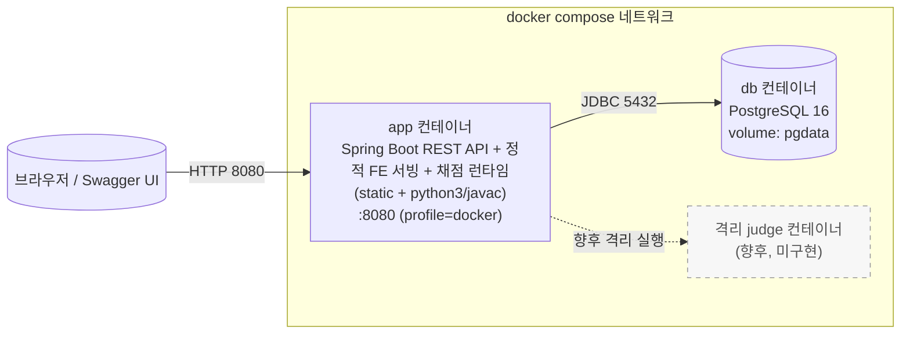
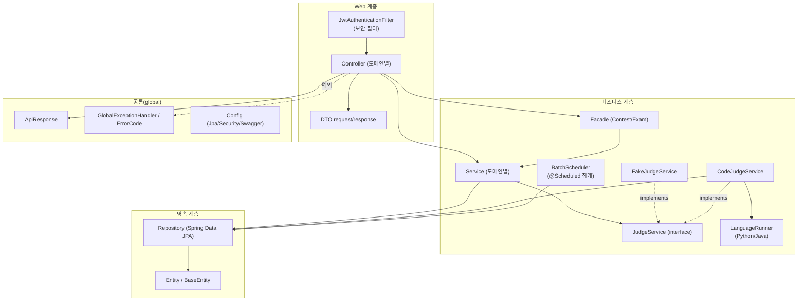
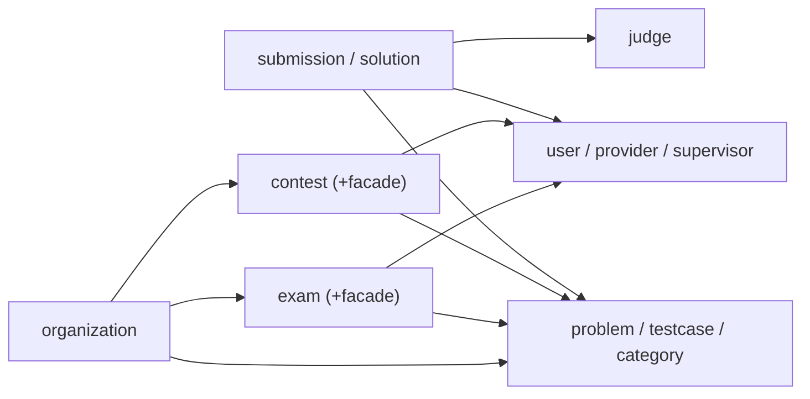

## 컴포넌트 다이어그램 명세서

본 명세서는 코딩 테스트 플랫폼을 컴포넌트 관점에서 정리한 문서이다. 배포 컴포넌트(컨테이너), 애플리케이션 내부 모듈, 도메인 간 의존을 나눠 표현한다. 기준은 현재 구현 코드와 Phase 1(컨테이너화) 결과이며, 향후 컴포넌트(채점기)는 점선/주석으로 구분한다.

## 1. 배포 컴포넌트 (Docker Compose)

- `app` : 멀티스테이지 `Dockerfile`(JDK21 빌드 → JDK21+python3 실행)로 생성. `judge.mode=code`면 **앱 내부에서** 제출 코드를 실행해 채점한다.
- `db` : healthcheck(`pg_isready`) 통과 후 `app` 기동, 데이터는 named volume 영속
- `격리 judge` : 앱 내부 실행의 격리 약점을 보완할 **향후** 분리 컴포넌트(제출별 컨테이너/별도 서비스)

## 2. 애플리케이션 내부 모듈 (계층)

- 컨트롤러는 서비스/퍼사드에만 의존하고, 응답은 `ApiResponse<T>`로 통일한다.
- 퍼사드는 복합 흐름(대회 참가, 시험 응시)을 조합한다.
- 서비스는 리포지토리와 (제출의 경우) `JudgeService` 인터페이스에 의존한다.

## 3. 도메인 컴포넌트 의존

문제(`problem`)가 제출·대회·시험·기관의 공통 참조 대상이며, 채점(`judge`)은 제출에서만 사용된다. 상세 클래스 관계는 [Class Diagram.md](Class%20Diagram.md) 참조.
