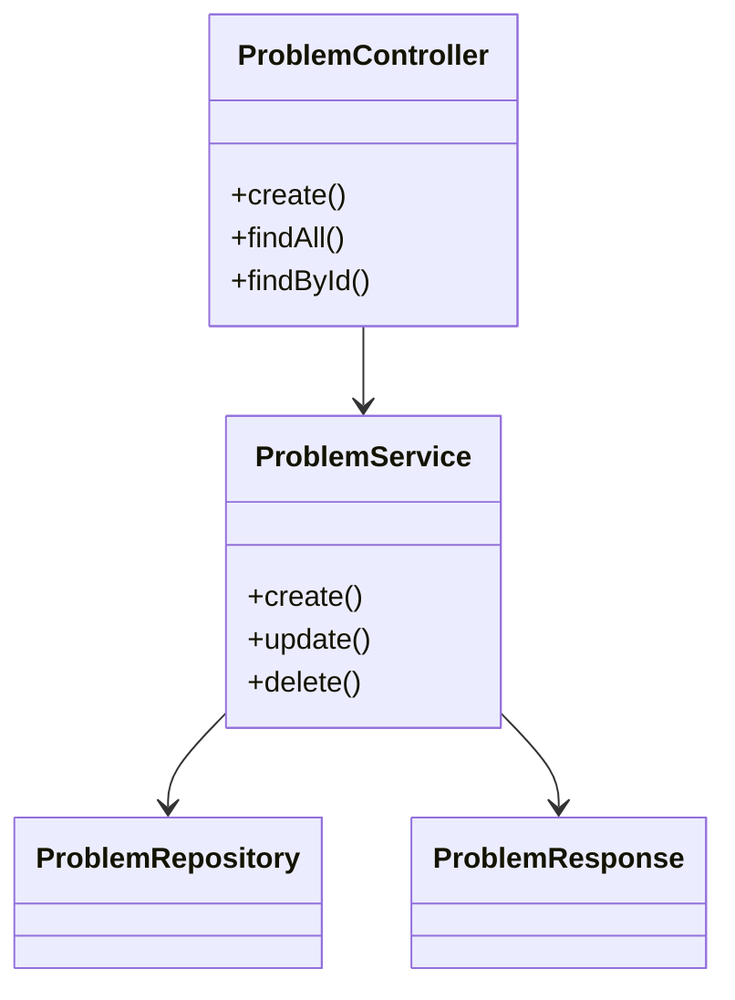
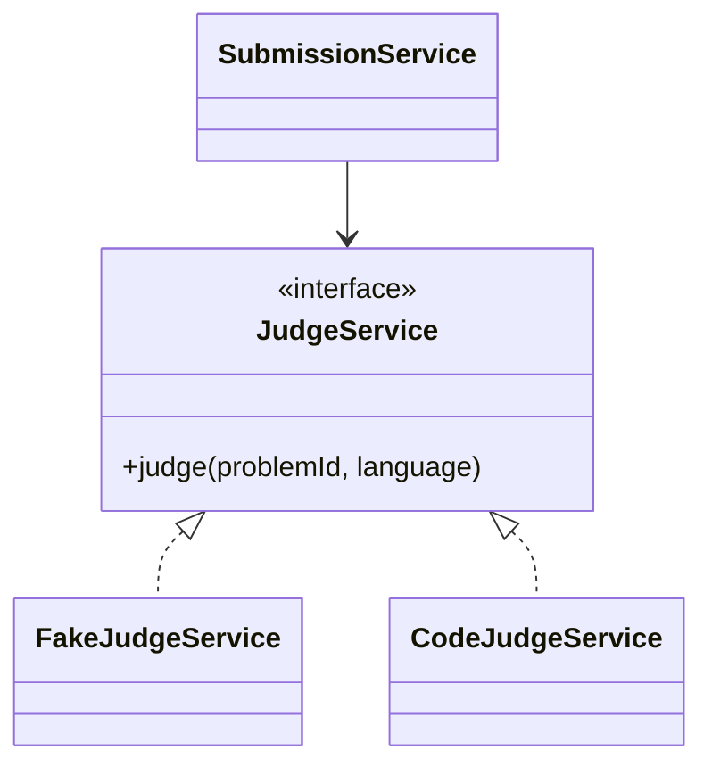
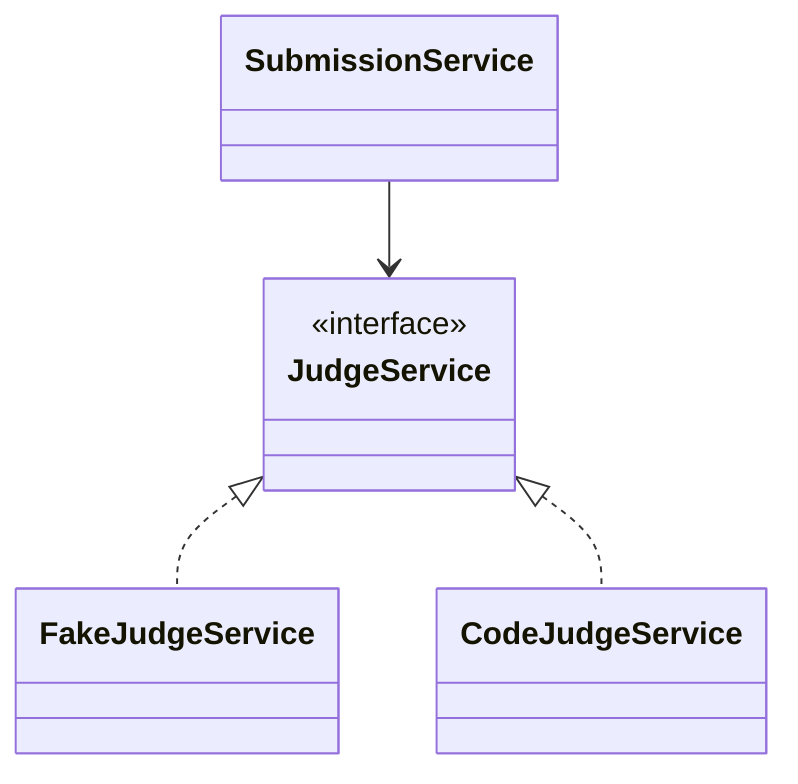
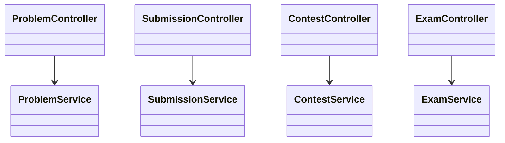
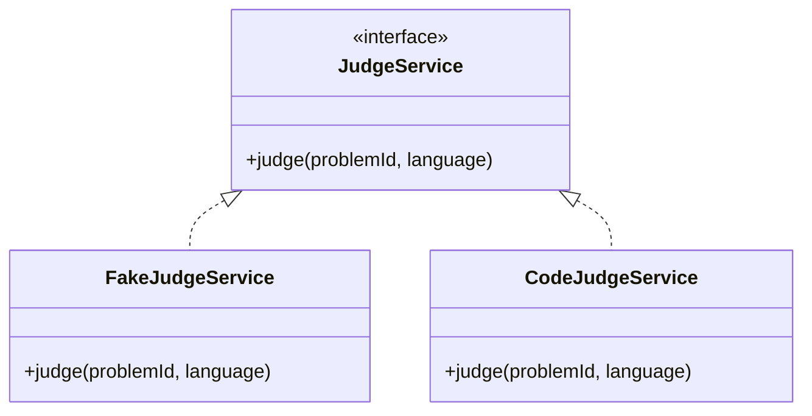
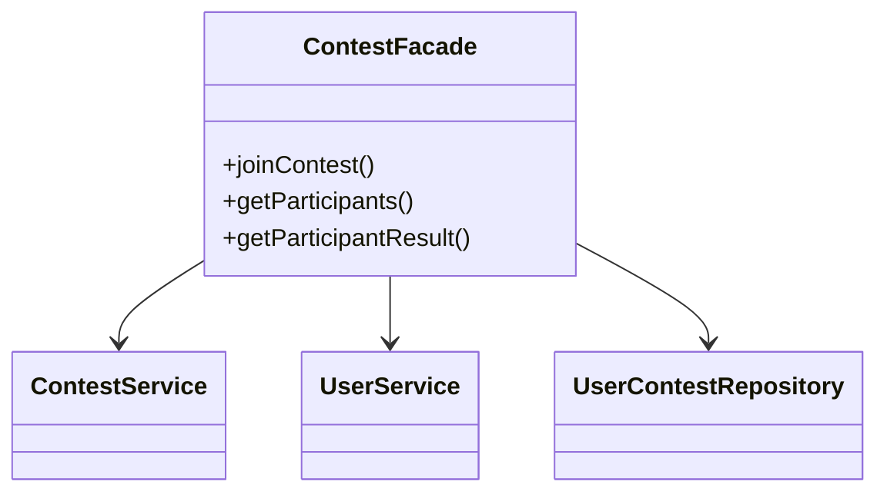
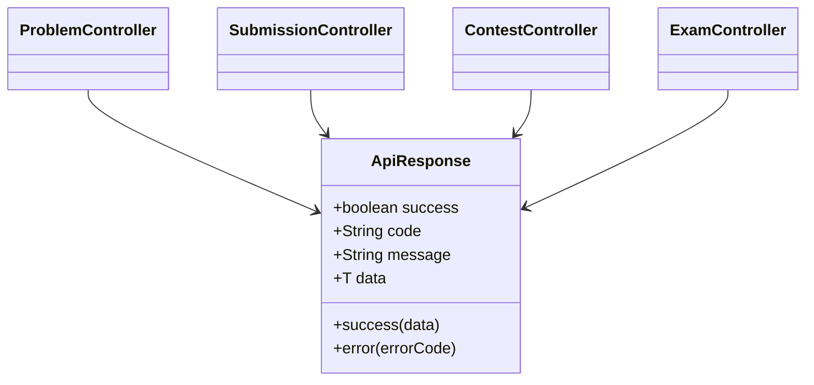
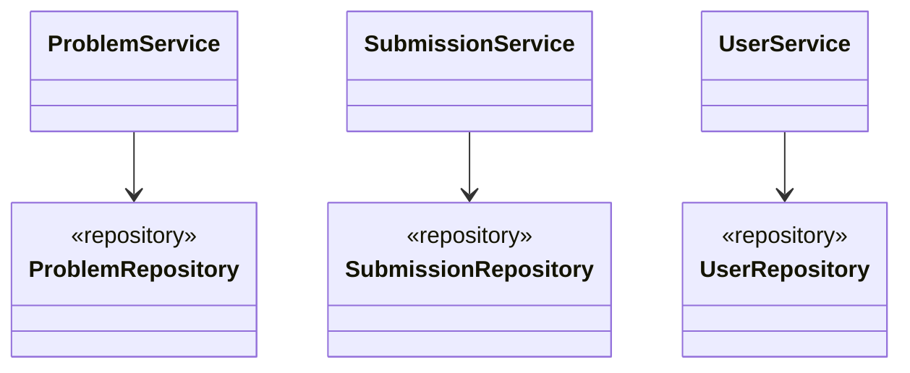
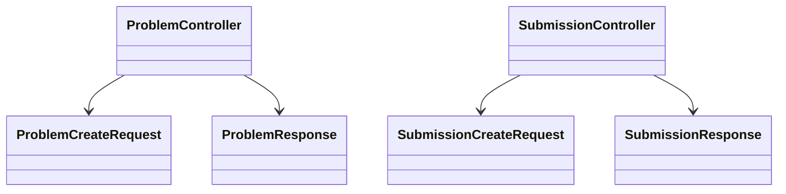

## SOLID와 디자인 패턴 적용 정리

본 문서는 Spring Boot 백엔드에서 SOLID 원칙과 디자인 패턴이 어떤 식으로 적용되었는지 정리한 문서이다. 각 항목은 원칙/패턴별로 나누고, 실제 코드 구조를 간단한 예시 코드 또는 Mermaid 그림으로 함께 제시한다.

## 1. SRP (단일 책임 원칙)

이 프로젝트는 도메인별, 계층별 책임 분리를 기본 구조로 사용한다.

- `Controller` : 요청/응답 처리
- `Service` : 비즈니스 로직 처리
- `Repository` : 데이터 접근
- `DTO` : 요청/응답 데이터 전달
- `Entity` : 도메인 상태 표현

예를 들어 `ProblemController` 는 HTTP 요청을 받고 `ProblemService` 를 호출하는 역할만 수행한다. 실제 문제 생성, 수정, 조회 로직은 `ProblemService` 가 담당한다.

### SRP 예시 코드

```java
@RestController
@RequestMapping("/api/problems")
@RequiredArgsConstructor
public class ProblemController {

    private final ProblemService problemService;

    @PostMapping
    public ResponseEntity<ApiResponse<ProblemResponse>> create(@RequestBody ProblemCreateRequest request) {
        return ResponseEntity.ok(ApiResponse.success(problemService.create(request)));
    }
}
```

### SRP 구조 예시



## 2. OCP (개방-폐쇄 원칙)

채점 기능은 `JudgeService` 인터페이스를 기준으로 설계되어 있다. 현재는 `FakeJudgeService` 가 구현체로 연결되어 있지만, 나중에 실제 `CodeJudgeService` 를 추가해도 `SubmissionService` 의 호출 구조는 유지할 수 있다.

즉, 확장은 구현체 추가로 하고, 기존 서비스 로직은 수정하지 않는 구조이다.

### OCP 예시 코드

```java
public interface JudgeService {
    JudgeResult judge(Long problemId, Language language);
}

@Service
public class FakeJudgeService implements JudgeService {
    @Override
    public JudgeResult judge(Long problemId, Language language) {
        return JudgeResult.builder()
                .status(SubmissionStatus.AC)
                .score(100)
                .build();
    }
}
```

### OCP 구조 예시



## 3. DIP (의존 역전 원칙)

`SubmissionService` 는 구체 구현체가 아니라 `JudgeService` 인터페이스에 의존한다. 따라서 상위 비즈니스 로직이 하위 수준 구현에 직접 묶이지 않는다.

이 구조는 실제 채점기를 교체하더라도 `SubmissionService` 의 핵심 로직을 유지할 수 있게 만든다.

### DIP 예시 코드

```java
@Service
@RequiredArgsConstructor
public class SubmissionService {

    private final SubmissionRepository submissionRepository;
    private final UserProblemRepository userProblemRepository;
    private final UserService userService;
    private final ProblemService problemService;
    private final JudgeService judgeService;
}
```

### DIP 구조 예시



## 4. ISP (인터페이스 분리 원칙)

프로젝트는 거대한 하나의 서비스 대신 도메인별 서비스로 기능을 분리하고 있다.

- `ProblemService`
- `SubmissionService`
- `ContestService`
- `ExamService`
- `OrganizationService`
- `UserService`

이 구조는 각 클라이언트가 자신이 필요한 기능에만 의존하도록 하며, 하나의 과도하게 큰 인터페이스나 서비스에 묶이지 않게 만든다.

### ISP 구조 예시



## 5. LSP (리스코프 치환 원칙)

`JudgeService` 구현체는 모두 동일한 계약을 따르는 것으로 가정된다. 현재는 `FakeJudgeService` 가 있고, 향후 `CodeJudgeService` 가 추가되더라도 호출부는 구현체를 구분하지 않고 사용할 수 있어야 한다.

즉, 인터페이스를 사용하는 쪽에서 구현체 교체가 가능하다는 점에서 LSP를 설명할 수 있다.

### LSP 구조 예시



## 6. Strategy Pattern

채점 기능은 대표적인 Strategy Pattern 구조로 볼 수 있다.

- 공통 전략 인터페이스 : `JudgeService`
- 현재 전략 구현체 : `FakeJudgeService`
- 향후 전략 구현체 : `CodeJudgeService`
- 전략 사용 클래스 : `SubmissionService`

### Strategy 구조 예시


## 7. Facade Pattern

`ContestFacade` 와 `ExamFacade` 는 여러 서비스와 리포지토리를 조합하여 하나의 복합 흐름을 제공한다.

예를 들어 `ContestFacade` 는 다음 과정을 하나의 진입점으로 묶는다.

- 대회 조회
- 사용자 조회
- 중복 참가 검사
- 참가 정보 저장

### Facade 예시 코드

```java
@Service
@RequiredArgsConstructor
public class ContestFacade {

    private final ContestService contestService;
    private final UserService userService;
    private final UserContestRepository userContestRepository;

    @Transactional
    public UserContestResponse joinContest(Long contestId, ContestJoinRequest request) {
        Contest contest = contestService.getById(contestId);
        User user = userService.getById(request.getUserId());
        if (userContestRepository.existsByContestAndUser(contest, user)) {
            throw new BusinessException(ErrorCode.DUPLICATE_PARTICIPATION);
        }
        UserContest userContest = UserContest.builder()
                .contest(contest)
                .user(user)
                .joinedAt(LocalDateTime.now())
                .build();
        return UserContestResponse.from(userContestRepository.save(userContest));
    }
}
```

### Facade 구조 예시



## 8. 공통 응답 템플릿 구조

`ApiResponse<T>` 는 모든 컨트롤러 응답을 같은 형식으로 감싸는 공통 응답 구조이다. 엄밀한 GoF 패턴으로 단정하기보다는, 응답 포맷을 공통 템플릿처럼 통일한 구조로 정리할 수 있다.

### 응답 구조 예시 코드

```java
@Getter
@Builder
public class ApiResponse<T> {
    private boolean success;
    private String code;
    private String message;
    private T data;

    public static <T> ApiResponse<T> success(T data) {
        return ApiResponse.<T>builder()
                .success(true)
                .code("SUCCESS")
                .message("요청 성공")
                .data(data)
                .build();
    }
}
```

### 응답 구조 예시



## 9. Repository Pattern

Repository Pattern 은 데이터 접근 로직을 비즈니스 로직에서 분리하는 데 사용된다. 이 프로젝트에서는 Spring Data JPA 기반의 리포지토리 인터페이스들이 그 역할을 담당한다.

예를 들어 `ProblemRepository`, `SubmissionRepository`, `UserRepository`, `ContestRepository` 등이 각각 도메인별 데이터 접근을 전담한다.

### Repository 구조 예시



## 10. Builder Pattern

Builder Pattern 은 엔티티와 DTO 생성 시 객체 생성 가독성을 높이고, 필드 수가 많은 객체를 안전하게 만들기 위해 사용된다.

이 프로젝트에서는 `Submission`, `UserContest`, `JudgeResult`, `ApiResponse` 등에서 `@Builder` 를 사용하고 있다.

### Builder 예시 코드

```java
Submission submission = Submission.builder()
        .user(user)
        .problem(problem)
        .submissionLanguage(request.getSubmissionLanguage())
        .submittedCode(request.getSubmittedCode())
        .submissionStatus(result.getStatus())
        .submissionScore(result.getScore())
        .submittedAt(LocalDateTime.now())
        .build();
```

## 11. DTO Pattern

DTO Pattern 은 엔티티를 API 계층에 직접 노출하지 않고, 요청과 응답을 별도 객체로 분리하는 구조이다.

이 프로젝트는 각 도메인마다 `dto/request`, `dto/response` 구조를 분리하고 있다.

- 요청 DTO : `ProblemCreateRequest`, `SubmissionCreateRequest`, `ContestJoinRequest`
- 응답 DTO : `ProblemResponse`, `SubmissionResponse`, `UserContestResponse`

이 방식은 API 계층과 엔티티 계층의 결합도를 낮추고, 응답 구조를 명확하게 통제할 수 있게 한다.

### DTO 구조 예시



## 12. Dependency Injection

Dependency Injection 은 객체 생성 책임과 객체 사용 책임을 분리하는 구조이다. Spring Boot 에서는 생성자 주입 방식으로 가장 명확하게 드러난다.

이 프로젝트는 `@RequiredArgsConstructor` 를 사용하여 필요한 의존성을 생성자 기반으로 주입받는다.

### Dependency Injection 예시 코드

```java
@Service
@RequiredArgsConstructor
public class ContestFacade {

    private final ContestService contestService;
    private final UserService userService;
    private final UserContestRepository userContestRepository;
}
```

이 구조는 테스트와 유지보수 측면에서 유리하며, 구현 교체 가능성도 높여 준다.

## 13. 정리

이 프로젝트의 Spring Boot 백엔드는 도메인 분리와 계층 분리를 기본 구조로 삼고 있으며, 특히 다음 항목이 비교적 명확하다.

- SOLID : SRP, OCP, DIP 중심 적용
- 디자인 패턴 : Strategy, Facade, Repository, Builder, DTO, Dependency Injection
- 채점 기능은 인터페이스 중심 구조로 설계되어 향후 실제 `Code Judge` 와 연결하기에 유리함

즉, 이 백엔드는 단순 CRUD 구조를 넘어서, 확장성과 유지보수성을 고려한 설계 원칙과 패턴이 실제 코드 수준에서 드러나는 사례로 정리할 수 있다.