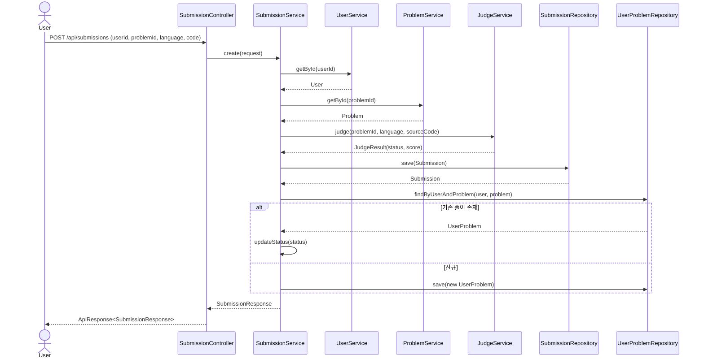
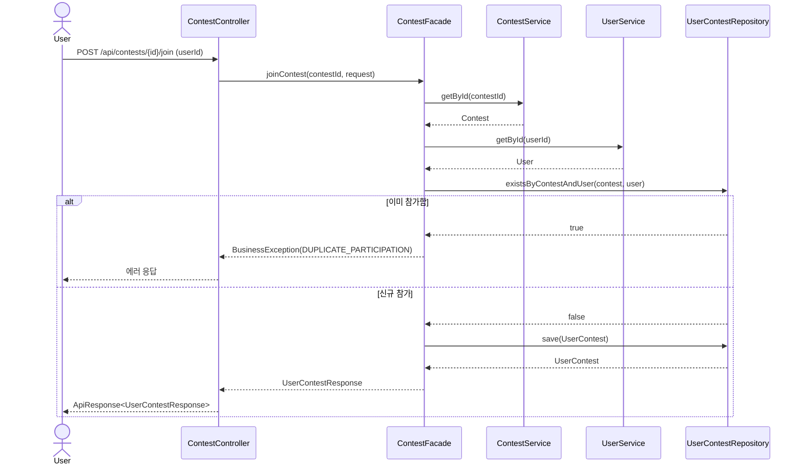
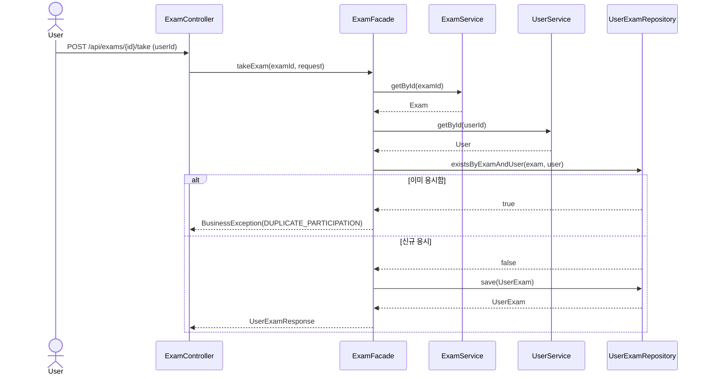
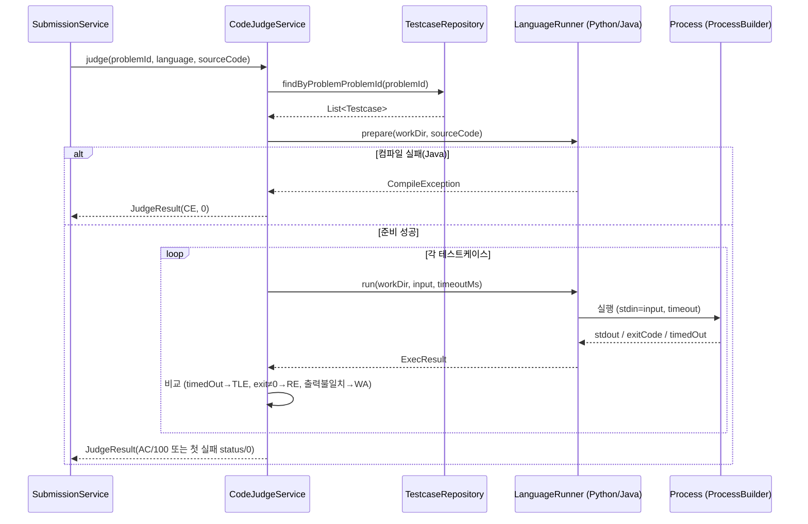
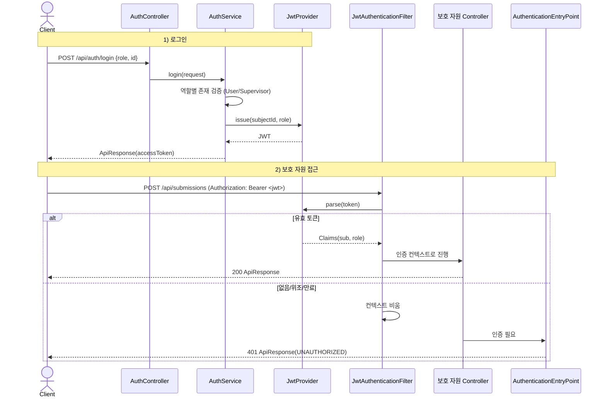

## 시퀀스 다이어그램 명세서

본 명세서는 코딩 테스트 플랫폼의 핵심 비즈니스 흐름을 시퀀스 다이어그램으로 정리한 문서이다. 기준은 현재 구현된 컨트롤러/서비스/퍼사드 코드이며, 채점은 `JudgeService` 인터페이스를 통해 `FakeJudgeService`가 호출되는 현 구조와 `CodeJudgeService`로의 교체 지점을 함께 표현한다.

## 1. 문제 제출 및 채점

`POST /api/submissions` → `SubmissionService.create`

> `JudgeService`는 인터페이스이므로 운영 시 `FakeJudgeService` → `CodeJudgeService` 교체에도 위 흐름은 변하지 않는다(OCP/DIP).

## 2. 대회 참가

`POST /api/contests/{id}/join` → `ContestFacade.joinContest`

## 3. 시험 응시

`POST /api/exams/{id}/take` → `ExamFacade.takeExam`

## 4. 실제 채점 — CodeJudgeService (Phase 2 구현)

`judge.mode=code`일 때 동작. `SubmissionService` 호출부는 `FakeJudgeService`와 동일(인터페이스). 제출 코드를 언어별 `LanguageRunner`(Strategy)로 앱 컨테이너 내부에서 실행하고 테스트케이스 출력과 비교한다.

> 본 Phase는 앱 컨테이너 내부 실행으로 격리가 약하다(완화: timeout, 임시 디렉터리 격리·정리). 운영 수준 격리(제출별 컨테이너/별도 judge 서비스)는 향후 과제.

## 5. 인증 — 로그인 및 보호 자원 접근 (Phase 3)

JWT 발급(로그인)과, 이후 토큰으로 보호 자원(변경계)에 접근하는 흐름.

