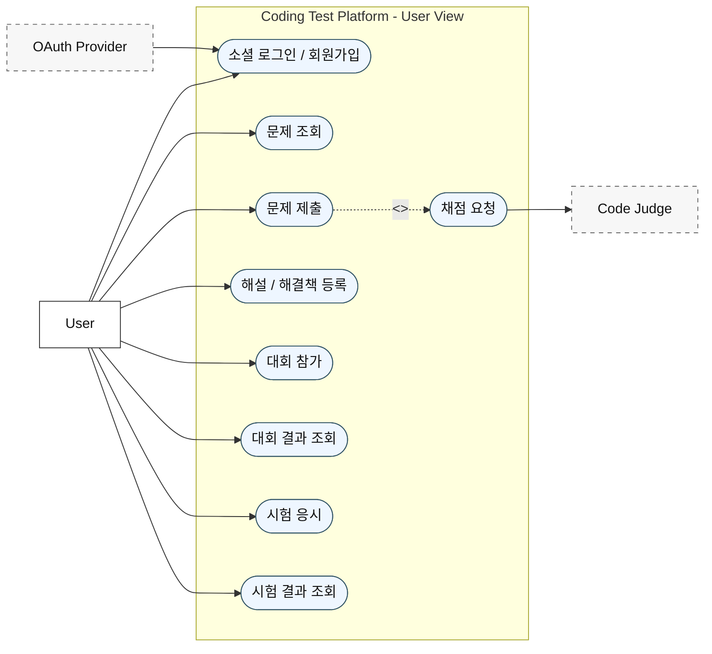
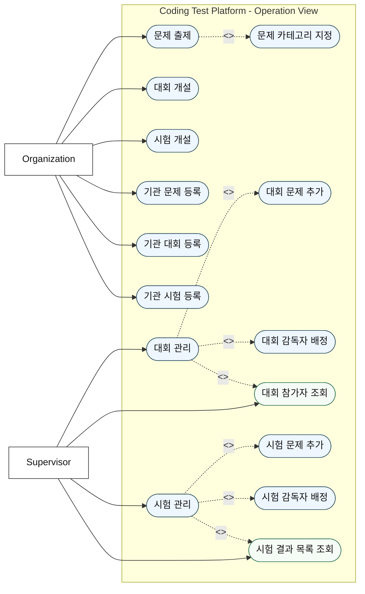
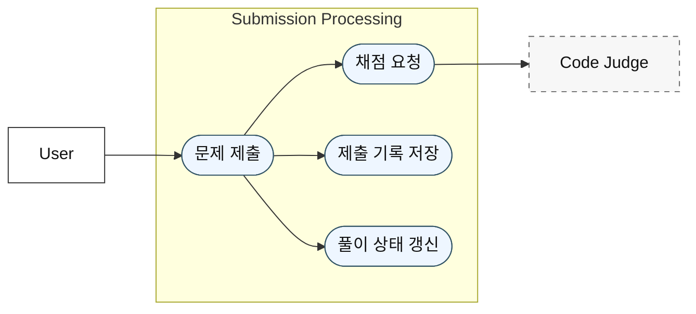

## 다이어그램 분리 기준

기존에는 모든 actor와 유스케이스를 한 장에 넣으려 했지만, 팀 공유용 문서로는 흐름이 너무 많아져서 가독성이 떨어진다. 따라서 이 문서에서는 관점을 분리해서 다음 3개의 다이어그램으로 정리한다.

- 유저 관점 유스케이스 다이어그램
- 운영 관점 유스케이스 다이어그램
- 제출 처리 상세 다이어그램

이렇게 나누면 서비스 사용 흐름과 운영 흐름이 섞이지 않고, 핵심 비즈니스 로직인 제출 처리도 별도로 설명할 수 있다.

## 1. 유저 관점 유스케이스 다이어그램

이 다이어그램은 일반 사용자가 플랫폼에서 수행하는 주요 행위를 기준으로 정리한 것이다.

핵심 actor:

- `User`
- `OAuth Provider`
- `Code Judge`

핵심 유스케이스:

- 소셜 로그인 / 회원가입
- 문제 조회
- 문제 제출
- 해설 / 해결책 등록
- 대회 참가
- 대회 결과 조회
- 시험 응시
- 시험 결과 조회

## 2. 운영 관점 유스케이스 다이어그램

이 다이어그램은 운영 주체의 책임을 기준으로 정리한 것이다. 여기서는 `Organization` 과 `Supervisor` 의 역할을 분리해서 본다.

역할 분리:

- `Organization`: 문제, 대회, 시험의 소유와 개설
- `Supervisor`: 대회와 시험의 실제 운영 및 관리

핵심 actor:

- `Organization`
- `Supervisor`

핵심 유스케이스:

- 문제 출제
- 문제 카테고리 지정
- 대회 개설
- 시험 개설
- 기관 문제 등록
- 기관 대회 등록
- 기관 시험 등록
- 대회 관리
- 시험 관리
- 대회 문제 추가
- 대회 감독자 배정
- 대회 참가자 조회
- 시험 문제 추가
- 시험 감독자 배정
- 시험 결과 목록 조회

## 3. 제출 처리 상세 다이어그램

이 다이어그램은 핵심 비즈니스 로직인 `문제 제출` 흐름만 따로 분리해서 보여준다. 구현 기준으로 보면 제출 처리의 핵심은 다음 4단계이다.

- 사용자 제출 요청
- 채점 요청
- 제출 기록 저장
- 풀이 상태 갱신

현재는 `JudgeService` 의 구현체가 `FakeJudgeService` 이지만, 구조상 외부 채점 시스템인 `Code Judge` 로 교체 가능하도록 설계되어 있다.

## 정리

팀 공유 기준에서는 하나의 거대한 통합 다이어그램보다 관점별로 분리한 구성이 더 적절하다.

- 유저 관점: 서비스 사용 흐름 이해
- 운영 관점: 운영 책임과 관리 범위 이해
- 제출 처리 상세: 핵심 비즈니스 로직 이해

이 구조는 현재 백엔드 구현과 앞으로의 확장 의도를 모두 설명하기에 가장 균형이 좋다.