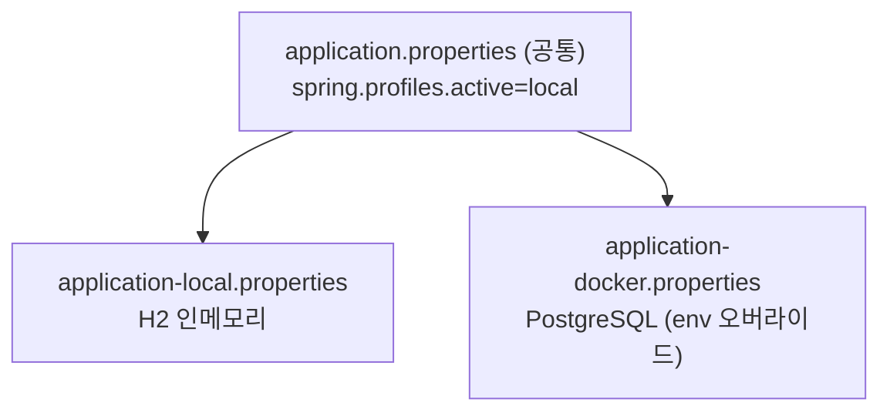
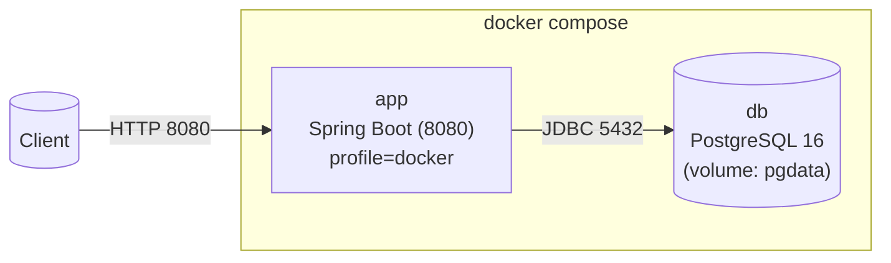
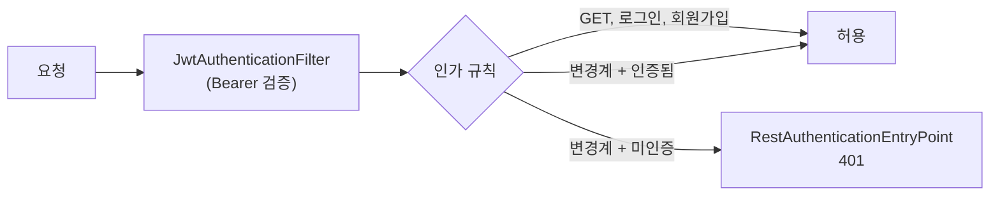

## 구조 명세서

본 문서는 코딩 테스트 플랫폼 백엔드의 기술 스택, 패키지/계층 구조, 프로파일 구성, 컨테이너 토폴로지를 정리한 구조 명세서이다. 기준은 현재 구현된 코드와 Phase 1(영속성·컨테이너화) 결과이다.

## 1. 기술 스택

| 구분 | 내용 |
|------|------|
| 언어/런타임 | Java 21 |
| 프레임워크 | Spring Boot 4.0.6 (Web MVC, Data JPA, Security) |
| 빌드 | Gradle (wrapper) |
| ORM | Hibernate / Spring Data JPA |
| DB (local/test) | H2 인메모리 (PostgreSQL 호환 모드) |
| DB (운영/docker) | PostgreSQL 16 |
| 문서/API | springdoc-openapi (Swagger UI) |
| 컨테이너 | Docker (멀티스테이지), Docker Compose |
| 채점 런타임 | (code 모드) app 이미지에 python3 + JDK(javac) 포함 |
| 프런트엔드 | 바닐라 JS(ES 모듈), `resources/static`에서 Spring 동일출처 서빙 |
| 보조 | Lombok, devtools |

## 2. 계층 구조 (Layered Architecture)

각 도메인은 동일한 계층 구조를 반복하며, 책임을 분리한다(SRP).

```
Controller  →  Service (/ Facade)  →  Repository  →  DB
     │                │
   DTO            Entity / Enum
```

- `Controller` : HTTP 요청/응답 처리, `ApiResponse<T>`로 래핑
- `Service` : 도메인 비즈니스 로직, `@Transactional`
- `Facade` : 여러 서비스/리포지토리를 조합하는 복합 흐름(ContestFacade, ExamFacade)
- `Repository` : Spring Data JPA 데이터 접근
- `DTO` : 요청(`dto/request`)·응답(`dto/response`) 분리
- `Entity` : 도메인 상태, `BaseEntity`로 생성/수정 시각 자동 관리

## 3. 패키지 구조

```
com.example.swedemo
├── SwedemoApplication
├── global
│   ├── common        (ApiResponse, BaseEntity, enums)
│   ├── config        (JpaConfig, SecurityConfig, SwaggerConfig)
│   └── exception     (ErrorCode, BusinessException, GlobalExceptionHandler)
├── auth              (JWT 인증: JwtProvider, JwtAuthenticationFilter, AuthService, 핸들러)
├── batch             (BatchScheduler, Contest/ExamAggregationService, BatchController)
├── provider | user | supervisor | organization
├── category | problem | testcase
├── submission | solution
├── contest | exam        (+ facade)
└── judge             (JudgeService, FakeJudgeService, CodeJudgeService, runner)
```

각 도메인 패키지는 `controller / service / (facade) / repository / entity / dto{request,response}` 하위 구조를 가진다.

## 4. 도메인 분류

| 계층 | 도메인 |
|------|--------|
| 사용자 | Provider, User, Supervisor |
| 문제 | Problem, Testcase, Submission, Solution, UserProblem, Category |
| 대회/시험 | Contest(+ContestProblem/UserContest/ContestSupervisor), Exam(+동일 구조) |
| 기관 | Organization(+Problem/Contest/Exam 연결) |
| 채점 | JudgeService(interface), FakeJudgeService, **CodeJudgeService**, JudgeResult, runner(LanguageRunner·PythonRunner·JavaRunner) |

상세 클래스 관계는 [Class Diagram.md](Class%20Diagram.md), 데이터 모델은 [ERD.md](ERD.md) 참조.

### 4.1 채점기 선택 (judge.mode)

`JudgeService` 구현체는 `judge.mode` 설정으로 택일된다(`@ConditionalOnProperty`, 활성 빈 1개).

| judge.mode | 활성 빈 | 동작 | 사용 |
|------------|---------|------|------|
| `fake` (기본) | FakeJudgeService | 항상 AC/100 (코드 미실행) | local/test |
| `code` | CodeJudgeService | 언어별 `LanguageRunner`로 제출 코드 실행·비교 | docker |

`code` 모드는 앱 컨테이너 내부에서 `python3`/`javac`(JDK)를 `ProcessBuilder`로 호출한다. 언어 추가는 `LanguageRunner` 구현체 추가만으로 가능(OCP). 시간 제한은 `judge.time-limit-ms`(기본 2000).

## 5. 프로파일 구성 (Phase 1)

설정은 공통 + 프로파일별로 분리한다.

| 파일 | 역할 | DB | ddl-auto |
|------|------|----|----|
| `application.properties` | 공통(앱명, JPA show-sql, Swagger), 기본 active=`local` | - | - |
| `application-local.properties` | 로컬/테스트 | H2 인메모리 | create-drop |
| `application-docker.properties` | 컨테이너/운영 | PostgreSQL | update |



docker 프로파일의 datasource 접속 정보는 `SPRING_DATASOURCE_URL/USERNAME/PASSWORD` 환경변수로 오버라이드된다.

## 6. 컨테이너 토폴로지 (Docker Compose)



- `app` : 멀티스테이지 `Dockerfile`로 빌드(JDK21로 bootJar → JRE21로 실행)
- `db` : `postgres:16-alpine`, healthcheck(`pg_isready`) 통과 후 `app` 기동
- 데이터는 named volume `pgdata`에 영속(재기동에도 유지)

컴포넌트 관점 상세는 [Component Diagram.md](Component%20Diagram.md) 참조.

## 7. 보안 (Phase 3)

JWT 기반 stateless 인증. `SecurityConfig`가 필터 체인을 구성한다.



| 항목 | 정책 |
|------|------|
| 세션 | STATELESS (서버 세션 없음) |
| 토큰 | HS256 JWT, `sub`=userId/supervisorId, `role` 클레임 |
| 공개 | 모든 GET, `POST /api/auth/login`, 회원가입(provider/user/supervisor), h2-console, swagger |
| 인증 필요 | 그 외 변경계(POST/PUT/DELETE) |
| 401/403 | `RestAuthenticationEntryPoint`/`RestAccessDeniedHandler` → `ApiResponse` JSON |
| 키 관리 | `jwt.secret` dev 기본값, 운영은 `JWT_SECRET` env 필수 |

> 개발용 로그인은 자격검증 없이 id로 토큰 발급(데모 한정). 실제 OAuth2(Google) 연동은 후속.

## 8. 프런트엔드 (Phase 5)

정적 FE(바닐라 JS, ES 모듈)를 `resources/static/`에 두어 Spring이 `/`에서 동일출처로 서빙한다(CORS 불필요).

```
static/
├── index.html               (대시보드)
├── pages/{problems,problem,submissions,contests,exams,operations}/index.html
└── assets/
    ├── css/{base,layout}.css
    └── js/
        ├── core/{api.js, ui.js, data.js}
        └── pages/*.js
```

- `core/api.js` — `/api` fetch 래퍼, `ApiResponse` 언랩, JWT(localStorage) Bearer 자동 부착, 로그인/로그아웃
- `core/ui.js` — 공통 셸 + 헤더 로그인 위젯 + 경로/포맷 헬퍼
- 각 `pages/*.js` — 해당 화면을 REST API로 렌더(문제/제출/대회/시험), 응답 형상에 적응
- 인가: 읽기(GET) 공개라 비로그인도 조회 가능, 제출 등 쓰기는 헤더 로그인(JWT) 후 가능

## 9. 설계 원칙 적용

SOLID·디자인 패턴 적용 현황은 [Design Pattern + Springboot.md](Design%20Pattern%20+%20Springboot.md)에 별도 정리한다. 요약하면 SRP(계층/도메인 분리), OCP·DIP(JudgeService 추상화), Facade·Strategy·Repository·Builder·DTO·DI 패턴을 코드 수준에서 적용한다.
