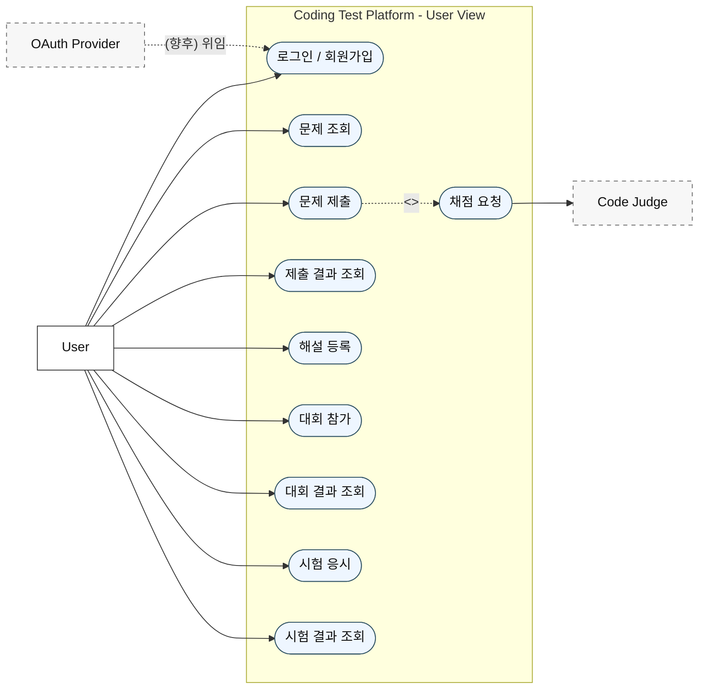
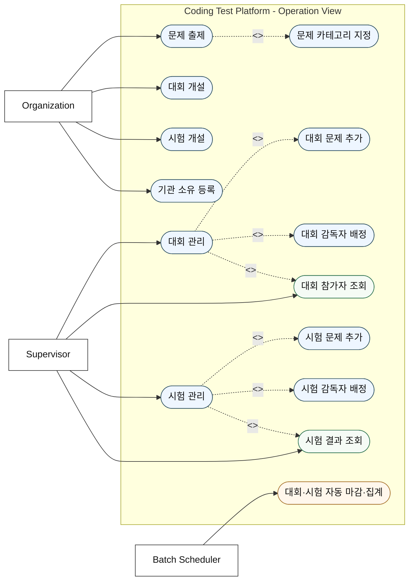

# 유스케이스 및 요구사항 명세서

본 명세서는 코딩 테스트 플랫폼(온라인 저지)의 사용자 의도와 시스템이 제공해야 할 기능 및 비기능 요구사항을 시나리오·유스케이스 관점에서 정의한 요구사항 명세서이다.

## 1. 목적 및 범위

본 명세서는 소프트웨어 공학 단계 중 **요구사항 분석** 활동의 산출물로서, 시나리오 및 유스케이스를 통해 "사용자가 무엇을(What) 의도하는가"를 파악하고 이를 기능 요구사항(FR)과 비기능 요구사항(NFR)으로 구조화하는 것을 목적으로 한다.

- **대상 시스템**: Spring Boot 4.0.6 / Java 21 기반 단일 애플리케이션. 하나의 애플리케이션이 `/api` 하위의 REST API와 정적 바닐라 JS 프런트엔드를 동일 출처(same-origin)로 서빙하는 server-client 구조이다.
- **포함 범위**: 계정·인증, 문제·테스트케이스 관리, 제출·자동 채점, 대회 운영, 시험 운영, 기관(소유) 관리, 배치 집계(자동 마감·랭킹/합격 산정), 프런트엔드 연동 핵심 루프.
- **제외 범위(향후 확장)**: 실제 Google OAuth2 소셜 로그인 실 흐름(현재 개발용 로그인으로 대체), 역할 세분 인가, 리프레시 토큰, 채점기 강 격리(제출별 컨테이너/별도 저지), C·C++·JavaScript·Kotlin 러너 및 MLE 검출, 실시간 시험/랭킹(WebSocket·Redis), 부정행위 감지.
- **구현 단계(Phase) 요약**: Phase 1(영속성·Docker), Phase 2(실제 채점), Phase 3(JWT 인증), Phase 4(배치 집계), Phase 5(프런트엔드 연동)까지 모두 구현 완료된 상태를 기준으로 한다.

## 2. 액터 정의

| 액터 | 설명 | 책임 |
|------|------|------|
| User | 문제를 풀고 코드를 제출하는 일반 사용자 | 문제 조회·제출, 대회 참가, 시험 응시, 해설(Solution) 등록, 자신의 제출·결과 조회 |
| Supervisor | 대회/시험의 실제 운영·관리를 담당하는 감독자 | 대회·시험 감독자로 배정되어 운영, 참가자 목록·결과 조회 등 관리 행위 수행 |
| Organization | 문제/대회/시험을 소유하고 개설하는 운영 주체(기관) | 문제 출제 및 카테고리 지정, 대회·시험 개설, 기관-문제/대회/시험 소유 관계 등록 |
| OAuth Provider | 소셜 로그인을 제공하는 외부 인증 주체 | (향후) 외부 인증 위임. 현재는 개발용 로그인(역할+id 기반 JWT 발급)으로 대체 |
| Code Judge | 제출 코드를 컴파일·실행·비교하는 채점 시스템 | 제출 소스를 앱 컨테이너 내부에서 실행(ProcessBuilder)하고 Testcase와 비교하여 결과(AC/WA/TLE/RE/CE)·점수 산출 |
| Batch Scheduler | 주기적 집계를 수행하는 내부 시스템 액터 | 종료된 대회/시험을 자동 마감하고 랭킹·합격/등급을 집계(@Scheduled + 수동 트리거) |

## 3. 기능 요구사항 (FR)

### 3.1 계정 · 인증

| ID | 요구사항 | 구현 근거 |
|----|----------|-----------|
| FR-01 | 사용자/감독자/제공자(Provider) 회원가입(생성)을 제공한다. | `POST /api/users`, `/api/supervisors`, `/api/providers` (공개) |
| FR-02 | 사용자 정보 조회·수정·삭제를 제공한다. | `GET/PUT/DELETE /api/users/{id}` |
| FR-03 | 개발용 로그인으로 역할(role)+id를 받아 JWT(HS256)를 발급한다. | `POST /api/auth/login` |
| FR-04 | 읽기(GET)는 공개, 변경계(POST/PUT/DELETE)는 JWT 인증을 요구한다. | `SecurityConfig`(STATELESS), `JwtAuthenticationFilter` |
| FR-05 | 인증 실패 401, 인가 거부 403을 표준 JSON으로 응답한다. | `RestAuthenticationEntryPoint`, `RestAccessDeniedHandler` |

### 3.2 문제 · 테스트케이스

| ID | 요구사항 | 구현 근거 |
|----|----------|-----------|
| FR-06 | 문제 CRUD를 제공한다. | `POST/GET/PUT/DELETE /api/problems` |
| FR-07 | 문제와 카테고리를 N:M으로 연결한다. | `POST /api/problems/{id}/categories/{categoryId}` |
| FR-08 | 카테고리 CRUD를 제공한다. | `POST/GET/DELETE /api/categories` |
| FR-09 | 문제별 테스트케이스 CRUD를 제공한다. | `POST/GET/PUT/DELETE /api/testcases`, `GET /api/testcases/problem/{problemId}` |
| FR-10 | 사용자별 문제 풀이 상태(UserProblem)를 관리한다. | `SubmissionService`가 제출 결과로 UserProblem 갱신 |

### 3.3 제출 · 채점

| ID | 요구사항 | 구현 근거 |
|----|----------|-----------|
| FR-11 | 사용자가 코드(언어·소스)를 제출하면 채점을 수행한다. | `POST /api/submissions` |
| FR-12 | 채점은 인터페이스(`JudgeService`)로 추상화되어 Mock/실채점을 교체한다. | `FakeJudgeService`(judge.mode=fake) / `CodeJudgeService`(judge.mode=code) |
| FR-13 | 실채점은 제출 코드를 컨테이너 내부에서 실행하고 Testcase와 비교한다. | `CodeJudgeService`, `PythonRunner`/`JavaRunner`(ProcessBuilder) |
| FR-14 | 채점 결과는 AC/WA/TLE/RE/CE로 판정하고 점수를 산출한다. | 전체 통과 시 AC/100, 첫 실패에서 종료(timeout→TLE, 종료코드≠0→RE, 불일치→WA, 컴파일 실패→CE) |
| FR-15 | 제출 기록(코드·언어·상태·점수)을 저장하고 단건/유저별/문제별 조회를 제공한다. | `GET /api/submissions/{id}`, `/user/{userId}`, `/problem/{problemId}` |
| FR-16 | 사용자가 문제 해설(Solution)을 등록·조회·수정·삭제한다. | `POST/GET/PUT/DELETE /api/solutions` |

### 3.4 대회

| ID | 요구사항 | 구현 근거 |
|----|----------|-----------|
| FR-17 | 대회 CRUD를 제공한다. | `POST/GET/PUT/DELETE /api/contests` |
| FR-18 | 대회에 문제(순서·배점)와 감독자를 배정한다. | `POST /api/contests/{id}/problems`, `/supervisors/{supervisorId}` |
| FR-19 | 사용자가 대회에 참가 신청한다(중복 검사). | `POST /api/contests/{id}/join` (`ContestFacade`) |
| FR-20 | 대회 참가자 목록을 조회한다. | `GET /api/contests/{id}/participants` |

### 3.5 시험

| ID | 요구사항 | 구현 근거 |
|----|----------|-----------|
| FR-21 | 시험 CRUD를 제공한다. | `POST/GET/PUT/DELETE /api/exams` |
| FR-22 | 시험에 문제(순서·배점)와 감독자를 배정한다. | `POST /api/exams/{id}/problems`, `/supervisors/{supervisorId}` |
| FR-23 | 사용자가 시험에 응시 신청한다(중복 검사). | `POST /api/exams/{id}/take` (`ExamFacade`) |
| FR-24 | 시험 결과 목록을 조회한다. | `GET /api/exams/{id}/results` |

### 3.6 기관

| ID | 요구사항 | 구현 근거 |
|----|----------|-----------|
| FR-25 | 기관 CRUD를 제공한다. | `POST/GET/PUT/DELETE /api/organizations` |
| FR-26 | 기관-문제/대회/시험 소유 관계를 등록한다. | `POST /api/organizations/{id}/problems/{problemId}`, `/contests/{contestId}`, `/exams/{examId}` |

### 3.7 배치 집계

| ID | 요구사항 | 구현 근거 |
|----|----------|-----------|
| FR-27 | 종료된(`endTime < now`, `!closed`) 대회/시험을 자동 마감한다. | `BatchScheduler`(@Scheduled), `Contest/Exam.close()` |
| FR-28 | 대회는 기간 내 AC 문제 수·총점으로 랭킹(총점 내림차순)을 산정한다. | `ContestAggregationService` |
| FR-29 | 시험은 총점·합격(만점 60% 이상)·등급(A/B/C/D/F)을 산정한다. | `ExamAggregationService` |
| FR-30 | 집계를 수동 트리거할 수 있으며, 마감 플래그로 멱등성을 보장한다. | `POST /api/batch/aggregate` (인증 필요) |

## 4. 비기능 요구사항 (NFR)

| ID | 항목 | 요구사항 | 구현 근거 |
|----|------|----------|-----------|
| NFR-01 | 보안(인증/인가) | JWT(HS256) 기반 stateless 인증, 읽기 공개·쓰기 인증. 비밀키는 운영 시 `JWT_SECRET` 환경변수로 교체. | `JwtProvider`, `SecurityConfig`, `JwtProperties` |
| NFR-02 | 확장성 | 채점기를 `JudgeService` 인터페이스로 추상화(OCP/DIP)하여 구현체를 무중단 교체. 언어 러너는 Strategy + Template Method로 확장. | `JudgeService`, `LanguageRunner`, `AbstractProcessRunner` |
| NFR-03 | 영속성 | 운영은 PostgreSQL 16, 로컬/테스트는 H2 인메모리를 프로파일로 분리. | `application-docker.properties`(Postgres), `application-local.properties`(H2) |
| NFR-04 | 배포성 | 멀티스테이지 Dockerfile + Docker Compose로 app + DB를 일괄 기동(healthcheck·volume). | `Dockerfile`, `docker-compose.yml` |
| NFR-05 | 유지보수성 | 도메인별·계층별 책임 분리(SRP), DTO로 API-엔티티 결합도 최소화, 공통 응답·전역 예외 처리. | `ApiResponse<T>`, `GlobalExceptionHandler` |
| NFR-06 | 일관성 | 표준 응답 형식과 표준 에러 코드(enum)로 응답을 통일. | `ApiResponse<T>`, `ErrorCode` |
| NFR-07 | 신뢰성(멱등성) | 배치 집계는 마감(`closed`) 플래그로 재실행 시 중복 집계를 방지. | `findByEndTimeBeforeAndClosedFalse`, `close()` |
| NFR-08 | 문서화 | 기획/구조/흐름/다이어그램을 `docs`로 관리하고 Phase마다 갱신. | `docs/`, `IMPLEMENTATION_PROGRESS.md` |
| NFR-09 | 격리/안전(제약) | 채점은 timeout·임시 디렉터리 격리·정리로 완화하되, 앱 컨테이너 내부 실행으로 강 격리는 향후 과제로 명시. | `CodeJudgeService`, `judge.time-limit-ms` |

## 5. 유스케이스 다이어그램

기존 `docs/usecase.md`와 동일한 Mermaid `flowchart` 스타일로 관점을 분리하여 표현한다.

### 5.1 유저 관점

### 5.2 운영 관점

## 6. 주요 유스케이스 명세

### 6.1 UC-01 로그인

| 항목 | 내용 |
|------|------|
| 유스케이스명 | 로그인(개발용) |
| 액터 | User, Supervisor, (향후) OAuth Provider |
| 사전조건 | 해당 역할의 계정(User/Supervisor)이 생성되어 있다. |
| 기본 흐름 | 1) 사용자가 역할(role)과 id를 담아 `POST /api/auth/login`을 호출한다. 2) `AuthService`가 요청을 검증한다. 3) `JwtProvider`가 role 클레임을 포함한 HS256 JWT를 발급한다. 4) `TokenResponse`로 토큰을 반환한다. 5) 프런트엔드는 토큰을 localStorage에 저장하고 이후 요청에 `Authorization: Bearer`로 첨부한다. |
| 대안 흐름 | 2a) 요청 형식이 잘못되면 검증 오류 응답을 반환한다. (향후 실제 OAuth2 흐름으로 대체 예정) |
| 사후조건 | 클라이언트가 유효한 JWT를 보유하여 변경계 API를 호출할 수 있다. |

### 6.2 UC-02 문제 제출 및 채점

| 항목 | 내용 |
|------|------|
| 유스케이스명 | 문제 제출 및 채점 |
| 액터 | User, Code Judge |
| 사전조건 | 사용자가 로그인(JWT 보유)되어 있고, 대상 문제와 해당 문제의 Testcase가 존재한다. |
| 기본 흐름 | 1) 사용자가 `userId`, `problemId`, `submissionLanguage`, `submittedCode`를 담아 `POST /api/submissions`를 호출한다. 2) `SubmissionService`가 User·Problem 엔티티를 조회한다. 3) `JudgeService.judge(problemId, language, sourceCode)`를 호출한다. 4) `CodeJudgeService`가 코드를 컨테이너 내부에서 실행하고 모든 Testcase와 출력을 비교한다. 5) 전체 통과 시 AC/100을 반환한다. 6) 제출 기록(코드·언어·상태·점수)을 저장한다. 7) `UserProblem` 풀이 상태를 갱신한다. 8) `SubmissionResponse`를 반환한다. |
| 대안 흐름 | 4a) 시간 초과 → TLE. 4b) 비정상 종료(종료코드≠0) → RE. 4c) 출력 불일치 → WA. 4d) 컴파일 실패 → CE. 0a) 토큰이 없으면 401을 반환한다. 0b) judge.mode=fake 환경에서는 `FakeJudgeService`가 항상 AC/100을 반환한다. |
| 사후조건 | 제출이 영속화되고, 사용자의 문제 풀이 상태가 채점 결과에 따라 갱신된다. |

### 6.3 UC-03 대회 참가

| 항목 | 내용 |
|------|------|
| 유스케이스명 | 대회 참가 |
| 액터 | User |
| 사전조건 | 사용자가 로그인(JWT 보유)되어 있고, 대상 대회(Contest)가 존재한다. |
| 기본 흐름 | 1) 사용자가 `POST /api/contests/{id}/join`을 호출한다. 2) `ContestFacade`가 대회와 사용자를 조회한다. 3) 이미 참가했는지 중복을 검사한다. 4) 신규이면 `UserContest`를 생성하여 참가 등록한다. 5) 등록 결과를 반환한다. |
| 대안 흐름 | 3a) 이미 참가한 경우 중복 참가 예외를 반환한다. 0a) 토큰이 없으면 401을 반환한다. |
| 사후조건 | 사용자가 해당 대회 참가자로 등록되며, 종료 후 배치 집계 대상이 된다. |

## 7. 요구사항 추적 매트릭스

| 요구사항 | 구현 Phase | 대표 엔드포인트 / 컴포넌트 |
|----------|-----------|----------------------------|
| FR-01 ~ FR-02 (계정) | Phase 3(인증 전반) / 기반 도메인 | `/api/users`, `/api/supervisors`, `/api/providers` |
| FR-03 ~ FR-05 (인증/인가) | Phase 3 | `POST /api/auth/login`, `JwtAuthenticationFilter`, `SecurityConfig` |
| FR-06 ~ FR-10 (문제·테스트케이스) | 기반 도메인 | `/api/problems`, `/api/categories`, `/api/testcases` |
| FR-11 ~ FR-16 (제출·채점·해설) | Phase 2(실채점) / Phase 5(FE 연동) | `/api/submissions`, `/api/solutions`, `CodeJudgeService` |
| FR-17 ~ FR-20 (대회) | 기반 도메인 + Phase 4(집계) | `/api/contests/**`, `ContestFacade` |
| FR-21 ~ FR-24 (시험) | 기반 도메인 + Phase 4(집계) | `/api/exams/**`, `ExamFacade` |
| FR-25 ~ FR-26 (기관) | 기반 도메인 | `/api/organizations/**` |
| FR-27 ~ FR-30 (배치 집계) | Phase 4 | `POST /api/batch/aggregate`, `BatchScheduler`, `*AggregationService` |
| NFR-01 (보안) | Phase 3 | `JwtProvider`, `SecurityConfig` |
| NFR-02 (확장성) | Phase 2 | `JudgeService`, `LanguageRunner` |
| NFR-03 (영속성) | Phase 1 | `application-{local,docker}.properties` |
| NFR-04 (배포성) | Phase 1 | `Dockerfile`, `docker-compose.yml` |
| NFR-05 ~ NFR-06 (유지보수·일관성) | 전 Phase | `ApiResponse<T>`, `GlobalExceptionHandler`, `ErrorCode` |
| NFR-07 (멱등성) | Phase 4 | `close()`, `findByEndTimeBeforeAndClosedFalse` |
| NFR-08 (문서화) | 전 Phase | `docs/`, `IMPLEMENTATION_PROGRESS.md` |
| NFR-09 (격리/안전) | Phase 2 | `CodeJudgeService`, `judge.time-limit-ms` |
