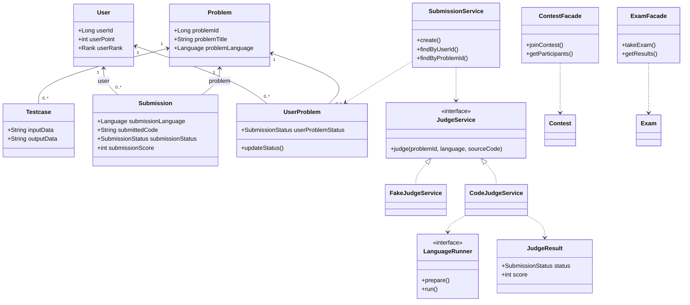
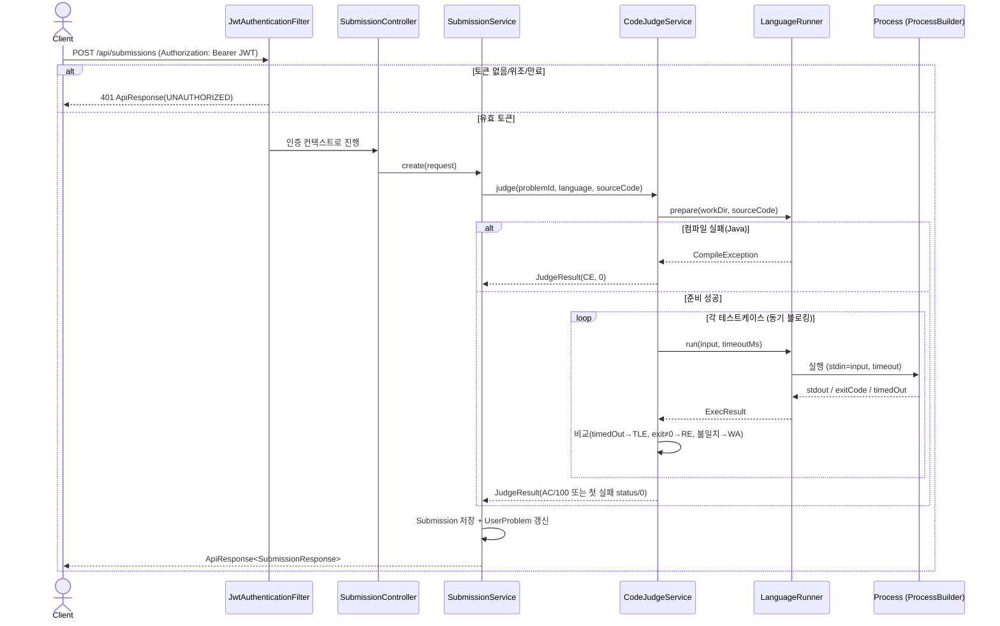
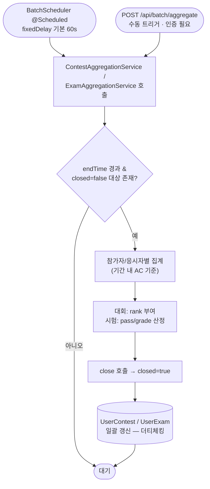
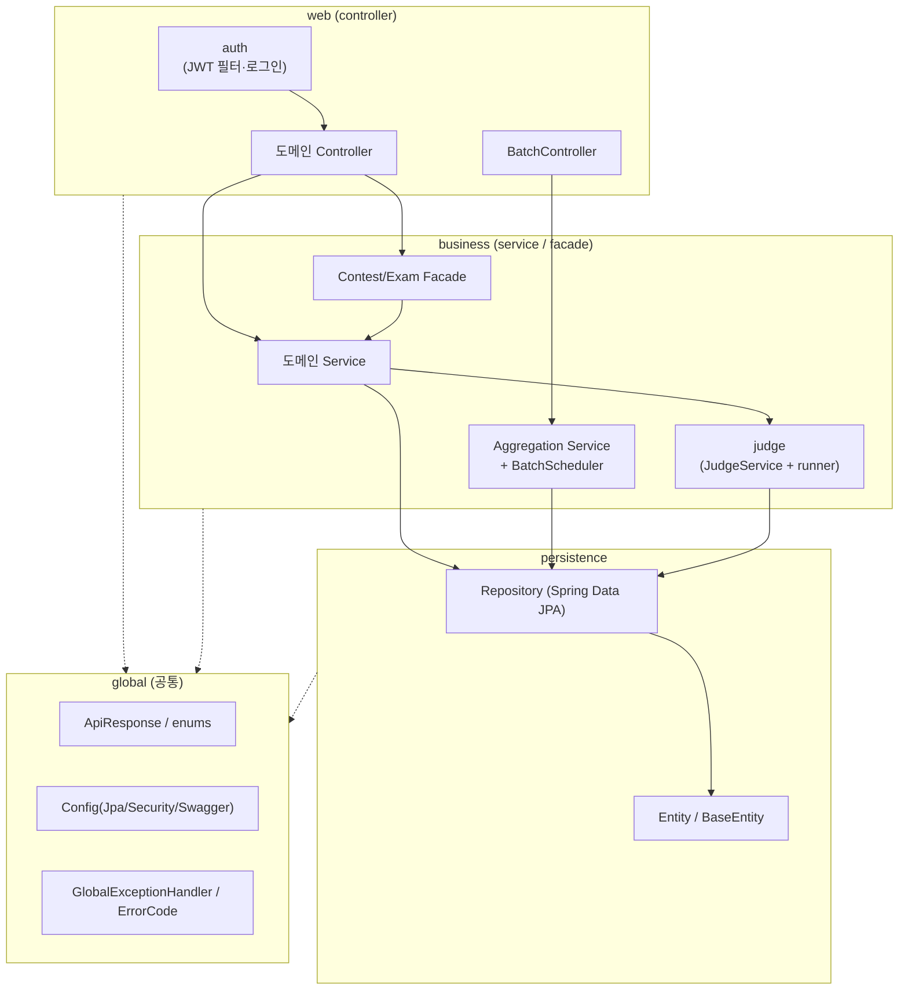
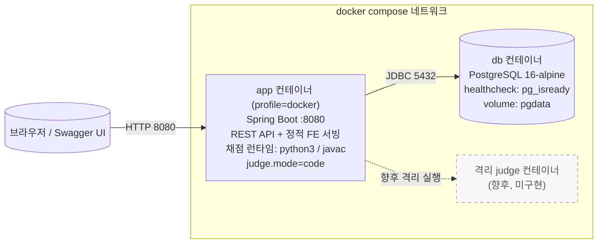
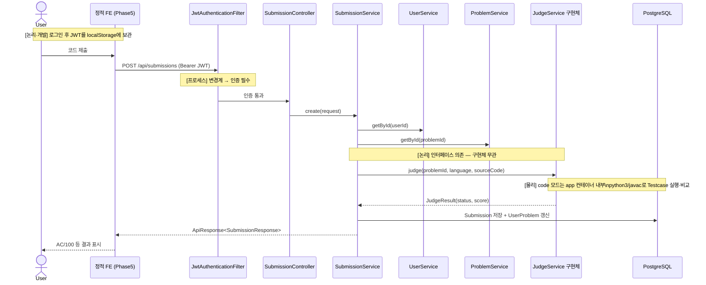

# 4+1 View 아키텍처 명세서

본 명세서는 코딩 테스트 플랫폼(온라인 저지)의 아키텍처를 Kruchten의 **4+1 View** 모델(논리·프로세스·개발·물리 뷰 + 시나리오 뷰)로 분석하여, 각 관점에서 도출되는 설계 제약사항과 품질속성(Why)을 정리한 아키텍처 분석 문서이다.

## 0. 도입 및 4+1 View 개요

본 명세서는 소프트웨어 공학 단계 중 **아키텍처 분석** 활동의 산출물로서, 직전 산출물인 [01 유스케이스 명세서](01_유스케이스_명세서.md)가 정의한 "사용자가 무엇을(What) 의도하는가"를 입력으로 받아, "그 요구를 만족시키기 위해 시스템을 **왜(Why) 이렇게 설계했는가**"를 네 개의 관점으로 분리하여 검증하는 것을 목적으로 한다.

단일 다이어그램은 모든 이해관계자의 관심사를 동시에 만족시키지 못한다. Kruchten의 4+1 View는 서로 다른 관심사를 가진 이해관계자별로 관점을 분리하여, 각 뷰가 독립적으로 설계 결정과 그 근거를 드러내도록 한다.

| 뷰 | 관심사(이해관계자) | 본 시스템에서 다루는 핵심 | 근거 문서 |
|----|------------------|--------------------------|-----------|
| 논리 뷰(Logical) | 기능 요구사항 / 도메인 설계자 | 도메인 엔티티·서비스·채점 추상화, 계층 책임 | [Class Diagram](../Class%20Diagram.md) |
| 프로세스 뷰(Process) | 런타임 동작·동시성 / 성능·통합 담당 | HTTP 요청 처리, JWT 필터, 동기 채점, @Scheduled 배치 | [Sequence Diagram](../Sequence%20Diagram.md), [Batch Diagram](../Batch%20Diagram.md) |
| 개발 뷰(Development) | 모듈 구성·빌드 / 개발자 | 패키지 구조, Gradle bootJar, 의존성 계층 | [구조](../구조.md), [Component Diagram](../Component%20Diagram.md) |
| 물리 뷰(Physical) | 배포 토폴로지 / 운영자 | docker compose app·db, 포트·볼륨·프로파일, 채점 런타임 | [구조](../구조.md), [Component Diagram](../Component%20Diagram.md) |
| 시나리오 뷰(+1) | 위 네 뷰의 검증 / 전체 | 핵심 유스케이스로 네 뷰를 가로질러 일관성 확인 | [01 유스케이스 명세서](01_유스케이스_명세서.md) |

> 본 분석의 기준은 Phase 1(영속성·Docker)부터 Phase 5(프런트엔드 연동)까지 모두 구현 완료된 상태이며, 미구현 항목은 각 절에서 **향후**로 명시한다.

## 1. 논리 뷰 (Logical View)

논리 뷰는 시스템이 제공하는 기능을 도메인 객체와 그 책임으로 표현한다. 본 시스템은 `Controller → Service/Facade → Repository → Entity` 계층 구조를 모든 도메인이 반복하며, 책임을 분리한다(SRP).

### 1.1 계층별 책임

| 계층 | 책임 | 대표 구성요소 |
|------|------|--------------|
| Controller | HTTP 요청/응답 처리, `ApiResponse<T>` 래핑 | `SubmissionController`, `ContestController`, `BatchController` |
| Service | 도메인 비즈니스 로직, `@Transactional` | `ProblemService`, `SubmissionService` |
| Facade | 여러 서비스/리포지토리를 조합하는 복합 흐름 | `ContestFacade`, `ExamFacade` |
| Repository | Spring Data JPA 데이터 접근 | `SubmissionRepository`, `ContestRepository` |
| Entity | 도메인 상태, `BaseEntity`로 생성/수정 시각 자동 관리 | `Problem`, `Submission`, `Contest`, `Exam` |
| 채점 추상화 | 채점 전략을 인터페이스로 분리(OCP/DIP) | `JudgeService`(interface), `CodeJudgeService`, `FakeJudgeService` |

### 1.2 핵심 도메인 클래스 다이어그램

문제 풀이(Submission)·채점(Judge) 도메인을 중심으로, 제출 서비스가 채점 **인터페이스**에 의존하여 구현체 교체에도 영향받지 않는 구조를 표현한다.



핵심 논리 설계 결정은 다음과 같다.

- **연결 클래스로 다대다 해소**: `ContestProblem`, `ExamProblem`, `OrganizationProblem`, `UserContest`, `UserExam` 등 연결 엔티티가 순서·배점·참가 기록을 보유하여 N:M 관계를 정규화한다.
- **채점 추상화(OCP/DIP)**: `SubmissionService`는 `JudgeService` 인터페이스에만 의존하며, 구현체(`FakeJudgeService`/`CodeJudgeService`)는 설정으로 택일된다.
- **상태 요약 분리**: 제출 이력(`Submission`)과 별개로 `UserProblem`이 사용자-문제 해결 상태를 요약하여, 채점 흐름과 상태 갱신 흐름을 분리한다.

## 2. 프로세스 뷰 (Process View)

프로세스 뷰는 런타임 시 제어 흐름과 동시성을 표현한다. 본 시스템에는 성격이 다른 네 종류의 실행 흐름이 존재한다.

| 흐름 | 트리거 | 동시성 특성 |
|------|--------|------------|
| HTTP 요청 처리 | 클라이언트 요청 | 서블릿 스레드 풀, 요청당 1스레드, STATELESS |
| JWT 인증 필터 | 변경계(POST/PUT/DELETE) 요청 | 요청 스레드 내 필터 체인 선행 실행 |
| 동기 채점 | `POST /api/submissions` | 요청 스레드가 `ProcessBuilder` 자식 프로세스를 **블로킹 대기**(timeout) |
| 주기 배치 | `@Scheduled` / `POST /api/batch/aggregate` | 별도 스케줄러 스레드, `closed` 플래그로 멱등 |

### 2.1 인증 + 동기 채점 통합 흐름

읽기는 공개, 변경계는 JWT 인증을 거치며, 제출 요청은 인증 통과 후 채점 프로세스가 동기적으로 실행된다.



> 채점은 요청 스레드에서 **동기·블로킹**으로 수행되므로 응답 지연이 채점 시간에 비례한다. 안전장치로 `judge.time-limit-ms`(기본 2000ms) timeout과 임시 디렉터리 격리·정리가 적용된다. 비동기 큐·워커 분리는 **향후** 과제이다.

### 2.2 주기 배치 집계 흐름

스케줄러 스레드가 주기적으로 종료된 대회/시험을 탐지하여 마감·집계한다. `closed` 플래그로 재실행 시 중복 집계를 방지한다(멱등).



> 단일 인스턴스 가정이므로 분산 락이 없다. 다중 인스턴스 시 중복 집계 위험이 있으며 분산 락·Spring Batch 전환은 **향후** 과제이다.

## 3. 개발 뷰 (Development View)

개발 뷰는 소스 코드의 모듈 조직과 빌드 산출물, 모듈 간 의존 방향을 표현한다.

### 3.1 패키지 구조

```
com.example.swedemo
├── SwedemoApplication
├── global
│   ├── common        (ApiResponse, BaseEntity, enums)
│   ├── config        (JpaConfig, SecurityConfig, SwaggerConfig)
│   └── exception     (ErrorCode, BusinessException, GlobalExceptionHandler)
├── auth              (JwtProvider, JwtAuthenticationFilter, AuthService, 401/403 핸들러)
├── batch             (BatchScheduler, Contest/ExamAggregationService, BatchController)
├── provider | user | supervisor | organization
├── category | problem | testcase
├── submission | solution
├── contest | exam        (+ facade)
└── judge             (JudgeService, FakeJudgeService, CodeJudgeService, runner)
```

각 도메인 패키지는 `controller / service / (facade) / repository / entity / dto{request,response}` 하위 구조를 반복한다.

### 3.2 빌드 산출물

- **빌드 도구**: Gradle (wrapper), Java toolchain 21.
- **산출물**: `bootJar` 단일 실행 가능 JAR(내장 Tomcat + 정적 FE `resources/static` 포함).
- **컨테이너화**: 멀티스테이지 `Dockerfile`(JDK21로 `bootJar` 빌드 → JDK21+python3 런타임으로 실행). 채점 모드에서 `python3`/`javac`를 실행하므로 런타임 이미지에 채점 런타임을 포함한다.
- **의존성**: Spring Boot Web/Data JPA/Security, springdoc-openapi, jjwt(api/impl/jackson), PostgreSQL 드라이버, H2, Lombok.

### 3.3 모듈 의존 계층

의존은 상위 계층에서 하위 계층으로 단방향 흐르며, `global`은 모든 계층이 공통 참조한다.



> `judge` 패키지는 `LanguageRunner` 구현체 추가만으로 언어 확장이 가능하다(OCP). 현재 Python/Java 러너가 구현되어 있고, C/C++/JS/Kotlin 러너는 **향후** 과제이다.

## 4. 물리 뷰 (Physical View)

물리 뷰는 실행 노드와 그 위의 컴포넌트 배치, 통신 경로를 표현한다. 본 시스템은 docker compose로 `app`과 `db` 두 컨테이너를 일괄 기동한다.



| 노드 | 구성 | 핵심 |
|------|------|------|
| `app` | 멀티스테이지 빌드, profile=docker, :8080 | REST API·정적 FE·채점을 **단일 컨테이너**에서 수행. 제출 코드를 앱 내부 `ProcessBuilder`로 실행 |
| `db` | postgres:16-alpine, named volume `pgdata` | `pg_isready` healthcheck 통과 후 `app` 기동, 데이터 재기동 후에도 영속 |

### 4.1 프로파일별 물리 구성

| 프로파일 | DB | ddl-auto | judge.mode | 용도 |
|---------|----|----|-----------|------|
| local(기본) | H2 인메모리 | create-drop | fake | 로컬/테스트(코드 미실행, 항상 AC/100) |
| docker | PostgreSQL 16 | update | code | 컨테이너/운영(python3/javac 실제 실행) |

docker 프로파일의 접속 정보는 `SPRING_DATASOURCE_URL/USERNAME/PASSWORD` 환경변수로, 토큰 비밀키는 `JWT_SECRET` 환경변수로 오버라이드된다.

> 채점이 `app` 컨테이너 내부에서 실행되므로 격리가 약하다. 제출별 컨테이너 또는 별도 격리 judge 서비스로의 분리는 **향후** 과제이다(다이어그램 점선).

## 5. 시나리오 뷰 (+1, Scenarios)

시나리오 뷰는 핵심 유스케이스를 골라 앞의 네 뷰가 일관되게 맞물리는지 검증한다. [01 유스케이스 명세서](01_유스케이스_명세서.md)의 **UC-02 문제 제출 및 채점**을 대표 시나리오로 선택한다. 이 유스케이스는 인증(프로세스), 도메인 객체 협력(논리), 채점 런타임(물리), 모듈 의존(개발)을 한 흐름에서 모두 가로지르기 때문이다.



이 시나리오를 통한 뷰 간 일관성 검증 결과는 다음과 같다.

| 뷰 | 시나리오에서의 확인 지점 |
|----|------------------------|
| 논리 | `SubmissionService`가 `JudgeService` 인터페이스에 의존 → 구현체 교체에도 흐름 불변 |
| 프로세스 | 변경계 요청은 JWT 필터 선행, 채점은 요청 스레드 동기 블로킹 |
| 개발 | `submission` → `judge` → `repository` 단방향 의존, FE는 동일출처 정적 서빙 |
| 물리 | `judge.mode=code` 시 `app` 컨테이너 내부에서 `python3`/`javac` 실행, 결과는 `db`에 영속 |

## 6. 설계 제약사항 및 품질속성 (Why)

각 뷰에서 도출된 설계 결정과 그 근거, 그리고 그로 인한 제약(트레이드오프)을 정리한다.

| # | 설계 결정 | 근거(품질속성) | 제약 / 트레이드오프 | 관련 뷰 |
|---|-----------|----------------|---------------------|---------|
| C-01 | 채점을 `JudgeService` 인터페이스로 추상화 | 확장성(OCP/DIP) — Fake↔Code 무중단 교체, 언어는 Strategy로 추가 | 인터페이스 시그니처 변경(`sourceCode` 추가) 시 전 구현체 동시 수정 필요 | 논리·개발 |
| C-02 | 채점을 `app` 단일 컨테이너 내부 `ProcessBuilder`로 실행 | 단순성·배포 용이성 — 별도 저지 인프라 불필요 | **격리 약함**(임의 코드 실행). timeout·임시 디렉터리로만 완화. 강 격리(제출별 컨테이너/별도 judge)는 향후 | 물리·프로세스 |
| C-03 | 채점을 요청 스레드에서 동기·블로킹 수행 | 구현 단순성, 즉시 결과 반환 | 응답 지연이 채점 시간에 비례, 대량 동시 제출에 취약. 비동기 큐는 향후 | 프로세스 |
| C-04 | JWT(HS256) 기반 STATELESS 인증, 읽기 공개·쓰기 인증 | 보안·확장성 — 서버 세션 없이 수평 확장 용이 | 역할 세분 인가·리프레시 토큰 미적용. 개발용 로그인은 자격검증 없음(데모 한정). 실 OAuth2는 향후 | 프로세스 |
| C-05 | 프로파일로 DB·ddl-auto·judge.mode 분리(local=H2/create-drop/fake, docker=PG/update/code) | 이식성·테스트 용이성 — 로컬은 경량, 운영은 영속 | 환경 간 동작 차이(채점 실행 여부) 존재, 프로파일 누락 시 의도와 다른 구성 위험 | 물리·개발 |
| C-06 | docker compose로 `app`+`db` 일괄 기동, `db` healthcheck 선행 | 배포성·신뢰성 — 기동 순서 보장, `pgdata` 볼륨 영속 | 단일 노드 구성. 다중 인스턴스·오케스트레이션은 향후 | 물리 |
| C-07 | 배치 집계에 `closed` 플래그 + `@Scheduled` 단일 실행 | 신뢰성(멱등성) — 재실행 시 중복 집계 0건 | 다중 인스턴스 시 분산 락 부재로 동시 집계 위험. Spring Batch 전환은 향후 | 프로세스 |
| C-08 | 계층·도메인별 책임 분리(SRP), DTO로 API-엔티티 분리, `ApiResponse<T>`·전역 예외 처리 | 유지보수성·일관성 — 결합도 최소화, 표준 응답/에러 통일 | 도메인마다 계층 보일러플레이트 반복 | 논리·개발 |
| C-09 | 정적 FE를 `resources/static`에 두어 Spring이 동일출처(`/`)로 서빙 | 단순성 — CORS 불필요, 단일 배포 산출물 | FE/BE 독립 배포 불가, FE 빌드 파이프라인 부재. 분리 배포는 향후 | 개발·물리 |
| C-10 | 채점 런타임(python3/javac)을 `app` 런타임 이미지에 포함 | 채점 가용성 — 외부 의존 없이 즉시 실행 | 이미지 비대화, JS/Kotlin 등 추가 언어 시 이미지 재구성 필요 | 물리·개발 |

> 위 제약 중 격리(C-02)·동기 채점(C-03)·분산 락(C-07)·OAuth2(C-04)는 [01 유스케이스 명세서](01_유스케이스_명세서.md)의 제외 범위 및 NFR-09와 일치하며, 모두 후속 Phase의 향후 과제로 명시되어 있다.
