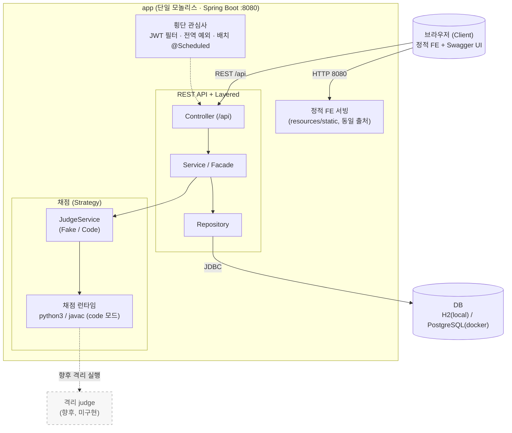
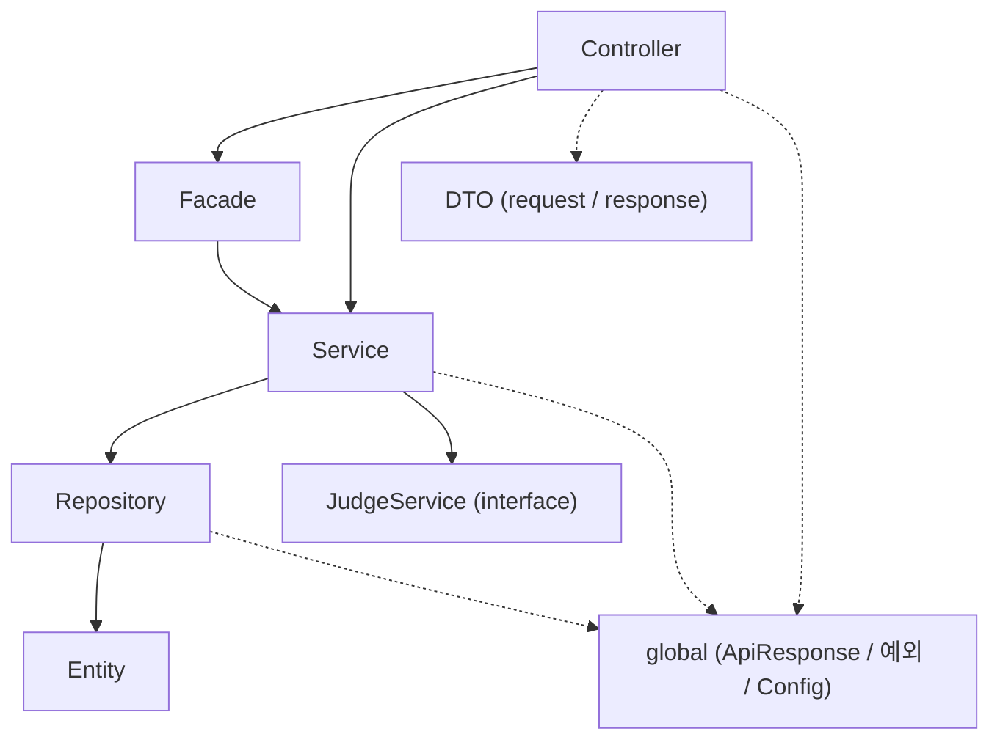
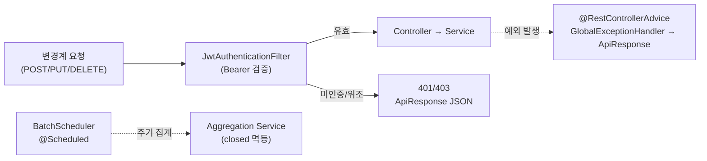

# 시스템 아키텍처 구조도 명세서

본 명세서는 코딩 테스트 플랫폼(온라인 저지)의 거시적 소프트웨어 구조(Architecture Style)를 결정하고, 채택한 스타일의 근거(Why)와 그에 따른 시스템 구조도·계층 책임·횡단 관심사·배포 구조를 정의한 아키텍처 설계 문서이다.

## 0. 도입 및 목적

본 명세서는 소프트웨어 공학 단계 중 **설계** 활동(아키텍처 스타일 결정)의 산출물로서, 직전 산출물인 [02 4+1 View 아키텍처 명세서](02_4plus1View_다이어그램_문서.md)가 네 관점으로 분석·검증한 설계 결정을 입력으로 받아, "그렇다면 이 시스템의 **기본 골격(Style)을 무엇으로 확립하는가**"를 명시적으로 결정하고 그 근거를 기록하는 것을 목적으로 한다.

4+1 View가 동일한 시스템을 여러 관점으로 **분석**한 문서라면, 본 명세서는 그 분석으로부터 거시적 구조 결정을 **확립**하는 문서이다. 따라서 본 문서는 02 명세서의 논리·개발·물리 뷰가 전제한 구조 위에 스타일 결정을 일관되게 쌓아 올린다.

> 본 명세서의 기준은 Phase 1(영속성·Docker)부터 Phase 5(프런트엔드 연동)까지 모두 구현 완료된 상태이며, 미구현 항목은 각 절에서 **향후**로 명시한다.

## 1. 아키텍처 스타일 결정

본 시스템은 단일 학습/데모 목적의 코딩 테스트 플랫폼으로, 적은 운영 비용으로 전체 도메인 기능을 일관되게 제공하는 것을 최우선 품질목표로 한다. 이 목표에 따라 다음 네 가지 거시적 스타일을 채택한다.

### 1.1 Client-Server (동일 출처 server-client)

- **결정**: 하나의 Spring Boot 애플리케이션이 `/api` 하위 REST API와 정적 프런트엔드(바닐라 JS, `resources/static`)를 **동일 출처(same-origin)**로 함께 서빙하는 Client-Server 구조를 채택한다. 브라우저(Client)는 정적 자원을 `/`에서 로드하고, 동일 출처의 `/api`로 REST 요청을 보낸다.
- **Why**: 클라이언트(표현·상호작용)와 서버(도메인 로직·데이터)의 책임을 분리하여 화면 변경이 도메인 로직에 영향을 주지 않게 한다. 또한 FE를 동일 출처로 서빙함으로써 **CORS 설정·프리플라이트가 불필요**해지고, 단일 배포 산출물(JAR/이미지)로 FE와 BE를 함께 배포할 수 있다.
- **대안 비교**: FE/BE를 별도 출처(예: 별도 웹서버 + CORS 허용)로 분리 배포하는 방식은 FE 독립 배포·CDN 캐싱에 유리하나, CORS·인증 쿠키/토큰 처리 복잡도와 배포 파이프라인 이중화 비용이 증가한다. 데모 규모에서는 동일 출처 단일 산출물의 단순성이 더 큰 가치를 가지므로 동일 출처를 선택한다(FE/BE 분리 배포는 **향후**).

### 1.2 Layered Architecture (계층형 구조)

- **결정**: 모든 도메인이 `Controller → Service/Facade → Repository → Entity`의 동일한 계층 구조를 반복하며, 의존은 상위 계층에서 하위 계층으로 **단방향**으로만 흐른다. 횡단 공통 모듈은 `global`(ApiResponse·예외·Config)로 분리한다.
- **Why**: 계층별 단일 책임(SRP)으로 표현·비즈니스·영속 관심사를 분리하여, 한 계층의 변경이 다른 계층으로 전파되지 않게 한다(낮은 결합도, 높은 응집도). DTO로 API 모델과 엔티티를 분리하여 API 스펙 변경이 도메인 모델을 오염시키지 않는다.
- **대안 비교**: 헥사고날(Ports & Adapters)·클린 아키텍처는 도메인 순수성과 인프라 교체 유연성에서 우수하나, 포트/어댑터 보일러플레이트가 늘어 데모 규모에는 과설계이다. 전통적 Layered가 Spring MVC/Data JPA의 관례와 자연스럽게 정합하므로 Layered를 선택한다. 단, 교체 가능성이 실제로 요구되는 **채점 부분에 한해** Strategy로 인터페이스를 분리(1.4)하여 부분적으로 포트-어댑터의 이점을 취한다.

### 1.3 Monolith + 프로파일 기반 구성

- **결정**: 전 도메인(계정·문제·제출·채점·대회·시험·기관·배치)을 **단일 배포 단위(Monolith)**로 묶고, 환경별 차이는 코드 분기가 아닌 **프로파일**(`local`=H2 / `docker`=PostgreSQL)과 외부 환경변수로 흡수한다.
- **Why**: 단일 프로세스이므로 도메인 간 호출이 인메모리 메서드 호출이고, 단일 트랜잭션·단일 빌드·단일 기동으로 운영 복잡도가 최소화된다. 프로파일 분리로 로컬은 경량(H2 인메모리)·운영은 영속(PostgreSQL)을 동일 코드베이스로 지원한다.
- **대안 비교**: MSA(마이크로서비스)는 도메인별 독립 배포·확장·장애 격리에 유리하나, 서비스 간 네트워크 통신·분산 트랜잭션·서비스 디스커버리·관측성 등 운영 비용이 급증한다. 본 시스템의 트래픽·팀 규모·도메인 결합도를 고려하면 분산의 이점보다 비용이 크므로 모놀리스를 선택한다(MSA 전환은 **향후**).

### 1.4 채점의 Strategy 기반 교체 가능 구조

- **결정**: 채점은 `JudgeService` 인터페이스로 추상화하고, 구현체(`FakeJudgeService` / `CodeJudgeService`)를 `judge.mode` 설정(`@ConditionalOnProperty`)으로 **택일**한다. 언어별 실행은 `LanguageRunner`(Strategy) + `AbstractProcessRunner`(Template Method)로 분리한다.
- **Why**: 채점 정책은 변경 가능성이 높은 지점이다(Mock↔실채점 교체, 언어 추가). 제출 흐름(`SubmissionService`)이 구현체가 아닌 인터페이스에만 의존(OCP/DIP)하므로, 채점 방식·언어를 추가·교체해도 상위 흐름은 불변이다.
- **대안 비교**: 채점 분기를 `SubmissionService` 내부 if/switch로 두는 방식은 초기 구현은 빠르나, 모드·언어 추가 시 서비스 본문을 계속 수정해야 해 OCP를 위반한다. 전략 인터페이스로 분리하면 빈 추가만으로 확장이 끝나므로 Strategy를 선택한다.

## 2. 거시적 시스템 구조도

전체 시스템은 브라우저(Client) → `app`(단일 모놀리스: 정적 FE + REST API + 계층 + 배치 + 채점) → DB로 구성되며, `code` 모드 채점은 `app` 컨테이너 내부의 채점 런타임에서 수행된다.



> `code` 모드에서 제출 코드는 별도 노드가 아니라 `app` 컨테이너 내부의 `ProcessBuilder` 자식 프로세스로 실행된다. 제출별 컨테이너/별도 격리 judge 서비스로의 분리는 **향후** 과제이다(점선).

## 3. 계층 구조와 책임

Layered Architecture의 각 계층 책임과 구성요소는 다음과 같으며, 의존은 상위에서 하위로 **단방향**으로만 흐른다. `global`과 `DTO`는 모든 계층이 공통 참조한다.

| 계층/요소 | 책임 | 대표 구성요소 |
|-----------|------|--------------|
| Controller | HTTP 요청/응답 매핑, 입력 수신, 결과를 `ApiResponse<T>`로 래핑 | `SubmissionController`, `ContestController`, `BatchController` |
| Service | 도메인 비즈니스 로직, 트랜잭션 경계(`@Transactional`) | `ProblemService`, `SubmissionService` |
| Facade | 여러 Service/Repository를 조합하는 복합 흐름(참가·응시 등) | `ContestFacade`, `ExamFacade` |
| Repository | Spring Data JPA 기반 영속 데이터 접근 | `SubmissionRepository`, `ContestRepository` |
| Entity | 도메인 상태·불변식 보유, `BaseEntity`로 생성/수정 시각 자동 관리 | `Problem`, `Submission`, `Contest`, `Exam` |
| DTO | API 모델(요청/응답)을 엔티티와 분리(`dto/request`, `dto/response`) | `SubmissionCreateRequest`, `SubmissionResponse` |
| global | 횡단 공통: 표준 응답·예외·공통 설정 | `ApiResponse<T>`, `GlobalExceptionHandler`, `SecurityConfig` |

### 3.1 의존 방향 (상위 → 하위 단방향)



> 하위 계층은 상위 계층을 참조하지 않는다(역방향 의존 금지). 채점은 인터페이스(`JudgeService`)에만 의존하므로 구현체 교체가 상위 흐름에 전파되지 않는다.

## 4. 횡단 관심사 (Cross-cutting Concerns)

특정 계층에 속하지 않고 여러 계층을 가로지르는 관심사는 `global`·`auth`·`batch`로 분리하여 도메인 코드에서 격리한다.

| 관심사 | 메커니즘 | 구현 근거 | 핵심 |
|--------|----------|-----------|------|
| 보안(인증/인가) | JWT 인증 필터 체인 | `JwtAuthenticationFilter`, `SecurityConfig` | STATELESS, 읽기(GET) 공개·변경계(POST/PUT/DELETE) 인증. 변경계 요청은 컨트롤러 진입 전 필터에서 선행 검증, 실패 시 401/403 표준 JSON |
| 예외 처리 | `@RestControllerAdvice` 전역 핸들러 | `GlobalExceptionHandler`, `ErrorCode`, `BusinessException` | 도메인 예외를 한곳에서 포착하여 `ApiResponse`(표준 에러 코드)로 통일 응답. 컨트롤러마다 try/catch 반복 제거 |
| 설정(구성) | 프로파일 + 외부 환경변수 | `application-{local,docker}.properties` | DB·ddl-auto·`judge.mode`를 환경별로 분리, 비밀키(`JWT_SECRET`)·DataSource 접속정보는 환경변수 오버라이드 |
| 스케줄링(배치) | `@Scheduled` 주기 실행 | `BatchScheduler`, `Contest/ExamAggregationService` | 종료된 대회/시험을 주기 탐지·자동 마감·집계. `closed` 플래그로 재실행 시 중복 집계를 방지(멱등). `POST /api/batch/aggregate`로 수동 트리거 가능 |



> 인가는 현재 인증 여부 기준(읽기 공개/쓰기 인증)까지 적용되며, 역할 세분 인가·리프레시 토큰·실제 OAuth2는 **향후** 과제이다. 배치는 단일 인스턴스 가정이므로 분산 락은 **향후** 과제이다.

## 5. 배포 구조

배포는 `docker compose`로 `app`과 `db` 두 컨테이너를 일괄 기동하는 Client-Server 물리 구성이다. `app`은 동일 출처로 정적 FE와 REST API를 함께 서빙하고, `code` 모드 채점을 컨테이너 내부에서 수행한다.

```mermaid
flowchart LR
  client[("브라우저 / Swagger UI")]

  subgraph compose["docker compose 네트워크"]
    app["app 컨테이너 (profile=docker)\nSpring Boot :8080\n정적 FE(동일 출처) + REST API\n채점 런타임: python3 / javac\njudge.mode=code"]
    db[("db 컨테이너\nPostgreSQL 16-alpine\nhealthcheck: pg_isready\nvolume: pgdata")]
  end

  client -->|HTTP 8080 (정적 + /api)| app
  app -->|JDBC 5432| db
```

| 항목 | 구성 |
|------|------|
| 빌드 | 멀티스테이지 `Dockerfile`(JDK21로 `bootJar` 빌드 → JDK21+python3 런타임). 정적 FE는 JAR 내 `resources/static`에 포함 |
| 포트 | `app` 8080(HTTP, 정적+REST 동일 출처) / `db` 5432(JDBC, compose 내부) |
| 볼륨 | named volume `pgdata`로 DB 데이터 영속(재기동에도 유지) |
| 기동 순서 | `db` healthcheck(`pg_isready`) 통과 후 `app` 기동 |
| 구성 오버라이드 | `SPRING_DATASOURCE_URL/USERNAME/PASSWORD`, `JWT_SECRET` 환경변수 |
| 동일 출처 정적 서빙 | Spring이 `/`에서 정적 FE를, `/api`에서 REST를 같은 출처로 응답 → CORS 불필요 |

> 채점이 `app` 컨테이너 내부에서 실행되므로 격리가 약하다(timeout·임시 디렉터리 격리·정리로만 완화). 제출별 컨테이너 또는 별도 격리 judge 서비스로의 분리는 **향후** 과제이다.

## 6. 아키텍처 결정 기록 (ADR 요약)

거시적 구조 확립 과정에서 내린 주요 결정과 그 대안·선택 이유·트레이드오프를 기록한다.

| # | 결정 | 대안 | 선택 이유 | 트레이드오프 |
|---|------|------|-----------|--------------|
| ADR-01 | Client-Server를 **동일 출처**로 구성(FE를 `resources/static`에서 서빙) | FE/BE 별도 출처 분리 + CORS | CORS·프리플라이트 불필요, 단일 배포 산출물로 단순화 | FE 독립 배포·CDN 캐싱 불가, FE 빌드 파이프라인 부재(분리 배포는 향후) |
| ADR-02 | **Layered Architecture** 채택 | 헥사고날/클린 아키텍처 | Spring MVC/Data JPA 관례와 정합, 데모 규모에 적정 복잡도 | 도메인마다 계층 보일러플레이트 반복, 인프라 교체 유연성은 채점 외 영역에서 낮음 |
| ADR-03 | **모놀리스** 단일 배포 단위 | MSA(마이크로서비스) | 단일 빌드·기동·트랜잭션으로 운영 비용 최소화 | 도메인별 독립 확장·장애 격리 불가(MSA 전환은 향후) |
| ADR-04 | 채점을 **인앱 실행**(`app` 내부 `ProcessBuilder`) | 분리된 격리 judge(제출별 컨테이너/별도 서비스) | 별도 저지 인프라 없이 즉시 채점, 배포 단순 | 격리 약함(임의 코드 실행). timeout·임시 디렉터리로만 완화(강 격리는 향후) |
| ADR-05 | 채점을 **Strategy 인터페이스**로 추상화(`judge.mode` 택일) | `SubmissionService` 내부 if/switch 분기 | OCP/DIP — 모드·언어 추가 시 빈 추가만으로 확장, 상위 흐름 불변 | 인터페이스 시그니처 변경 시 전 구현체 동시 수정 필요 |
| ADR-06 | 환경 차이를 **프로파일 + 환경변수**로 흡수(local=H2/docker=PG) | 단일 설정 + 코드 내 환경 분기 | 동일 코드베이스로 경량 로컬·영속 운영 동시 지원 | 환경 간 동작 차이(채점 실행 여부 등) 존재, 프로파일 누락 시 의도와 다른 구성 위험 |
| ADR-07 | 스키마를 **`ddl-auto`(create-drop/update)**로 관리 | Flyway/Liquibase 마이그레이션 | 데모 단계에서 스키마 변경을 무비용으로 반영, 초기 셋업 단순 | 버전 관리·롤백·운영 스키마 이력 부재(마이그레이션 도구 도입은 향후) |
| ADR-08 | 배치를 **`@Scheduled` + `closed` 플래그(멱등)** 단일 실행 | Spring Batch / 외부 잡 스케줄러 + 분산 락 | 단일 인스턴스 가정에서 최소 구성으로 멱등 집계 달성 | 다중 인스턴스 시 분산 락 부재로 중복 집계 위험(Spring Batch·분산 락은 향후) |

> 위 결정의 트레이드오프 중 인앱 채점(ADR-04)·분산 락 부재(ADR-08)·동일 출처(ADR-01)·OAuth2 미적용은 [01 유스케이스 명세서](01_유스케이스_명세서.md)의 제외 범위 및 NFR과 일치하며, [02 4+1 View 명세서](02_4plus1View_다이어그램_문서.md)의 제약사항(C-02·C-07·C-09)과도 정합한다.
