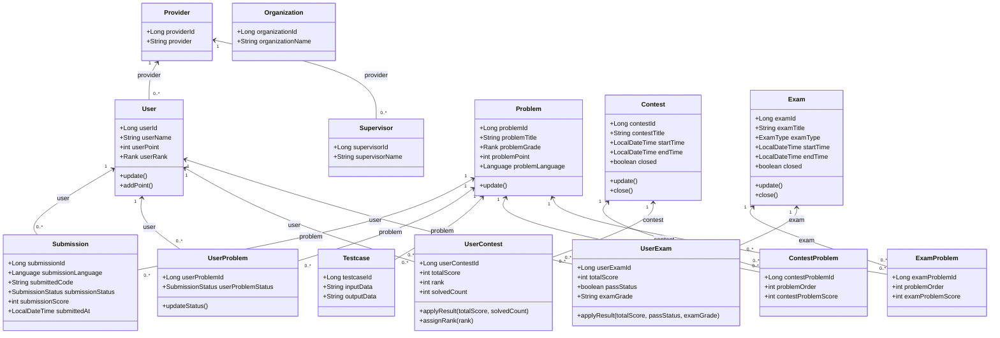
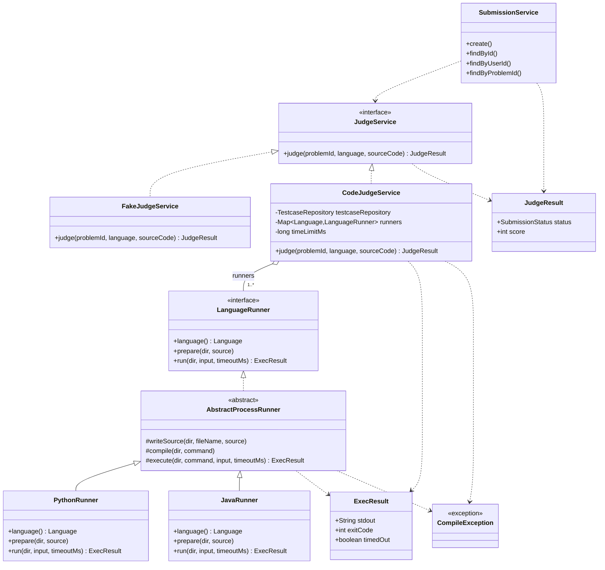
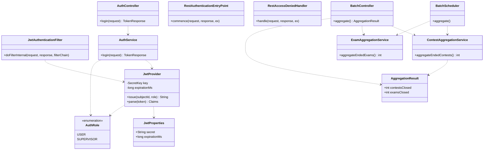

# 클래스 다이어그램 확정 명세서

본 명세서는 [03 시스템 아키텍처 구조도 명세서](03_시스템_아키텍처_구조도_명세서.md)가 확립한 계층형(Layered) 골격 위에서, 현재 구현 완료된 코딩 테스트 플랫폼 백엔드의 클래스와 클래스 간 관계·인터페이스를 확정하여 정의하는 상세 설계(구조) 산출물이다.

## 0. 도입 및 목적

본 명세서는 소프트웨어 공학 단계 중 **상세 설계(구조)** 활동(클래스 및 관계 설계)의 산출물로서, 목표는 객체 간 역할 분담(Structure)을 확정하는 것이며, 내용은 클래스 간 관계 및 인터페이스 정의이다. 직전 산출물인 03 아키텍처 명세서가 결정한 `Controller → Service/Facade → Repository → Entity` 단방향 계층 구조와 채점의 Strategy/Template Method 분리(1.4절)·횡단 관심사(`auth`/`batch`) 결정을 입력으로 받아, 그 구조를 충족하는 구체 클래스 집합으로 구체화한다.

기존 [Class Diagram 명세서](../Class%20Diagram.md)가 원형 도메인 클래스(사용자·문제·제출·대회·시험·기관 계층)를 정의한 문서라면, 본 명세서는 이후 단계에서 **추가·구현된** 채점 실행 계층(`judge.runner`), 인증 계층(`auth`), 배치 계층(`batch`)을 반영하여 클래스 다이어그램을 **확정**한다. 기존 도메인 엔티티는 변동이 없으므로 요약 표로 처리하고 기존 문서를 참조하며, 본 문서는 신규·변경 클래스를 중심으로 상세화한다. 미구현 항목은 **향후**로 명시한다.

> 본 명세서의 기준은 Phase 1(영속성·Docker)부터 Phase 5(프런트엔드 연동)까지 모두 구현 완료된 상태이며, 메서드 시그니처는 `src/main/java/com/example/swedemo/` 실제 소스에 정합한다.

## 1. 클래스 분류

본 시스템의 클래스는 계층/도메인별로 다음과 같이 구분한다. 굵게 표시한 그룹(`judge.runner`·`auth`·`batch`)은 본 확정 명세에서 추가된 영역이다.

| 계층/영역 | 분류 | 주요 클래스 |
|-----------|------|-------------|
| 도메인 — 사용자 | Entity | `Provider`, `User`, `Supervisor`, `UserProblem` |
| 도메인 — 문제 | Entity | `Problem`, `Testcase`, `Submission`, `Solution`, `Category`, `ProblemCategory` |
| 도메인 — 대회 | Entity | `Contest`, `ContestProblem`, `UserContest`, `ContestSupervisor` |
| 도메인 — 시험 | Entity | `Exam`, `ExamProblem`, `UserExam`, `ExamSupervisor` |
| 도메인 — 기관 | Entity | `Organization`, `OrganizationProblem`, `OrganizationContest`, `OrganizationExam` |
| 서비스 | Service | `ProblemService`, `SubmissionService`, `UserService`, `ContestService`, `ExamService` 등 |
| 서비스 | Facade | `ContestFacade`, `ExamFacade` |
| **채점 — 전략** | Service / Interface | `JudgeService`(interface), `FakeJudgeService`, `CodeJudgeService`, `JudgeResult` |
| **채점 — 실행(runner)** | Strategy / Template Method | `LanguageRunner`(interface), `AbstractProcessRunner`(abstract), `PythonRunner`, `JavaRunner`, `ExecResult`, `CompileException` |
| **인증(auth)** | 횡단(Security) | `JwtProvider`, `JwtAuthenticationFilter`, `AuthService`, `AuthController`, `JwtProperties`, `AuthRole`, `RestAuthenticationEntryPoint`, `RestAccessDeniedHandler`, `LoginRequest`, `TokenResponse` |
| **배치(batch)** | 횡단(Scheduling) | `BatchScheduler`, `ContestAggregationService`, `ExamAggregationService`, `BatchController`, `BatchConfig`, `AggregationResult` |
| 공통(global) | 횡단 | `BaseEntity`, `ApiResponse<T>`, `GlobalExceptionHandler`, `ErrorCode`, `SecurityConfig` |

## 2. 핵심 클래스 명세

신규·변경 클래스를 중심으로 역할·주요 속성·주요 연산·관계를 정의한다. 변동이 없는 원형 도메인 엔티티는 4.1절 요약 표 및 기존 [Class Diagram 명세서](../Class%20Diagram.md)를 참조한다.

### 2.1 채점 전략 계층 (judge)

#### 2.1.1 JudgeService (interface)

- 역할 : 채점 전략의 공통 인터페이스(Strategy). 제출 흐름이 구현체가 아닌 본 인터페이스에만 의존하게 하여 채점 방식 교체가 상위로 전파되지 않게 한다.
- 주요 연산 : `JudgeResult judge(Long problemId, Language language, String sourceCode)`
- 관계 : `SubmissionService` 가 본 인터페이스에 의존(DIP). `FakeJudgeService`·`CodeJudgeService` 가 구현.
- 설명 : 시그니처에 `sourceCode` 가 포함되어 실제 코드 실행 채점이 가능하다. `judge.mode` 설정으로 구현체가 택일된다.

#### 2.1.2 CodeJudgeService (변경 — 구현 완료)

- 역할 : 실제 채점 구현체. 문제의 테스트케이스를 불러와 제출 코드를 언어별 러너로 실행하고 출력 비교로 채점한다.
- 주요 속성 : `TestcaseRepository testcaseRepository`, `Map<Language, LanguageRunner> runners`, `long timeLimitMs`
- 주요 연산 : `judge(problemId, language, sourceCode)` — 임시 작업 디렉터리 생성 → `runner.prepare()` → 테스트케이스 순회 `runner.run()` → 출력 정규화 비교 → 결과 산출, 정리(cleanup)
- 관계 : `JudgeService` 구현. `TestcaseRepository`, 다수의 `LanguageRunner` 에 의존(생성자에서 `List<LanguageRunner>` 를 언어별 `Map` 으로 구성).
- 설명 : `@ConditionalOnProperty(judge.mode=code)` 로 활성(docker/운영). 모든 테스트케이스 통과 시 `AC`/100, 첫 실패에서 `TLE`(timeout)·`RE`(종료코드≠0)·`WA`(출력 불일치)·`CE`(컴파일 실패)/0 으로 종료한다.

#### 2.1.3 FakeJudgeService (변경)

- 역할 : Mock 채점 구현체. 코드를 실행하지 않고 항상 `AC`/100 을 반환한다.
- 주요 연산 : `judge(problemId, language, sourceCode)`
- 관계 : `JudgeService` 구현.
- 설명 : `@ConditionalOnProperty(judge.mode=fake, matchIfMissing=true)` 로 기본 활성(local/test). 변경된 인터페이스 시그니처에 맞추어 `sourceCode` 파라미터를 수용한다.

#### 2.1.4 JudgeResult (값 객체)

- 역할 : 채점 결과를 캡슐화하는 값 객체.
- 주요 속성 : `SubmissionStatus status`, `int score`
- 관계 : `JudgeService.judge()` 의 반환 타입.

### 2.2 채점 실행 계층 (judge.runner) — 신규

#### 2.2.1 LanguageRunner (interface)

- 역할 : 언어별 실행 전략(Strategy). 컴파일 언어와 인터프리터 언어를 동일 인터페이스로 추상화한다.
- 주요 연산 :
  - `Language language()` — 이 러너가 담당하는 언어
  - `void prepare(Path dir, String source) throws CompileException` — 작업 디렉터리에 소스 작성, 컴파일 언어는 컴파일(실패 시 `CompileException`)
  - `ExecResult run(Path dir, String input, long timeoutMs)` — 준비된 프로그램을 stdin과 함께 1회 실행
- 관계 : `CodeJudgeService` 가 다수의 구현체를 주입받아 언어별로 디스패치. `AbstractProcessRunner` 가 구현.

#### 2.2.2 AbstractProcessRunner (abstract — Template Method)

- 역할 : 프로세스 실행 공통 로직(Template Method). 프로세스 기동·입출력 리다이렉트·타임아웃 처리를 제공하고, 각 언어 러너는 소스 작성/명령 구성만 담당하게 한다.
- 주요 연산(protected 골격) :
  - `void writeSource(Path dir, String fileName, String source)` — 소스 파일 작성
  - `void compile(Path dir, List<String> command) throws CompileException` — 컴파일 명령 실행, 종료코드≠0 또는 타임아웃 시 `CompileException`
  - `ExecResult execute(Path dir, List<String> command, String input, long timeoutMs)` — stdin/stdout 파일 리다이렉트로 1회 실행(파이프 데드락 회피), 타임아웃 시 `destroyForcibly()`
- 관계 : `LanguageRunner` 구현. `PythonRunner`·`JavaRunner` 가 상속. `ExecResult` 생성, `CompileException` 발생.
- 설명 : 가변점(소스 작성·실행 명령)은 하위 클래스의 `prepare()`/`run()` 에 위임하고, 불변 골격(프로세스 제어)은 본 클래스가 고정하는 전형적 Template Method 구조이다.

#### 2.2.3 PythonRunner (신규)

- 역할 : Python 러너(인터프리터 언어, 컴파일 단계 없음).
- 주요 연산 : `language()` → `PYTHON`, `prepare()` → `Main.py` 작성, `run()` → `python3 Main.py` 실행
- 관계 : `AbstractProcessRunner` 상속. `@Component` 빈으로 등록되어 `CodeJudgeService` 에 수집된다.

#### 2.2.4 JavaRunner (신규)

- 역할 : Java 러너(컴파일 언어). 제출 코드는 진입점 규약상 `Main` 클래스를 포함해야 한다.
- 주요 연산 : `language()` → `JAVA`, `prepare()` → `Main.java` 작성 후 `javac` 컴파일(실패 시 `CompileException`=CE), `run()` → `java -cp . Main` 실행
- 관계 : `AbstractProcessRunner` 상속. `@Component` 빈.

#### 2.2.5 ExecResult (값 객체 — 신규)

- 역할 : 프로세스 1회 실행 결과 값 객체.
- 주요 속성 : `String stdout`(표준 출력, 표준 에러 병합), `int exitCode`(타임아웃/실패 시 -1), `boolean timedOut`
- 관계 : `AbstractProcessRunner.execute()` 의 반환, `CodeJudgeService` 가 판정에 사용.

#### 2.2.6 CompileException (예외 — 신규)

- 역할 : 제출 코드 컴파일 실패를 나타내는 검사 예외(`extends Exception`).
- 관계 : `JavaRunner.prepare()`·`AbstractProcessRunner.compile()` 에서 발생, `CodeJudgeService` 가 포착하여 `CE`/0 으로 변환.

### 2.3 인증 계층 (auth) — 신규

#### 2.3.1 JwtProvider

- 역할 : JWT 발급/검증 담당(HS256 대칭키 서명).
- 주요 속성 : `SecretKey key`, `long expirationMs`
- 주요 연산 :
  - `String issue(Long subjectId, AuthRole role)` — subject(=식별자) + `role` 클레임으로 토큰 발급
  - `Claims parse(String token)` — 서명·만료 검증 후 클레임 반환(실패 시 예외)
- 관계 : `JwtProperties` 주입. `AuthService`(발급)·`JwtAuthenticationFilter`(검증) 가 의존.

#### 2.3.2 JwtAuthenticationFilter (OncePerRequestFilter)

- 역할 : `Authorization: Bearer` 토큰을 검증하여 `SecurityContext` 에 인증을 설정하는 필터.
- 주요 연산 : `doFilterInternal(request, response, filterChain)` — 헤더에서 토큰 추출 → `JwtProvider.parse()` → `ROLE_{role}` 권한으로 `UsernamePasswordAuthenticationToken` 설정. 토큰이 없거나 유효하지 않으면 컨텍스트를 비운 채 통과.
- 관계 : `OncePerRequestFilter` 상속, `JwtProvider` 의존. `SecurityConfig` 가 필터 체인에 등록.
- 설명 : 보호 자원 접근 시 인증이 비어 있으면 `RestAuthenticationEntryPoint` 가 401을 응답한다.

#### 2.3.3 AuthService

- 역할 : 개발용 로그인 서비스. `role` 에 맞는 도메인 서비스로 식별자 존재를 검증한 뒤 JWT를 발급한다(자격 증명 검증은 미적용 — 데모용).
- 주요 연산 : `TokenResponse login(LoginRequest request)`
- 관계 : `UserService`, `SupervisorService`, `JwtProvider` 에 의존. `AuthController` 가 호출.

#### 2.3.4 AuthController

- 역할 : 인증 API 진입점.
- 주요 연산 : `POST /api/auth/login` → `login()`(역할+식별자로 JWT 발급)
- 관계 : `AuthService` 의존, `ApiResponse<TokenResponse>` 반환.

#### 2.3.5 보조 클래스

| 클래스 | 종류 | 역할 |
|--------|------|------|
| `JwtProperties` | `@ConfigurationProperties(prefix="jwt")` | `jwt.secret`(서명 키), `jwt.expiration-ms`(만료, 기본 3,600,000ms) 바인딩 |
| `AuthRole` | enum | `USER`, `SUPERVISOR` — 토큰 `role` 클레임 및 `ROLE_*` 권한 매핑 |
| `RestAuthenticationEntryPoint` | `AuthenticationEntryPoint` | 미인증(401)을 표준 `ApiResponse` JSON으로 응답 |
| `RestAccessDeniedHandler` | `AccessDeniedHandler` | 인증되었으나 권한 없음(403)을 표준 JSON으로 응답 |
| `LoginRequest` | DTO | 요청 — `AuthRole role`, `Long id` |
| `TokenResponse` | DTO | 응답 — `String accessToken`, `String role`, `Long subjectId` |

### 2.4 배치 계층 (batch) — 신규

#### 2.4.1 BatchScheduler

- 역할 : 주기 배치. 종료된 대회/시험을 자동 마감·집계한다.
- 주요 연산 : `aggregate()` — `@Scheduled(fixedDelayString, initialDelayString)` 로 주기 실행, 두 집계 서비스를 차례로 호출
- 관계 : `ContestAggregationService`, `ExamAggregationService` 에 의존.

#### 2.4.2 ContestAggregationService

- 역할 : 종료된 대회를 마감하고 참가자 결과(총점/해결 수/순위)를 집계한다.
- 주요 연산 : `int aggregateEndedContests()` — `findByEndTimeBeforeAndClosedFalse(now)` 대상 조회 → 참가자별 기간 내 AC 판정으로 `solvedCount`·`totalScore` 산출 → `UserContest.applyResult()` → 총점 내림차순 `assignRank()` → `Contest.close()`. 처리한 대회 수 반환.
- 관계 : `ContestRepository`, `ContestProblemRepository`, `UserContestRepository`, `SubmissionRepository` 에 의존. `Contest`·`UserContest` 의 변경 연산 호출.
- 설명 : `closed` 플래그로 재실행 시 중복 집계를 방지(멱등).

#### 2.4.3 ExamAggregationService

- 역할 : 종료된 시험을 마감하고 응시자 결과(총점/합격/등급)를 집계한다.
- 주요 연산 : `int aggregateEndedExams()` — 대상 조회 → 응시자별 기간 내 AC `examProblemScore` 합산 → 만점 대비 백분율로 합격(≥60%)·등급(A≥90/B≥80/C≥70/D≥60/F) 산정 → `UserExam.applyResult()` → `Exam.close()`. 처리한 시험 수 반환.
- 관계 : `ExamRepository`, `ExamProblemRepository`, `UserExamRepository`, `SubmissionRepository` 에 의존. `Exam`·`UserExam` 의 변경 연산 호출.

#### 2.4.4 BatchController

- 역할 : 배치 수동 트리거(스케줄러와 동일 집계 즉시 실행, 인증 필요).
- 주요 연산 : `POST /api/batch/aggregate` → `aggregate()` → `AggregationResult` 반환
- 관계 : 두 집계 서비스 의존.

#### 2.4.5 보조 클래스

| 클래스 | 종류 | 역할 |
|--------|------|------|
| `BatchConfig` | `@Configuration @EnableScheduling` | 배치 스케줄링 활성화 |
| `AggregationResult` | DTO | 집계 결과 요약 — `int contestsClosed`, `int examsClosed` |

### 2.5 도메인 엔티티의 추가 연산 (변경)

배치 집계를 지원하기 위해 다음 엔티티에 상태 변경 연산과 플래그가 추가되었다.

| 엔티티 | 추가 속성 | 추가 연산 | 설명 |
|--------|-----------|-----------|------|
| `Contest` | `boolean closed`(기본 false) | `close()` | 배치 집계 완료(마감) 표시, 멱등 처리 기준 |
| `Exam` | `boolean closed`(기본 false) | `close()` | 동일 |
| `UserContest` | `totalScore`, `rank`, `solvedCount` | `applyResult(int totalScore, int solvedCount)`, `assignRank(int rank)` | 집계된 총점/해결 수 반영, 순위 부여 |
| `UserExam` | `totalScore`, `passStatus`, `examGrade` | `applyResult(int totalScore, boolean passStatus, String examGrade)` | 집계된 총점/합격/등급 반영 |

## 3. 인터페이스 정의

본 시스템의 핵심 확장점은 두 개의 인터페이스로 정의되며, 각 계약과 구현체는 다음과 같다.

### 3.1 JudgeService

```java
public interface JudgeService {
    JudgeResult judge(Long problemId, Language language, String sourceCode);
}
```

| 항목 | 내용 |
|------|------|
| 계약 | `problemId`·`language`·`sourceCode` 를 받아 `JudgeResult`(status, score) 를 반환한다. 구현체는 채점 방식만 다르고 계약은 동일하다(LSP). |
| 구현체 | `FakeJudgeService`(Mock, `judge.mode=fake`/기본), `CodeJudgeService`(실제 실행, `judge.mode=code`) |
| 선택 메커니즘 | `@ConditionalOnProperty(name="judge.mode")` 로 빈 택일 |
| 의존 주체 | `SubmissionService` (인터페이스에만 의존, DIP) |

### 3.2 LanguageRunner

```java
public interface LanguageRunner {
    Language language();
    void prepare(Path dir, String source) throws CompileException;
    ExecResult run(Path dir, String input, long timeoutMs);
}
```

| 항목 | 내용 |
|------|------|
| 계약 | 담당 언어를 보고(`language()`), 작업 디렉터리에 소스를 준비(필요 시 컴파일, 실패 시 `CompileException`)하고(`prepare()`), 입력과 함께 1회 실행하여 `ExecResult` 를 반환한다(`run()`). |
| 구현 | `AbstractProcessRunner`(abstract, Template Method)가 공통 프로세스 제어를 제공하고, `PythonRunner`·`JavaRunner` 가 언어별 가변점을 구현 |
| 수집/디스패치 | `CodeJudgeService` 가 `List<LanguageRunner>` 를 주입받아 `Language → LanguageRunner` 맵으로 구성, 제출 언어로 디스패치 |
| 확장(향후) | C/CPP/JS/Kotlin 러너 추가 시 `@Component` 빈 추가만으로 확장(OCP) |

## 4. 확정 클래스 다이어그램

가독성을 위해 다이어그램을 (1) 핵심 도메인, (2) 채점, (3) 인증·배치 세 개로 분할한다. 표기는 기존 [Class Diagram 명세서](../Class%20Diagram.md)의 `classDiagram` 스타일을 따른다.

### 4.1 핵심 도메인 다이어그램

원형 도메인 엔티티는 변동이 없으므로 핵심 속성·관계만 요약한다. 상세는 기존 문서를 참조한다.



### 4.2 채점 다이어그램 (Strategy + Template Method)



### 4.3 인증·배치 다이어그램



## 5. 관계 요약

확정 다이어그램에 나타난 클래스 간 관계를 유형별로 정리한다.

### 5.1 구현 (Realization, `..|>`)

| 인터페이스 | 구현체 |
|-----------|--------|
| `JudgeService` | `FakeJudgeService`, `CodeJudgeService` |
| `LanguageRunner` | `AbstractProcessRunner`(추상 구현) |
| `AuthenticationEntryPoint` | `RestAuthenticationEntryPoint` |
| `AccessDeniedHandler` | `RestAccessDeniedHandler` |

### 5.2 상속 (Inheritance, `<|--`)

| 상위 | 하위 |
|------|------|
| `AbstractProcessRunner` | `PythonRunner`, `JavaRunner` |
| `OncePerRequestFilter` | `JwtAuthenticationFilter` |
| `BaseEntity` | `Contest`, `Exam`, `UserContest`, `UserExam` 등 모든 엔티티 |
| `Exception` | `CompileException` |

### 5.3 의존 (Dependency, `..>`)

| 주체 | 대상 | 성격 |
|------|------|------|
| `SubmissionService` | `JudgeService`, `JudgeResult` | 채점 위임(인터페이스 의존) |
| `CodeJudgeService` | `TestcaseRepository`, `ExecResult`, `CompileException` | 테스트케이스 조회·실행 결과 |
| `AbstractProcessRunner` | `ExecResult`, `CompileException` | 실행 결과 생성·예외 발생 |
| `JwtAuthenticationFilter` | `JwtProvider` | 토큰 검증 |
| `AuthService` | `UserService`, `SupervisorService`, `JwtProvider` | 식별자 검증·토큰 발급 |
| `BatchScheduler` / `BatchController` | `ContestAggregationService`, `ExamAggregationService` | 집계 위임 |
| `Contest/ExamAggregationService` | 각 `*Repository`, `SubmissionRepository` | 대상 조회·AC 판정 |

### 5.4 연관·집약 (Association / Aggregation)

| 관계 | 다중도 | 성격 |
|------|--------|------|
| `CodeJudgeService` o-- `LanguageRunner` | 1 — 1..* | 집약(주입된 러너 목록을 언어별 맵으로 보유) |
| `Contest` — `ContestProblem` — `UserContest` | 1 — 0..* | 대회 구성·참가 연관 |
| `Exam` — `ExamProblem` — `UserExam` | 1 — 0..* | 시험 구성·응시 연관 |
| `User` — `Submission` / `UserProblem` / `UserContest` / `UserExam` | 1 — 0..* | 사용자 활동 연관 |
| `Problem` — `Testcase` / `Submission` / `ContestProblem` / `ExamProblem` | 1 — 0..* | 문제 중심 연관 |

> 본 확정 명세의 클래스 구성과 관계는 [03 아키텍처 명세서](03_시스템_아키텍처_구조도_명세서.md)의 계층 단방향 의존(3.1절)·채점 Strategy 분리(ADR-05)·횡단 관심사 격리(4절)와 정합한다. 미구현 확장(추가 언어 러너, 역할 세분 인가·리프레시 토큰·실제 OAuth2, 배치 분산 락)은 **향후** 과제이다.
