# 데이터 저장 방식 명세서

본 명세서는 [04 클래스 다이어그램 확정 명세서](04_클래스_다이어그램_확정_명세서.md)가 확정한 클래스 구조 위에서, 코딩 테스트 플랫폼 백엔드의 자료구조·영속 필드·연관관계 매핑·영속성 환경을 실제 `@Entity` 소스 코드를 근거로 정리하는 **상세 설계(내부)** 산출물이다. 04 명세서가 클래스 간 관계·인터페이스를 확정했다면, 본 명세서는 "그 클래스가 데이터를 어떻게 저장·조회하는가(Efficiency)"를 JPA 매핑 수준에서 기술한다.

## 0. 도입 및 목적

본 명세서는 소프트웨어 공학 단계 중 **상세 설계(내부)** 활동(자료구조 및 알고리즘)의 산출물로서, 목표는 자원 효율성 확보(Efficiency)이다. 클래스 내부 데이터 저장 방식, 연관관계 매핑 전략, 영속성 환경 구성을 다룬다.

모든 스키마 서술은 `src/main/java/com/example/swedemo/` 하위 실제 `@Entity` 소스에서 확인된 것만 기술하며, 코드에 없는 제약·컬럼·관계는 기술하지 않는다. 미구현 항목은 **향후**로 명시한다.

> 본 명세서의 기준은 Phase 1(영속성·Docker)부터 Phase 5(프런트엔드 연동)까지 모두 구현 완료된 상태이며, 필드명·어노테이션은 실제 소스에 정합한다.

---

## 1. 저장 계층 개요

### 1.1 엔티티 목록 및 테이블 매핑

본 시스템은 22개의 `@Entity` 클래스가 22개 DB 테이블에 1:1 매핑된다.

| 엔티티 클래스 | 테이블명 | 도메인 | 역할 |
|-------------|---------|-------|------|
| `Provider` | `provider` | 계정 | 소셜 로그인 제공자 |
| `User` | `users` | 계정 | 문제 풀이·대회 참가 사용자 |
| `Supervisor` | `supervisor` | 계정 | 대회·시험 감독자 |
| `Organization` | `organization` | 기관 | 문제·대회·시험 주최 기관 |
| `Category` | `category` | 문제 | 문제 카테고리 |
| `Problem` | `problem` | 문제 | 코딩 문제 |
| `Testcase` | `testcase` | 문제 | 채점용 입출력 케이스 |
| `ProblemCategory` | `problem_category` | 문제 | Problem↔Category N:M 연결 |
| `Submission` | `submission` | 제출 | 제출 기록 + 채점 결과 |
| `Solution` | `solution` | 풀이 | 사용자 풀이 게시물 |
| `UserProblem` | `user_problem` | 제출 | User↔Problem 풀이 상태 추적 |
| `Contest` | `contest` | 대회 | 대회 기본 정보 |
| `ContestProblem` | `contest_problem` | 대회 | Contest↔Problem N:M 연결 |
| `ContestSupervisor` | `contest_supervisor` | 대회 | Contest↔Supervisor N:M 연결 |
| `UserContest` | `user_contest` | 대회 | User↔Contest N:M + 집계 결과 |
| `Exam` | `exam` | 시험 | 시험 기본 정보 |
| `ExamProblem` | `exam_problem` | 시험 | Exam↔Problem N:M 연결 |
| `ExamSupervisor` | `exam_supervisor` | 시험 | Exam↔Supervisor N:M 연결 |
| `UserExam` | `user_exam` | 시험 | User↔Exam N:M + 집계 결과 |
| `OrganizationProblem` | `organization_problem` | 기관 | Organization↔Problem N:M 연결 |
| `OrganizationContest` | `organization_contest` | 기관 | Organization↔Contest N:M 연결 |
| `OrganizationExam` | `organization_exam` | 기관 | Organization↔Exam N:M 연결 |

### 1.2 공통 설계 원칙

실제 소스에서 확인된 전체 엔티티 공통 설계 원칙이다.

| 원칙 | 적용 내용 | 소스 근거 |
|------|----------|----------|
| ID 생성 전략 | 전 엔티티 `@GeneratedValue(strategy = GenerationType.IDENTITY)` | 22개 엔티티 전부 |
| 공통 감사 필드 | 전 엔티티 `extends BaseEntity` | 22개 엔티티 전부 |
| Enum 저장 방식 | 전 Enum 필드 `@Enumerated(EnumType.STRING)` | 아래 §3 참조 |
| Fetch 전략 | 전 `@ManyToOne` `FetchType.LAZY` | 모든 연관관계 |
| 연관관계 방향 | 전 연관관계 단방향 `@ManyToOne` (bidirectional 없음) | `mappedBy` 미사용 |
| N:M 해소 | 직접 `@ManyToMany` 없이 연결 엔티티로 전량 해소 | 11개 연결 엔티티 (순수 N:M 해소 10개 + 상태추적 1개(UserProblem)) |

---

## 2. 기반 구조

### 2.1 BaseEntity — 공통 감사 필드

```java
// global/common/BaseEntity.java
@MappedSuperclass
@EntityListeners(AuditingEntityListener.class)
public abstract class BaseEntity {

    @CreatedDate
    @Column(updatable = false)
    private LocalDateTime createdAt;   // 생성 시각 — 자동 기록, 이후 수정 불가

    @LastModifiedDate
    private LocalDateTime updatedAt;   // 최종 수정 시각 — 저장/수정 시 자동 갱신
}
```

모든 22개 엔티티가 `BaseEntity`를 상속한다. `@MappedSuperclass`이므로 독립 테이블을 생성하지 않고 각 자식 테이블에 `created_at`, `updated_at` 컬럼이 포함된다. JPA Auditing은 `global/config/JpaConfig.java`의 `@EnableJpaAuditing`으로 활성화된다.

### 2.2 ID 생성 전략

```java
@Id
@GeneratedValue(strategy = GenerationType.IDENTITY)
private Long xxxId;
```

전 엔티티가 `IDENTITY` 전략을 사용한다. IDENTITY는 INSERT 시 DB가 자동 증가값을 생성하며, 그 값을 JPA가 되돌려 받아 엔티티에 채운다. PostgreSQL의 `SERIAL`/`BIGSERIAL`, H2의 자동 증가 컬럼 모두와 호환된다.

> `SEQUENCE`나 `TABLE` 전략은 사용하지 않는다. 연결 엔티티도 복합 기본키 없이 단일 대리키(`IDENTITY`)를 채택하여 JPA 관리를 단순화한다.

### 2.3 Enum 저장 전략

본 시스템에 사용되는 4개 Enum은 전부 `@Enumerated(EnumType.STRING)`으로 저장된다. `EnumType.ORDINAL` 방식은 Enum 순서 변경 시 기존 데이터가 오염될 위험이 있으나, `STRING` 방식은 Enum 상수명을 문자열로 저장하므로 순서 변경에 안전하다.

| Enum | 상수 | 저장 방식 | 사용 엔티티 |
|------|------|----------|------------|
| `Rank` | `BRONZE, SILVER, GOLD, PLATINUM, DIAMOND, RUBY` | STRING | `User.userRank`, `Problem.problemGrade` |
| `Language` | `C, CPP, JAVA, PYTHON, JAVASCRIPT, KOTLIN` | STRING | `Problem.problemLanguage`, `Submission.submissionLanguage` |
| `SubmissionStatus` | `AC, WA, TLE, MLE, RE, CE` | STRING | `Submission.submissionStatus`, `UserProblem.userProblemStatus` |
| `ExamType` | `CERTIFICATION, COMPANY_TEST, SCHOOL_TEST` | STRING | `Exam.examType` |

---

## 3. 도메인별 엔티티 설계

### 3.1 계정 도메인

#### 3.1.1 Provider (`provider` 테이블)

| 필드 | 타입 | 제약 | 설명 |
|------|------|------|------|
| `providerId` | `Long` | PK, IDENTITY | |
| `provider` | `String` | NOT NULL, **UNIQUE** | 소셜 로그인 제공자명 |
| `createdAt` | `LocalDateTime` | NOT NULL, not updatable | BaseEntity 상속 |
| `updatedAt` | `LocalDateTime` | | BaseEntity 상속 |

`provider` 컬럼에 `@Column(nullable = false, unique = true)` 선언. 동일 제공자명 중복 등록을 DB 레벨에서 방지한다.

#### 3.1.2 User (`users` 테이블)

| 필드 | 타입 | 제약 | 설명 |
|------|------|------|------|
| `userId` | `Long` | PK, IDENTITY | |
| `provider_id` | FK → `provider` | LAZY | `@ManyToOne LAZY @JoinColumn(name="provider_id")` |
| `userName` | `String` | NOT NULL | |
| `userInfo` | `String` | nullable | 자기소개 |
| `userPoint` | `int` | default 0 | `@Builder.Default = 0` |
| `userRank` | `Rank` | STRING | `@Enumerated(STRING)`, default BRONZE |

#### 3.1.3 Supervisor (`supervisor` 테이블)

| 필드 | 타입 | 제약 | 설명 |
|------|------|------|------|
| `supervisorId` | `Long` | PK, IDENTITY | |
| `provider_id` | FK → `provider` | LAZY | `@ManyToOne LAZY @JoinColumn(name="provider_id")` |
| `supervisorName` | `String` | NOT NULL | |

`User`와 `Supervisor`는 모두 `Provider`를 `@ManyToOne LAZY`로 참조한다. 소셜 로그인 제공자와 계정 유형을 분리한 구조다.

### 3.2 문제 도메인

#### 3.2.1 Problem (`problem` 테이블)

| 필드 | 타입 | 제약 | 설명 |
|------|------|------|------|
| `problemId` | `Long` | PK, IDENTITY | |
| `problemTitle` | `String` | NOT NULL | |
| `problemContent` | `String` | TEXT | `@Column(columnDefinition = "TEXT")` |
| `problemGrade` | `Rank` | STRING | `@Enumerated(STRING)` |
| `problemPoint` | `int` | | 획득 포인트 |
| `problemLanguage` | `Language` | STRING | `@Enumerated(STRING)` — 허용 제출 언어 |

`problemContent`는 `TEXT` 타입으로 선언하여 장문 문제 본문을 수용한다.

#### 3.2.2 Testcase (`testcase` 테이블)

| 필드 | 타입 | 제약 | 설명 |
|------|------|------|------|
| `testcaseId` | `Long` | PK, IDENTITY | |
| `problem_id` | FK → `problem` | LAZY | `@ManyToOne LAZY @JoinColumn(name="problem_id")` |
| `inputData` | `String` | TEXT | 표준 입력 |
| `outputData` | `String` | TEXT | 기대 표준 출력 |

`inputData`·`outputData` 모두 `TEXT`로 선언. 채점 시 `CodeJudgeService`가 `testcaseRepository.findByProblemProblemId(problemId)`로 해당 문제의 케이스 전체를 조회한다.

#### 3.2.3 Category (`category` 테이블)

| 필드 | 타입 | 제약 | 설명 |
|------|------|------|------|
| `categoryId` | `Long` | PK, IDENTITY | |
| `categoryName` | `String` | NOT NULL, **UNIQUE** | `@Column(nullable = false, unique = true)` |

`categoryName`에 UNIQUE 제약으로 중복 카테고리 등록을 방지한다.

#### 3.2.4 ProblemCategory (`problem_category` 테이블) — 연결 엔티티

| 필드 | 타입 | 제약 | 설명 |
|------|------|------|------|
| `problemCategoryId` | `Long` | PK, IDENTITY | 대리키 |
| `problem_id` | FK → `problem` | LAZY | `@ManyToOne LAZY` |
| `category_id` | FK → `category` | LAZY | `@ManyToOne LAZY` |

`Problem`↔`Category` N:M을 해소하는 연결 엔티티. 추가 속성 없이 순수 연결 역할만 수행한다.

### 3.3 제출·풀이 도메인

#### 3.3.1 Submission (`submission` 테이블)

| 필드 | 타입 | 제약 | 설명 |
|------|------|------|------|
| `submissionId` | `Long` | PK, IDENTITY | |
| `user_id` | FK → `users` | LAZY | `@ManyToOne LAZY` |
| `problem_id` | FK → `problem` | LAZY | `@ManyToOne LAZY` |
| `submissionLanguage` | `Language` | STRING | `@Enumerated(STRING)` |
| `submittedCode` | `String` | TEXT | `@Column(columnDefinition = "TEXT")` |
| `submissionStatus` | `SubmissionStatus` | STRING | `@Enumerated(STRING)` |
| `submissionScore` | `int` | | |
| `submittedAt` | `LocalDateTime` | | 비즈니스 타임스탬프 (서비스 계층에서 `LocalDateTime.now()` 직접 설정) |

`submittedAt`은 `BaseEntity.createdAt`과 별도로 존재한다. 서비스 계층(`SubmissionService.create()`)이 명시적으로 `LocalDateTime.now()`를 설정하여 채점 완료 시각을 비즈니스 타임스탬프로 기록한다. 배치 집계 시 `existsByUserUserIdAndProblemProblemIdAndSubmissionStatusAndSubmittedAtBetween()`에서 이 필드를 기간 조건으로 사용한다.

#### 3.3.2 Solution (`solution` 테이블)

| 필드 | 타입 | 제약 | 설명 |
|------|------|------|------|
| `solutionId` | `Long` | PK, IDENTITY | |
| `problem_id` | FK → `problem` | LAZY | `@ManyToOne LAZY` |
| `user_id` | FK → `users` | LAZY | `@ManyToOne LAZY` |
| `solutionTitle` | `String` | NOT NULL | |
| `solutionContent` | `String` | TEXT | `@Column(columnDefinition = "TEXT")` |

#### 3.3.3 UserProblem (`user_problem` 테이블) — 집계 연결 엔티티

| 필드 | 타입 | 제약 | 설명 |
|------|------|------|------|
| `userProblemId` | `Long` | PK, IDENTITY | |
| `user_id` | FK → `users` | LAZY | `@ManyToOne LAZY` |
| `problem_id` | FK → `problem` | LAZY | `@ManyToOne LAZY` |
| `userProblemStatus` | `SubmissionStatus` | STRING | 최신 제출 상태 (`AC`/`WA` 등) |
| `solvedAt` | `LocalDateTime` | nullable | 최초 AC 시각 (`updateStatus(AC)` 호출 시 기록) |

`UserProblem`은 `User`↔`Problem` 관계를 기록하되, 최신 채점 상태(`userProblemStatus`)와 최초 해결 시각(`solvedAt`)을 추가로 저장한다. `SubmissionService.create()` 내부 `updateUserProblem()`이 제출 결과에 따라 이 엔티티를 생성하거나 `updateStatus()`를 호출해 갱신한다.

### 3.4 대회 도메인

#### 3.4.1 Contest (`contest` 테이블)

| 필드 | 타입 | 제약 | 설명 |
|------|------|------|------|
| `contestId` | `Long` | PK, IDENTITY | |
| `contestTitle` | `String` | NOT NULL | |
| `contestDescription` | `String` | TEXT | |
| `startTime` | `LocalDateTime` | nullable | |
| `endTime` | `LocalDateTime` | nullable | 배치 집계 기준 종료 시각 |
| `closed` | `boolean` | default false | 배치 마감 완료 플래그 (`@Builder.Default = false`) |

`closed` 필드는 배치 집계 멱등성 보장을 위해 추가된 설계다(06 §2.3, 07 §7.2 참조). `ContestAggregationService`가 `findByEndTimeBeforeAndClosedFalse(now)`로 미마감 대회만 조회하고, 집계 후 `contest.close()`를 호출하여 `closed = true`로 전환한다.

#### 3.4.2 ContestProblem (`contest_problem` 테이블) — 추가 속성 포함 연결 엔티티

| 필드 | 타입 | 제약 | 설명 |
|------|------|------|------|
| `contestProblemId` | `Long` | PK, IDENTITY | 대리키 |
| `contest_id` | FK → `contest` | LAZY | `@ManyToOne LAZY` |
| `problem_id` | FK → `problem` | LAZY | `@ManyToOne LAZY` |
| `problemOrder` | `int` | | 대회 내 문제 순서 |
| `contestProblemScore` | `int` | | 문제별 배점. 배치 집계 시 총점 산출에 사용 |

`Contest`↔`Problem` N:M을 해소하며 `problemOrder`(출제 순서)와 `contestProblemScore`(배점)를 추가로 저장한다.

#### 3.4.3 ContestSupervisor (`contest_supervisor` 테이블) — 연결 엔티티

| 필드 | 타입 | 제약 | 설명 |
|------|------|------|------|
| `contestSupervisorId` | `Long` | PK, IDENTITY | 대리키 |
| `contest_id` | FK → `contest` | LAZY | `@ManyToOne LAZY` |
| `supervisor_id` | FK → `supervisor` | LAZY | `@ManyToOne LAZY` |

`Contest`↔`Supervisor` N:M 해소. 추가 속성 없는 순수 연결 역할.

#### 3.4.4 UserContest (`user_contest` 테이블) — 집계 결과 포함 연결 엔티티

| 필드 | 타입 | 제약 | 설명 |
|------|------|------|------|
| `userContestId` | `Long` | PK, IDENTITY | 대리키 |
| `contest_id` | FK → `contest` | LAZY | `@ManyToOne LAZY` |
| `user_id` | FK → `users` | LAZY | `@ManyToOne LAZY` |
| `joinedAt` | `LocalDateTime` | nullable | 참가 신청 시각 |
| `totalScore` | `int` | default 0 | 배치 집계 후 갱신 (`@Builder.Default = 0`) |
| `rank` | `int` | default 0 | 순위. 배치 집계 후 갱신 |
| `solvedCount` | `int` | default 0 | 해결 문제 수. 배치 집계 후 갱신 |

`totalScore`·`rank`·`solvedCount` 세 필드는 참가 시점에 0으로 초기화되고, 배치 집계(`ContestAggregationService`)가 대회 종료 후 `applyResult()`·`assignRank()`를 통해 갱신한다.

### 3.5 시험 도메인

#### 3.5.1 Exam (`exam` 테이블)

| 필드 | 타입 | 제약 | 설명 |
|------|------|------|------|
| `examId` | `Long` | PK, IDENTITY | |
| `examTitle` | `String` | NOT NULL | |
| `examDescription` | `String` | TEXT | |
| `examType` | `ExamType` | STRING | `@Enumerated(STRING)` — `CERTIFICATION`/`COMPANY_TEST`/`SCHOOL_TEST` |
| `startTime` | `LocalDateTime` | nullable | |
| `endTime` | `LocalDateTime` | nullable | 배치 집계 기준 종료 시각 |
| `closed` | `boolean` | default false | Contest와 동일한 멱등 플래그 |

#### 3.5.2 ExamProblem (`exam_problem` 테이블) — 추가 속성 포함 연결 엔티티

| 필드 | 타입 | 제약 | 설명 |
|------|------|------|------|
| `examProblemId` | `Long` | PK, IDENTITY | |
| `exam_id` | FK → `exam` | LAZY | `@ManyToOne LAZY` |
| `problem_id` | FK → `problem` | LAZY | `@ManyToOne LAZY` |
| `problemOrder` | `int` | | 시험 내 문제 순서 |
| `examProblemScore` | `int` | | 문제별 배점. 배치 집계 시 총점 산출에 사용 |

`ContestProblem`과 완전히 대칭적인 구조이다.

#### 3.5.3 ExamSupervisor (`exam_supervisor` 테이블) — 연결 엔티티

`ContestSupervisor`와 대칭적인 구조: `examSupervisorId`(PK), `exam_id`(FK LAZY), `supervisor_id`(FK LAZY).

#### 3.5.4 UserExam (`user_exam` 테이블) — 집계 결과 포함 연결 엔티티

| 필드 | 타입 | 제약 | 설명 |
|------|------|------|------|
| `userExamId` | `Long` | PK, IDENTITY | 대리키 |
| `exam_id` | FK → `exam` | LAZY | `@ManyToOne LAZY` |
| `user_id` | FK → `users` | LAZY | `@ManyToOne LAZY` |
| `joinedAt` | `LocalDateTime` | nullable | 응시 신청 시각 |
| `totalScore` | `int` | default 0 | 배치 집계 후 갱신 |
| `passStatus` | `boolean` | default false | 합격 여부 (총점 ≥ 만점 60%) |
| `examGrade` | `String` | nullable | 등급 문자열: `"A"`/`"B"`/`"C"`/`"D"`/`"F"`. 배치 집계 후 갱신 |

`examGrade`는 Enum이 아닌 `String`으로 저장된다. 배치 집계 시 `ExamAggregationService`가 만점 대비 백분율에 따라 문자열 등급을 산출하여 `applyResult()`로 기록한다.

### 3.6 기관 도메인

#### 3.6.1 Organization (`organization` 테이블)

| 필드 | 타입 | 제약 | 설명 |
|------|------|------|------|
| `organizationId` | `Long` | PK, IDENTITY | |
| `organizationName` | `String` | NOT NULL | |
| `organizationDescription` | `String` | TEXT | |

#### 3.6.2 Organization 연결 엔티티 3종

| 엔티티 | 테이블 | FK 구성 | 추가 속성 |
|--------|-------|---------|----------|
| `OrganizationProblem` | `organization_problem` | `organization_id` LAZY + `problem_id` LAZY | 없음 |
| `OrganizationContest` | `organization_contest` | `organization_id` LAZY + `contest_id` LAZY | 없음 |
| `OrganizationExam` | `organization_exam` | `organization_id` LAZY + `exam_id` LAZY | 없음 |

세 연결 엔티티 모두 대리키 + 두 FK만 가지는 순수 N:M 해소 테이블이다.

---

## 4. N:M 관계 해소 전략 — 연결 엔티티

### 4.1 설계 원칙

본 시스템은 `@ManyToMany`를 한 곳도 사용하지 않고, 모든 N:M 관계를 별도의 `@Entity` 연결 클래스로 해소한다.

**이유**: `@ManyToMany`는 JPA가 중간 테이블을 자동 생성하나, 중간 테이블에 추가 컬럼(`contestProblemScore`, `totalScore` 등)을 붙이거나 엔티티 수준에서 직접 조회·변경하기 어렵다. 연결 엔티티 방식은 중간 레코드를 직접 Repository로 CRUD할 수 있어 집계·이력 추적에 유리하다.

**복합키 vs 대리키**: 전 연결 엔티티가 복합 기본키 없이 대리키(`IDENTITY`)를 채택한다. 복합키는 `@EmbeddedId` 또는 `@IdClass`가 필요해 JPA 관리가 복잡해지나, 대리키는 단순한 `Long` PK로 Repository 조작이 직관적이다.

### 4.2 연결 엔티티 목록 및 추가 속성

| 연결 엔티티 | 해소하는 N:M | 추가 속성 | 역할 |
|------------|------------|---------|------|
| `ProblemCategory` | Problem ↔ Category | 없음 | 순수 분류 연결 |
| `ContestProblem` | Contest ↔ Problem | `problemOrder`, `contestProblemScore` | 출제 순서·배점 |
| `ExamProblem` | Exam ↔ Problem | `problemOrder`, `examProblemScore` | 출제 순서·배점 |
| `ContestSupervisor` | Contest ↔ Supervisor | 없음 | 감독 배정 |
| `ExamSupervisor` | Exam ↔ Supervisor | 없음 | 감독 배정 |
| `UserContest` | User ↔ Contest | `joinedAt`, `totalScore`, `rank`, `solvedCount` | 참가 + 집계 결과 |
| `UserExam` | User ↔ Exam | `joinedAt`, `totalScore`, `passStatus`, `examGrade` | 응시 + 집계 결과 |
| `UserProblem` | User ↔ Problem | `userProblemStatus`, `solvedAt` | 풀이 상태 추적 |
| `OrganizationProblem` | Organization ↔ Problem | 없음 | 출제 기관 연결 |
| `OrganizationContest` | Organization ↔ Contest | 없음 | 주최 기관 연결 |
| `OrganizationExam` | Organization ↔ Exam | 없음 | 주최 기관 연결 |

---

## 5. 연관관계 매핑 전략

### 5.1 단방향 @ManyToOne 일관성

본 시스템의 모든 연관관계는 **단방향 `@ManyToOne`**이다. `@OneToMany(mappedBy = …)` 형태의 양방향 매핑을 사용하는 엔티티가 없다.

```java
// 대표 예: Testcase가 Problem을 단방향으로 참조
@ManyToOne(fetch = FetchType.LAZY)
@JoinColumn(name = "problem_id")
private Problem problem;
```

양방향 매핑은 편의 메서드(`addTestcase()` 등)와 `orphanRemoval` 관리가 필요하여 실수가 발생하기 쉽다. 단방향으로 설계하면 연관관계 주인이 항상 FK를 가진 쪽으로 명확하고, `mappedBy` 불일치 버그가 발생하지 않는다.

### 5.2 Fetch 전략

```java
// 전 연관관계 동일
@ManyToOne(fetch = FetchType.LAZY)
```

모든 `@ManyToOne`이 `FetchType.LAZY`로 선언되어 있다. `EAGER`를 사용한 연관관계는 없다. LAZY 로딩은 연관 엔티티를 실제 접근 시점에 쿼리하므로 불필요한 조인을 방지한다. `EAGER`라면 `findById(contestId)` 한 번에 `Contest` → `User` → `Provider` 등 전체가 즉시 로드되어 성능 손해가 발생할 수 있다.

> **N+1 고려**: 현 시스템의 서비스 계층은 컬렉션을 반복하며 연관 엔티티에 접근하는 패턴보다, 단일 엔티티를 조회한 뒤 필요한 연관 필드에만 접근하는 패턴이 주를 이룬다. Fetch Join이나 `@EntityGraph`는 현재 적용되어 있지 않다 — N+1이 실제로 문제가 되는 컬렉션 조회 경로에 대한 최적화는 **향후** 과제이다.

### 5.3 Cascade 정책

모든 `@ManyToOne`에 `cascade` 속성이 선언되어 있지 않다(기본값: cascade 없음). 부모 엔티티(`Contest`, `Problem` 등) 삭제 시 자식 엔티티(`ContestProblem`, `Testcase` 등)를 자동 삭제하는 `CascadeType.REMOVE`나 `orphanRemoval`도 사용하지 않는다.

삭제 연산은 서비스 계층이 명시적으로 Repository를 통해 처리해야 하며, 현재 구현에서 연결 엔티티 자동 정리(예: 대회 삭제 시 ContestProblem 자동 삭제)는 **향후** 구현 과제이다.

---

## 6. 영속성 환경 설계

### 6.1 프로파일별 DB 분리

```
application.properties (공통, 기본 active=local)
 ├─ application-local.properties  → H2 인메모리 (개발·테스트)
 └─ application-docker.properties → PostgreSQL 16 (docker compose)
```

| 설정 항목 | local 프로파일 | docker 프로파일 |
|----------|--------------|----------------|
| JDBC URL | `jdbc:h2:mem:codingtest;MODE=PostgreSQL` | `jdbc:postgresql://db:5432/codingtest` (환경변수 오버라이드 가능) |
| 드라이버 | `org.h2.Driver` | `org.postgresql.Driver` |
| Dialect | `H2Dialect` | `PostgreSQLDialect` |
| `ddl-auto` | `create-drop` | `update` |
| H2 콘솔 | 활성 (`/h2-console`) | 비활성 |

H2 URL에 `MODE=PostgreSQL`을 사용하여 local 환경이 PostgreSQL 방언과 최대한 근접한다. 두 프로파일 모두 `spring.jpa.show-sql=true`(공통)로 SQL 로깅을 활성화한다.

### 6.2 DDL 자동화 전략

| 프로파일 | ddl-auto | 동작 |
|---------|----------|------|
| local | `create-drop` | 애플리케이션 시작 시 스키마 생성, 종료 시 삭제 — 항상 깨끗한 상태 |
| docker | `update` | 기존 스키마를 유지하면서 변경 분만 반영 — 데이터 보존 |

> `create-drop` 환경에서는 테이블 정의가 엔티티 어노테이션 기준으로 자동 생성된다. 별도의 `schema.sql` 또는 Flyway/Liquibase 마이그레이션은 현재 사용하지 않는다 — 이는 **향후** 운영 고도화 단계의 과제이다.

---

## 7. 효율성 관점

### 7.1 유니크 제약 — DB 수준 중복 방지

코드에서 `unique = true`가 선언된 컬럼은 두 곳이다.

| 엔티티 | 컬럼 | 선언 | 의도 |
|--------|------|------|------|
| `Provider` | `provider` | `@Column(nullable = false, unique = true)` | 동일 소셜 제공자명 중복 방지 |
| `Category` | `categoryName` | `@Column(nullable = false, unique = true)` | 동일 카테고리명 중복 방지 |

이 두 필드 외에 선언된 `@UniqueConstraint`나 `unique = true`는 없다. `UserContest`의 (user, contest) 조합 유니크 제약은 `@Column(unique)` 선언 없이 서비스 계층의 `existsByContestAndUser()` 체크로 애플리케이션 수준에서 보장한다(DB 유니크 인덱스 없음 — **향후** 추가 가능).

### 7.2 TEXT 컬럼 선택

`@Column(columnDefinition = "TEXT")`로 선언된 컬럼 목록이다.

| 엔티티 | 컬럼 | 이유 |
|--------|------|------|
| `Problem` | `problemContent` | 장문 문제 본문 |
| `Testcase` | `inputData`, `outputData` | 멀티라인 입출력 |
| `Submission` | `submittedCode` | 제출 소스 코드 전체 |
| `Solution` | `solutionContent` | 풀이 게시물 본문 |
| `Contest` | `contestDescription` | 대회 설명 |
| `Exam` | `examDescription` | 시험 설명 |
| `Organization` | `organizationDescription` | 기관 설명 |

`VARCHAR` 기본 길이(255자)를 초과할 수 있는 컬럼에만 `TEXT`를 적용하고, 단순 식별자·이름 컬럼(`contestTitle` 등)은 `VARCHAR`를 유지한다.

### 7.3 LAZY 로딩과 N+1

모든 `@ManyToOne`이 `LAZY`여서 단일 엔티티 조회 시 불필요한 연관 데이터를 즉시 로드하지 않는다. 단, 컬렉션을 반복하며 각 요소의 연관 엔티티에 접근하면 N+1 문제가 발생할 수 있다.

현재 구현에서 Response DTO 변환은 서비스 계층에서 이루어지며, 연관 필드 접근 시 지연 로딩이 트리거된다. 대규모 목록 조회 경로에서 Fetch Join이 필요할 경우 Repository 쿼리 메서드에 `@Query("… JOIN FETCH …")`나 `@EntityGraph`로 대응하는 것이 **향후** 개선 방향이다.

### 7.4 배치 집계 컬럼 설계

`UserContest`(`totalScore`, `rank`, `solvedCount`)와 `UserExam`(`totalScore`, `passStatus`, `examGrade`)의 집계 필드는 CQRS적 접근의 단순 형태다 — 이벤트마다 집계하지 않고, 대회·시험 종료 후 배치가 한 번에 계산하여 저장한다. 이 덕분에 참가자 결과 조회(`getResults`, `getParticipants`)가 별도 집계 쿼리 없이 단순 `SELECT`로 처리된다.

`Contest.closed`와 `Exam.closed` 플래그는 배치 재실행 시 이미 집계된 대회·시험을 `findByEndTimeBeforeAndClosedFalse(now)`로 걸러내어 멱등성을 보장한다.

---

## 8. 전체 요약

### 8.1 엔티티 관계도 (전체)

```mermaid
erDiagram
    PROVIDER ||--o{ USER : "1:N"
    PROVIDER ||--o{ SUPERVISOR : "1:N"

    USER ||--o{ SUBMISSION : "1:N"
    USER ||--o{ SOLUTION : "1:N"
    USER ||--o{ USER_PROBLEM : "1:N"
    USER ||--o{ USER_CONTEST : "1:N"
    USER ||--o{ USER_EXAM : "1:N"

    PROBLEM ||--o{ TESTCASE : "1:N"
    PROBLEM ||--o{ SUBMISSION : "1:N"
    PROBLEM ||--o{ SOLUTION : "1:N"
    PROBLEM ||--o{ USER_PROBLEM : "1:N"
    PROBLEM ||--o{ PROBLEM_CATEGORY : "1:N"
    PROBLEM ||--o{ CONTEST_PROBLEM : "1:N"
    PROBLEM ||--o{ EXAM_PROBLEM : "1:N"
    PROBLEM ||--o{ ORGANIZATION_PROBLEM : "1:N"

    CATEGORY ||--o{ PROBLEM_CATEGORY : "1:N"

    CONTEST ||--o{ CONTEST_PROBLEM : "1:N"
    CONTEST ||--o{ CONTEST_SUPERVISOR : "1:N"
    CONTEST ||--o{ USER_CONTEST : "1:N"
    CONTEST ||--o{ ORGANIZATION_CONTEST : "1:N"

    EXAM ||--o{ EXAM_PROBLEM : "1:N"
    EXAM ||--o{ EXAM_SUPERVISOR : "1:N"
    EXAM ||--o{ USER_EXAM : "1:N"
    EXAM ||--o{ ORGANIZATION_EXAM : "1:N"

    SUPERVISOR ||--o{ CONTEST_SUPERVISOR : "1:N"
    SUPERVISOR ||--o{ EXAM_SUPERVISOR : "1:N"

    ORGANIZATION ||--o{ ORGANIZATION_PROBLEM : "1:N"
    ORGANIZATION ||--o{ ORGANIZATION_CONTEST : "1:N"
    ORGANIZATION ||--o{ ORGANIZATION_EXAM : "1:N"
```



### 8.2 설계 결정 요약

| 설계 항목 | 선택 | 근거 |
|----------|------|------|
| ID 전략 | `IDENTITY` (전 엔티티) | H2/PostgreSQL 공통 호환, 구현 단순 |
| Enum 저장 | `EnumType.STRING` (전 Enum) | Enum 순서 변경에 안전 |
| 연관관계 방향 | 단방향 `@ManyToOne` (전체) | 관계 주인 명확, mappedBy 버그 없음 |
| Fetch 전략 | LAZY (전 연관관계) | 불필요한 즉시 로드 방지 |
| Cascade | 없음 (전 연관관계) | 명시적 삭제로 의도치 않은 전파 방지 |
| N:M 해소 | 연결 엔티티 11개 (순수 N:M 해소 10개 + 상태추적 1개(UserProblem)) | 추가 속성·직접 조회 가능 |
| 공통 감사 | `BaseEntity` (`@MappedSuperclass`) | DRY, 전 테이블 `created_at`/`updated_at` |
| DB 환경 분리 | 프로파일(local/docker) | local=H2 `create-drop`, docker=PostgreSQL `update` |
| 유니크 제약 | `Provider.provider`, `Category.categoryName` | DB 수준 중복 방지 (코드에서 확인된 두 곳만) |

---

## 자가 검증표

작성에 사용된 모든 스키마 주장을 실제 소스와 대조한 결과이다.

| 주장 | 근거 소스 | 확인 결과 |
|------|----------|---------|
| `GenerationType.IDENTITY` 전 엔티티 적용 | 22개 엔티티 소스 직접 확인 | **코드에서 확인** |
| `BaseEntity` — `@MappedSuperclass`, `AuditingEntityListener`, `createdAt`/`updatedAt` | `global/common/BaseEntity.java` | **코드에서 확인** |
| `@EnableJpaAuditing` 위치 | `global/config/JpaConfig.java` | **코드에서 확인** |
| 전 Enum `@Enumerated(EnumType.STRING)` | Rank: User/Problem, Language: Problem/Submission, SubmissionStatus: Submission/UserProblem, ExamType: Exam 직접 확인 | **코드에서 확인** |
| 전 `@ManyToOne` `FetchType.LAZY` | 22개 엔티티 연관관계 필드 전수 확인 | **코드에서 확인** |
| 양방향 매핑(`mappedBy`) 없음 | 전 엔티티 소스 확인, `@OneToMany` 선언 없음 | **코드에서 확인** |
| `@ManyToMany` 미사용 | 전 엔티티 소스 확인 | **코드에서 확인** |
| Cascade 미선언 | 전 `@ManyToOne` 어노테이션 확인, `cascade` 속성 없음 | **코드에서 확인** |
| `Provider.provider` unique=true | `Provider.java:19` `@Column(nullable = false, unique = true)` | **코드에서 확인** |
| `Category.categoryName` unique=true | `Category.java:19` `@Column(nullable = false, unique = true)` | **코드에서 확인** |
| `TEXT` 컬럼 7개 엔티티 | Problem/Testcase/Submission/Solution/Contest/Exam/Organization 소스 직접 확인 | **코드에서 확인** |
| `Contest.closed` boolean default false | `Contest.java` `@Builder.Default private boolean closed = false` | **코드에서 확인** |
| `Exam.closed` boolean default false | `Exam.java` `@Builder.Default private boolean closed = false` | **코드에서 확인** |
| `UserContest` — `totalScore`/`rank`/`solvedCount` 집계 필드 | `UserContest.java` 직접 확인 | **코드에서 확인** |
| `UserExam` — `totalScore`/`passStatus`/`examGrade` 집계 필드 | `UserExam.java` 직접 확인 | **코드에서 확인** |
| `examGrade`가 String(Enum 아님) | `UserExam.java` `private String examGrade` | **코드에서 확인** |
| `Submission.submittedAt` 비즈니스 타임스탬프(명시적 설정) | `Submission.java` `LocalDateTime submittedAt` + `SubmissionService.java` `LocalDateTime.now()` 설정 | **코드에서 확인** |
| local: H2 `create-drop`, docker: PostgreSQL `update` | `application-local.properties`, `application-docker.properties` 직접 확인 | **코드에서 확인** |
| H2 URL `MODE=PostgreSQL` | `application-local.properties:4` | **코드에서 확인** |
| `UserContest.existsByContestAndUser()` — 애플리케이션 수준 중복 방지 | `UserContestRepository.java:11` | **코드에서 확인** |
| `ContestProblem.contestProblemScore` / `ExamProblem.examProblemScore` | `ContestProblem.java`, `ExamProblem.java` | **코드에서 확인** |
| `Rank` enum 상수 6개 | `global/common/enums/Rank.java` | **코드에서 확인** |
| `Language` enum 상수 6개 | `global/common/enums/Language.java` | **코드에서 확인** |
| `SubmissionStatus` enum 상수 6개 | `global/common/enums/SubmissionStatus.java` | **코드에서 확인** |
| `ExamType` enum 상수 3개 | `global/common/enums/ExamType.java` | **코드에서 확인** |
| 연결 엔티티 11개 전부 대리키(IDENTITY) 채택 (순수 N:M 해소 10개 + 상태추적 UserProblem 1개) | 해당 엔티티 11개 소스 직접 확인 | **코드에서 확인** |
