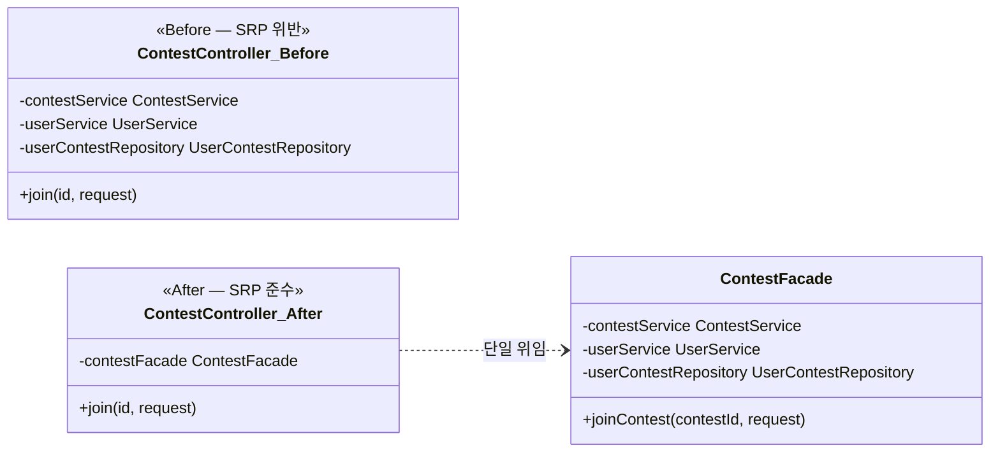
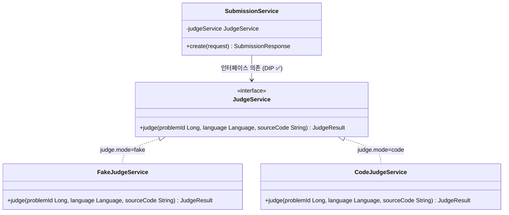
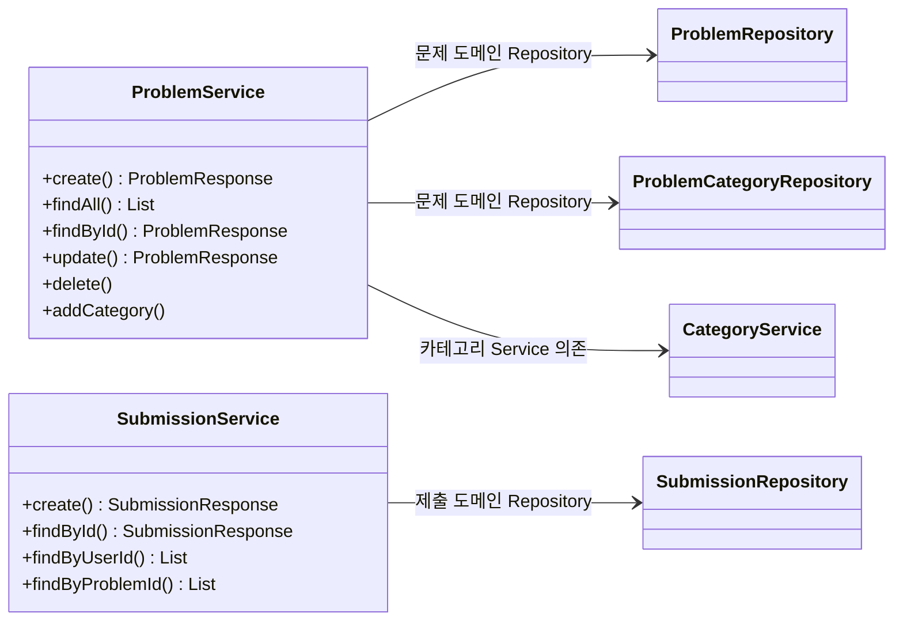
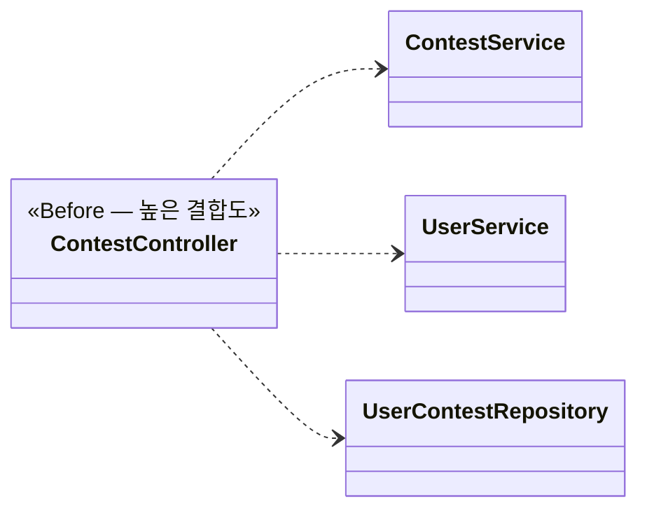
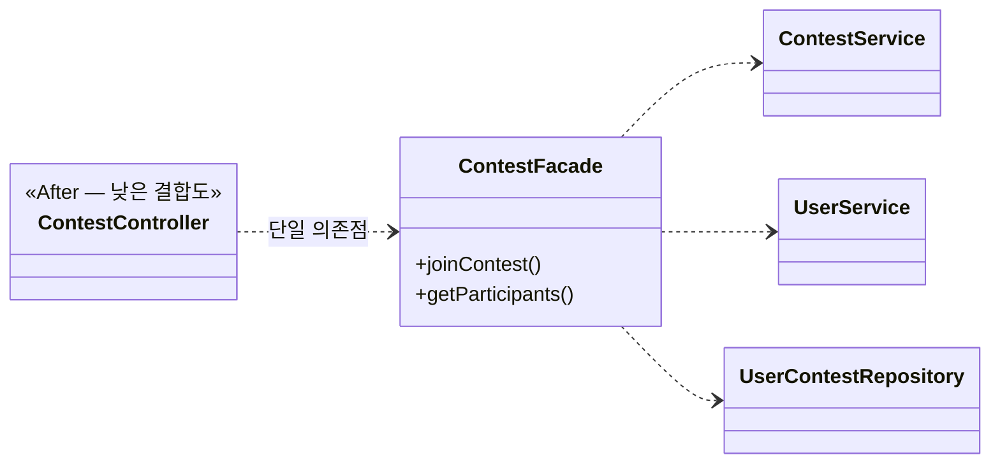

# 응집도·결합도 관점 명세서

본 명세서는 [04 클래스 다이어그램 확정 명세서](04_클래스_다이어그램_확정_명세서.md)가 확정한 클래스 구조 위에서, 코딩 테스트 플랫폼 백엔드에 적용된 SOLID 원칙과 응집도(Cohesion)·결합도(Coupling) 수준을 실제 소스 코드를 근거로 분석하는 **품질 정제** 산출물이다. [07 디자인 패턴 적용 명세서](07_디자인패턴_적용내용_명세서.md)에서 확정된 패턴(Strategy·공통 헬퍼 추출·Facade·Builder·AOP)이 각 원칙을 어떻게 실현하는지 연결하여 설명한다.

## 0. 도입 및 목적

본 명세서는 소프트웨어 공학 단계 중 **품질 정제** 활동(SOLID 원칙 적용)의 산출물로서, 목표는 설계 유연성(Quality)을 확보하는 것이다. 04 명세서가 "무엇이 있는가(Structure)"를 다뤘다면, 본 명세서는 "그 구조가 얼마나 좋은가(Quality)"를 SOLID 원칙·응집도·결합도 세 관점에서 분석한다.

각 원칙의 서술 형식은 다음 순서를 따른다.

1. **정의** — 원칙 내용
2. **적용 위치** — 실제 패키지·클래스명
3. **Before / After** — 위반 시 발생할 문제와 현 구조의 비교
4. **효과** — 설계 개선 내용

> 본 명세서의 기준은 Phase 1(영속성·Docker)부터 Phase 5(프런트엔드 연동)까지 모두 구현 완료된 상태이며, 클래스명·메서드 시그니처는 `src/main/java/com/example/swedemo/` 실제 소스에 정합한다.

---

## 1. SOLID 원칙 적용 개요

본 시스템에서 SOLID 다섯 원칙이 어느 위치에서 어떤 메커니즘으로 실현되는지 요약한다.

| 원칙 | 핵심 적용 | 코드 근거 | 연관 패턴 (07 §) |
|------|----------|-----------|-----------------|
| SRP | 도메인별 Service 분리, Facade로 컨트롤러 책임 한정 | `ProblemService`, `ContestFacade` | Facade (§5) |
| OCP | 채점 방식·실행 언어를 인터페이스로 추상화 | `JudgeService`, `LanguageRunner` | Strategy (§2, §3) |
| LSP | JudgeService·LanguageRunner 구현체 대체 가능 | `FakeJudgeService`, `CodeJudgeService` | Strategy (§2) |
| ISP | 단일 메서드/최소 연산 인터페이스 | `JudgeService`(1 메서드), `LanguageRunner`(3 메서드) | — |
| DIP | 구체 클래스가 아닌 인터페이스에 의존 | `SubmissionService.judgeService`, `CodeJudgeService.runners` | Strategy (§2, §3) |

---

## 2. SRP — 단일 책임 원칙

### 2.1 정의

**단일 책임 원칙(Single Responsibility Principle)**: 클래스는 변경 이유가 하나여야 한다. 하나의 클래스가 하나의 역할·도메인만 담당해야 한다.

### 2.2 도메인 서비스 SRP

각 Service 클래스는 하나의 도메인만 담당한다.

| 클래스 | 담당 도메인 | 패키지 | 책임 범위 |
|--------|-----------|--------|----------|
| `ProblemService` | 문제 | `problem.service` | 문제 CRUD, 카테고리 연결 |
| `SubmissionService` | 제출 | `submission.service` | 제출 생성·조회, UserProblem 갱신 |
| `ContestService` | 대회 | `contest.service` | 대회 CRUD, 문제·감독자 등록 |
| `ExamService` | 시험 | `exam.service` | 시험 CRUD, 문제·감독자 등록 |
| `UserService` | 사용자 | `user.service` | 사용자 CRUD |
| `CategoryService` | 카테고리 | `category.service` | 카테고리 CRUD |
| `ContestAggregationService` | 대회 집계 | `batch` | 종료 대회 마감·순위 산출 |
| `ExamAggregationService` | 시험 집계 | `batch` | 종료 시험 마감·합격 판정 |

`ProblemService`가 제출 도메인 로직을 포함하지 않고, `SubmissionService`가 대회 도메인 로직을 포함하지 않는 것이 SRP 준수의 직접적 증거다. 배치 계층도 대회 집계(`ContestAggregationService`)와 시험 집계(`ExamAggregationService`)를 분리하여 각각이 단일 집계 유형만 담당한다.

### 2.3 컨트롤러 SRP — Facade를 통한 책임 위임

대회 참가 신청은 Contest·User·UserContest 세 도메인을 조합해야 한다. 이 조합 로직이 컨트롤러에 있으면, 컨트롤러가 "HTTP 매핑 변경"과 "비즈니스 규칙 변경"이라는 두 가지 변경 이유를 갖게 된다.

**Before** — 컨트롤러가 조합 로직 직접 수행 (위반 가정):

```
ContestController
  ├─ ContestService.getById(id)               // 대회 도메인
  ├─ UserService.getById(userId)              // 사용자 도메인
  ├─ UserContestRepository.existsByContestAndUser() // 중복 검사
  └─ UserContestRepository.save(userContest)  // 저장
```

이 구조에서 컨트롤러는 "중복 검사 방식 변경"과 "HTTP 요청 형식 변경" 모두에 의해 수정된다.

**After** — `ContestFacade`로 조합 로직 위임:

```java
// ContestController — HTTP 처리만 담당
@PostMapping("/{id}/join")
public ResponseEntity<ApiResponse<UserContestResponse>> join(
        @PathVariable Long id, @RequestBody ContestJoinRequest request) {
    return ResponseEntity.ok(ApiResponse.success(contestFacade.joinContest(id, request)));
}
```

`ContestFacade.joinContest()`가 Contest·User 조회, 중복 검사, `UserContest` 저장을 단독으로 수행한다. 컨트롤러의 변경 이유는 "HTTP 매핑·인증 규칙 변경"으로 한정된다.



`ExamFacade`도 동일한 구조로 시험 응시 신청(`takeExam`, `getResults`)의 조합 흐름을 컨트롤러로부터 분리한다.

### 2.4 횡단 관심사 SRP — GlobalExceptionHandler

예외 처리를 각 컨트롤러에 `try-catch`로 분산하면, 컨트롤러는 도메인 처리와 에러 응답 형식이라는 두 관심사를 함께 갖는다. `@RestControllerAdvice`로 `GlobalExceptionHandler` 한 클래스에 전역 예외 처리를 집중시켜 컨트롤러는 정상 흐름만 서술한다(07 §7.1).

### 2.5 적용 효과

| 효과 | 설명 |
|------|------|
| 변경 국소화 | 도메인 로직 변경은 해당 Service·Facade만 수정 |
| 컨트롤러 단순화 | 컨트롤러는 HTTP 매핑·인증·응답 래핑에만 집중 |
| 테스트 용이 | 도메인별 Service를 독립적으로 단위 테스트 가능 |

---

## 3. OCP — 개방-폐쇄 원칙

### 3.1 정의

**개방-폐쇄 원칙(Open/Closed Principle)**: 소프트웨어 개체는 확장에 열려 있고, 수정에 닫혀 있어야 한다. 새 기능 추가가 기존 코드 수정 없이 새 클래스 추가로 가능해야 한다.

### 3.2 채점 방식 OCP — JudgeService (07 §2 연계)

`SubmissionService`가 채점 방식을 조건 분기로 처리하면, 채점 방식이 추가될 때마다 `SubmissionService`를 수정해야 한다(OCP 위반).

**Before** — `SubmissionService` 내부 분기 (위반 가정):

```java
JudgeResult result;
if (judgeMode.equals("fake")) {
    result = JudgeResult.builder().status(SubmissionStatus.AC).score(100).build();
} else if (judgeMode.equals("code")) {
    result = runInProcess(problemId, language, sourceCode);
}
// 새 방식 추가 시 else if 추가 → SubmissionService 수정 필요 (OCP 위반)
```

**After** — 인터페이스 추상화:

```java
// SubmissionService.java — JudgeService 인터페이스만 의존
private final JudgeService judgeService;

JudgeResult result = judgeService.judge(
        problem.getProblemId(), request.getSubmissionLanguage(), request.getSubmittedCode());
```

새 채점 방식(예: `DockerIsolatedJudgeService`)을 추가할 때 `SubmissionService`는 수정하지 않는다. `JudgeService`를 구현하는 새 클래스와 `@ConditionalOnProperty` 조건만 추가하면 된다.

### 3.3 언어별 실행 OCP — LanguageRunner (07 §3 연계)

`CodeJudgeService`가 언어별 실행을 직접 분기하면, 언어 추가 시마다 `CodeJudgeService`를 수정해야 한다.

**Before** — `CodeJudgeService` 내부 언어 분기 (위반 가정):

```java
if (language == Language.PYTHON) {
    // python3 실행 코드 ...
} else if (language == Language.JAVA) {
    // javac + java 실행 코드 ...
}
// C++ 지원 추가 시 → CodeJudgeService 수정 (OCP 위반)
```

**After** — `LanguageRunner` 인터페이스로 디스패치:

```java
// CodeJudgeService 생성자 — List<LanguageRunner>를 Map으로 수집
this.runners = runnerList.stream()
        .collect(Collectors.toMap(LanguageRunner::language, Function.identity()));

// judge 메서드 — 언어에 맞는 러너를 Map에서 조회
LanguageRunner runner = runners.get(language);
runner.prepare(workDir, sourceCode);
ExecResult result = runner.run(workDir, tc.getInputData(), timeLimitMs);
```

C++·JavaScript·Kotlin 러너는 `AbstractProcessRunner`를 상속한 새 `@Component` 클래스로 추가하기만 하면 Spring이 자동으로 `runners` Map에 포함시킨다. `CodeJudgeService`는 수정하지 않는다.

### 3.4 적용 효과

| 효과 | 설명 |
|------|------|
| 채점 방식 확장 | 새 JudgeService 구현체 클래스 추가만으로 채점 방식 교체 가능 |
| 언어 확장 | 새 LanguageRunner 구현체 추가만으로 지원 언어 확장 (IMPLEMENTATION_PROGRESS: C/CPP/JS/Kotlin 러너 향후 계획) |
| 핵심 로직 불변 | `SubmissionService`·`CodeJudgeService`는 변경 없이 기능 확장 달성 |

---

## 4. LSP — 리스코프 치환 원칙

### 4.1 정의

**리스코프 치환 원칙(Liskov Substitution Principle)**: 상위 타입 객체를 하위 타입 객체로 교체해도 프로그램의 정확성이 유지되어야 한다.

### 4.2 JudgeService 구현체 대체 가능성

`SubmissionService`는 `JudgeService` 인터페이스에만 의존한다. `FakeJudgeService`와 `CodeJudgeService` 어느 구현체가 주입되어도 `SubmissionService.create()` 메서드는 동일하게 동작한다.

| 구현체 | 활성 조건 | `judge()` 계약 준수 여부 |
|--------|----------|--------------------------|
| `FakeJudgeService` | `judge.mode=fake` (기본값) | `JudgeResult`(status=AC, score=100) 반환 — 계약 준수 ✅ |
| `CodeJudgeService` | `judge.mode=code` (docker) | `JudgeResult`(status∈{AC,WA,TLE,MLE,RE,CE}, score∈{0,100}) 반환 — 계약 준수 ✅ |

두 구현체 모두 `judge(Long problemId, Language language, String sourceCode): JudgeResult` 시그니처를 정확히 구현하며, 정상 흐름에서 `null`을 반환하거나 선언되지 않은 예외를 던지지 않는다. `SubmissionService`는 어느 구현체가 주입되었는지 알지 못하고 알 필요도 없다.

### 4.3 LanguageRunner 구현체 대체 가능성

`CodeJudgeService`는 `Map<Language, LanguageRunner>`를 통해 러너에 접근한다. `PythonRunner`와 `JavaRunner` 모두 `LanguageRunner` 계약을 준수한다.

| 구현체 | `language()` | `prepare()` 동작 | `run()` 동작 |
|--------|-------------|-------------------|-------------|
| `PythonRunner` | `Language.PYTHON` | `Main.py` 작성 (컴파일 없음) | `python3 Main.py` 실행 |
| `JavaRunner` | `Language.JAVA` | `Main.java` 작성 → `javac` 컴파일 | `java -cp . Main` 실행 |

`CodeJudgeService`는 `runner.prepare()`와 `runner.run()`을 호출할 뿐, 런타임 타입을 `instanceof`로 확인하지 않는다. 인터프리터 언어(`PythonRunner`)와 컴파일 언어(`JavaRunner`)를 동일한 인터페이스로 처리하는 것이 LSP의 직접적 적용이다.

### 4.4 적용 효과

| 효과 | 설명 |
|------|------|
| `instanceof` 제거 | 런타임 타입 검사 없이 다형성으로 언어별 실행 |
| 안전한 교체 | `FakeJudgeService` → `CodeJudgeService` 전환 시 `SubmissionService` 무변경 |
| 향후 확장 신뢰 | LSP 준수 보장 하에 새 러너 추가 시 기존 채점 흐름 영향 없음 |

---

## 5. ISP — 인터페이스 분리 원칙

### 5.1 정의

**인터페이스 분리 원칙(Interface Segregation Principle)**: 클라이언트는 자신이 사용하지 않는 메서드에 의존하도록 강요받아서는 안 된다. 인터페이스는 클라이언트가 실제로 사용할 연산만 노출해야 한다.

### 5.2 JudgeService — 최소 인터페이스

```java
public interface JudgeService {
    JudgeResult judge(Long problemId, Language language, String sourceCode);
}
```

`JudgeService`는 단 하나의 메서드만 선언한다. `SubmissionService`가 필요로 하는 연산(채점 실행)만 포함한다. 채점 기록 조회(`findResult()`), 채점 통계(`getStats()`) 같은 부수 연산을 인터페이스에 추가했다면, 구현체들은 사용하지 않는 메서드를 빈 구현으로 채워야 하는 부담이 생긴다.

### 5.3 LanguageRunner — 최소 인터페이스

```java
public interface LanguageRunner {
    Language language();                                             // 담당 언어 식별
    void prepare(Path dir, String source) throws CompileException;  // 소스 작성 (+ 컴파일)
    ExecResult run(Path dir, String input, long timeoutMs);         // 실행
}
```

세 메서드 모두 `PythonRunner`와 `JavaRunner`가 빠짐없이 구현하고 사용한다. 가상의 "fat 인터페이스" — 예컨대 `getMemoryLimit()`, `getSupportedVersion()`, `getDockerImage()` — 를 추가하면 두 러너 모두 관련 없는 메서드를 구현해야 한다. 현 설계는 이를 방지한다.

### 5.4 도메인 서비스 간 ISP — 예방적 준수

ISP는 클라이언트가 사용하지 않는 메서드를 **인터페이스**를 통해 강제로 의존하게 되는 상황을 방지하는 원칙이다. 구체 클래스의 메서드 일부만 호출하는 것은 ISP 문제가 아니다.

본 시스템은 도메인 Service 클래스에 대한 **별도 통합 인터페이스를 두지 않는** 설계를 택하여, ISP 위반이 구조적으로 발생하지 않는다. 가상의 위반 구조 — 예컨대 문제·제출·채점 연산을 하나의 `ProblemAndSubmissionService` 인터페이스로 묶는 경우 — 라면, 제출 기능만 필요한 클라이언트도 문제 관련 추상 메서드에 의존해야 한다. 현 설계는 도메인 경계를 Service 클래스 단위로 분리함으로써 이 구조적 위험을 제거한다.

### 5.5 적용 효과

| 효과 | 설명 |
|------|------|
| 구현 부담 최소화 | 인터페이스 구현체가 실제로 필요한 연산만 구현 |
| 변경 격리 | 특정 구현체에만 필요한 연산을 인터페이스에 강제하지 않아 변경 영향 최소화 |

---

## 6. DIP — 의존성 역전 원칙

### 6.1 정의

**의존성 역전 원칙(Dependency Inversion Principle)**: 고수준 모듈은 저수준 모듈에 의존하면 안 된다. 둘 모두 추상화(인터페이스)에 의존해야 한다.

### 6.2 SubmissionService → JudgeService 인터페이스 의존

```java
@Service
@RequiredArgsConstructor
@Transactional(readOnly = true)
public class SubmissionService {
    private final JudgeService judgeService;  // 인터페이스 의존 ← DIP ✅
    // (위반 가정) private final FakeJudgeService judgeService; // 구체 클래스 의존
}
```

고수준 모듈 `SubmissionService`는 저수준 모듈 `FakeJudgeService`·`CodeJudgeService`에 직접 의존하지 않는다. Spring의 `@ConditionalOnProperty`가 `judge.mode` 프로퍼티를 읽어 런타임에 올바른 구현체를 주입한다.



### 6.3 CodeJudgeService → LanguageRunner 인터페이스 의존

```java
public class CodeJudgeService implements JudgeService {
    private final Map<Language, LanguageRunner> runners; // 인터페이스 Map ← DIP ✅

    public CodeJudgeService(TestcaseRepository testcaseRepository,
                            List<LanguageRunner> runnerList,
                            @Value("${judge.time-limit-ms:2000}") long timeLimitMs) {
        this.runners = runnerList.stream()
                .collect(Collectors.toMap(LanguageRunner::language, Function.identity()));
    }
}
```

`CodeJudgeService`는 `PythonRunner`·`JavaRunner`의 구체 타입을 전혀 참조하지 않는다. Spring이 `@Component` 러너들을 `List<LanguageRunner>`로 자동 수집하고, 생성자에서 언어별 `Map`으로 조립한다.

### 6.4 Spring DI와 생성자 주입

본 시스템의 모든 Service·Facade·Controller는 `@RequiredArgsConstructor`와 `final` 필드를 통해 생성자 주입을 일관되게 사용한다.

| 장점 | 설명 |
|------|------|
| 불변성 | `final` 필드로 주입 후 재할당 불가 |
| 테스트 용이 | 생성자 호출로 Mock 주입 가능 (Spring 컨텍스트 불필요) |
| 순환 의존 탐지 | 생성자 주입은 순환 의존을 애플리케이션 시작 시점에 탐지 |

### 6.5 적용 효과

| 효과 | 설명 |
|------|------|
| 구현체 교체 투명성 | `judge.mode` 프로퍼티만 변경하면 채점 구현체 교체 — 상위 코드 수정 없음 |
| 언어 추가 투명성 | 새 `LanguageRunner` 빈 추가 시 `CodeJudgeService` 수정 없음 |
| 테스트 독립성 | Mock `JudgeService` 주입으로 `SubmissionService` 단독 테스트 가능 |

---

## 7. 응집도 분석

### 7.1 개요

응집도는 모듈 내부 구성 요소들이 얼마나 밀접하게 관련되어 있는가를 나타낸다. 높을수록 좋다. 주요 응집도 수준과 본 시스템의 해당 사례는 다음과 같다.

| 응집도 수준 | 정의 | 본 시스템 해당 사례 |
|------------|------|--------------------|
| 기능적(Functional) | 모듈이 단 하나의 기능을 수행 | 각 도메인 Service, `ContestFacade`, `ExamFacade` |
| 순차적(Sequential) | 이전 단계의 출력이 다음 단계의 입력 | `ContestAggregationService` (대회 조회 → 참가자 집계 → 랭킹 산출 → 마감) |
| 절차적(Procedural) | 처리 순서로 묶임 | `SubmissionService.create()` (조회 → 채점 → 저장 → UserProblem 갱신) |

### 7.2 기능적 응집 사례

#### 7.2.1 ProblemService

`ProblemService`는 문제 도메인의 CRUD와 카테고리 연결만 담당한다. 제출·대회·시험 도메인의 비즈니스 로직을 포함하지 않는다.

```java
@Service @RequiredArgsConstructor @Transactional(readOnly = true)
public class ProblemService {
    private final ProblemRepository problemRepository;
    private final ProblemCategoryRepository problemCategoryRepository;
    private final CategoryService categoryService;

    public ProblemResponse create(...)   { ... }  // 문제 생성
    public List<ProblemResponse> findAll() { ... } // 목록 조회
    public ProblemResponse findById(...) { ... }  // 단건 조회
    public ProblemResponse update(...)   { ... }  // 수정
    public void delete(...)              { ... }  // 삭제
    public void addCategory(...)         { ... }  // 카테고리 연결
}
```

여섯 가지 연산 모두 "문제 관리"라는 단일 기능에 집중되어 있다.

#### 7.2.2 ContestFacade

`ContestFacade`는 대회 참가라는 단일 복합 흐름만 담당한다. 대회 CRUD(`ContestService`)와 사용자 CRUD(`UserService`)는 각 Service에 위임하고, Facade 자신은 두 도메인을 조합하는 역할에만 집중한다.

```java
@Service @RequiredArgsConstructor
public class ContestFacade {
    public UserContestResponse joinContest(...)           { ... }  // 참가 신청
    public List<UserContestResponse> getParticipants(...) { ... }  // 참가자 조회
}
```

`ExamFacade`도 동일한 구조로 시험 응시(`takeExam`)와 결과 조회(`getResults`)를 단일 진입점으로 제공한다.

#### 7.2.3 배치 서비스 분리

`ContestAggregationService`와 `ExamAggregationService`는 각각 대회 집계와 시험 집계를 독립적으로 담당한다. 단일 `AggregationService`로 통합되었다면, 대회 집계 규칙 변경(예: 순위 산출 방식)이 시험 집계 코드를 함께 수정해야 하는 상황이 발생한다.

### 7.3 응집도 다이어그램



각 Service는 자신의 도메인 Repository에만 직접 접근하며, 타 도메인 Repository를 직접 참조하지 않는다. Service 간 의존(`ProblemService → CategoryService`)은 도메인 조합에 한정되며, Repository 계층 침범과는 구별된다.

---

## 8. 결합도 분석

### 8.1 개요

결합도는 모듈 간 의존 정도를 나타낸다. 낮을수록 좋다. 본 시스템의 결합도 수준 현황은 다음과 같다.

| 결합도 수준 | 정의 | 본 시스템 상태 |
|------------|------|---------------|
| 내용 결합(Content) | 타 모듈 내부 구현에 직접 접근 | ❌ 없음 |
| 공통 결합(Common) | 전역 변수·공유 상태 의존 | ❌ 없음 (상태는 DB 경유) |
| 제어 결합(Control) | 플래그로 타 모듈 흐름 제어 | ❌ 없음 (Strategy로 제거됨) |
| 스탬프 결합(Stamp) | 구조체(DTO) 전달 | △ DTO 전달 (계층 간 불가피) |
| 데이터 결합(Data) | 단순 데이터 전달 | ✅ 목표 수준 |
| 메시지 결합(Message) | 인터페이스 메서드 호출 | ✅ `JudgeService`, `LanguageRunner` |

### 8.2 인터페이스 경계로 결합도 감소

`SubmissionService`와 `judge` 패키지 사이의 결합은 `JudgeService` 인터페이스 하나로 제한된다.

- `SubmissionService`는 `FakeJudgeService`·`CodeJudgeService`의 필드·구현 세부사항을 전혀 알지 못한다.
- `judge` 패키지 내부 구현이 변경되어도 `JudgeService` 인터페이스가 유지되는 한 `SubmissionService`는 수정 불필요하다.

`CodeJudgeService`와 `judge.runner` 패키지 사이도 동일한 구조다. `CodeJudgeService`는 `LanguageRunner` 인터페이스에만 의존하며, `PythonRunner`·`JavaRunner`의 내부 구현(`writeSource`, `compile`, `execute` protected 헬퍼 호출 방식)을 참조하지 않는다.

### 8.3 Facade를 통한 도메인 간 결합도 감소

**Before** — `ContestController`가 여러 도메인에 직접 결합:



`ContestController`의 직접 의존 수: 3개. `UserContestRepository` 또는 `UserService`가 변경되면 `ContestController`도 영향을 받는다.

**After** — Facade를 통한 결합도 감소:



`ContestController`의 직접 의존 수: 1개. `UserContestRepository`가 변경되어도 `ContestFacade`만 영향 받고 `ContestController`는 무관하다.

### 8.4 SubmissionService의 허용 결합도

`SubmissionService`는 `UserService`, `ProblemService`, `JudgeService`, `SubmissionRepository`, `UserProblemRepository` 다섯 대상에 의존한다.

| 의존 대상 | 의존 유형 | 평가 |
|----------|----------|------|
| `UserService` | 서비스 간 교차 도메인 | 제출 생성 시 User 조회 불가피 |
| `ProblemService` | 서비스 간 교차 도메인 | 제출 생성 시 Problem 조회 불가피 |
| `JudgeService` | 인터페이스(메시지 결합) | DIP로 결합도 최소화 ✅ |
| `SubmissionRepository` | 자체 도메인 Repository | 적절 ✅ |
| `UserProblemRepository` | 연관 도메인 Repository | 제출 결과로 UserProblem 갱신 필요, 허용 범위 ✅ |

`SubmissionService`가 여러 의존을 갖는 것은 제출 생성이 본질적으로 다도메인 조합이기 때문이다. 그러나 `JudgeService`는 인터페이스 의존(메시지 결합)으로 구조화하여 judge 패키지 내부 변경 격리를 달성했다.

---

## 9. 전체 요약

### 9.1 SOLID 준수 현황

| 원칙 | 준수 수준 | 핵심 근거 |
|------|----------|----------|
| SRP | ✅ 준수 | 도메인별 Service 분리, `ContestFacade`·`ExamFacade`로 컨트롤러 SRP 보장, `GlobalExceptionHandler`로 예외 처리 집중화 |
| OCP | ✅ 준수 | `JudgeService`·`LanguageRunner` 인터페이스로 기존 코드 수정 없는 채점 방식·언어 확장 |
| LSP | ✅ 준수 | `FakeJudgeService`·`CodeJudgeService` 상호 대체 가능, `PythonRunner`·`JavaRunner` 상호 대체 가능 (`instanceof` 없음) |
| ISP | ✅ 준수 | `JudgeService`(1 메서드), `LanguageRunner`(3 메서드) — 구현체가 사용하지 않는 메서드 강제 없음 |
| DIP | ✅ 준수 | 모든 핵심 의존이 인터페이스 경유, `@RequiredArgsConstructor` 생성자 주입 일관 적용 |

### 9.2 응집도·결합도 현황

| 관점 | 수준 | 핵심 근거 |
|------|------|----------|
| 응집도 | 높음 (기능적) | 각 Service가 단일 도메인만 담당, 배치 서비스도 대회·시험 분리, Facade가 복합 흐름만 집중 |
| 결합도 | 낮음 (메시지/데이터) | `JudgeService`·`LanguageRunner` 인터페이스로 패키지 간 결합 최소화, Facade로 컨트롤러 직접 결합 제거 |

### 9.3 패턴–원칙 연결

07 명세서의 디자인 패턴과 SOLID 원칙은 다음과 같이 상호 강화 관계에 있다.

| 패턴 (07 §) | 실현하는 원칙 |
|------------|-------------|
| Strategy — JudgeService (§2) | OCP, LSP, DIP, ISP |
| Strategy — LanguageRunner (§3) | OCP, LSP, DIP, ISP |
| 공통 헬퍼 추출 변형 — AbstractProcessRunner (§4) | SRP (프로세스 인프라 로직 분리), DRY |
| Facade — ContestFacade·ExamFacade (§5) | SRP (컨트롤러·서비스 책임 분리), 결합도 감소 |
| Builder — @Builder (§6) | SRP (생성 로직 분리) |
| AOP — @RestControllerAdvice (§7.1) | SRP (예외 처리 집중화) |
| AOP — @Transactional 15개 클래스 (§7.2) | SRP (트랜잭션 관심사 분리) |

> 본 명세서에서 "공통 헬퍼 추출 변형"·"@Transactional 15개"는 [07 디자인 패턴 명세서](07_디자인패턴_적용내용_명세서.md) 확정 내용과 정합한다.
