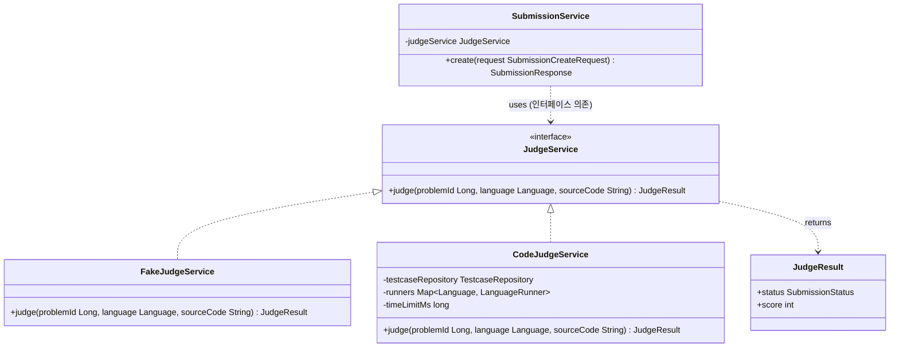
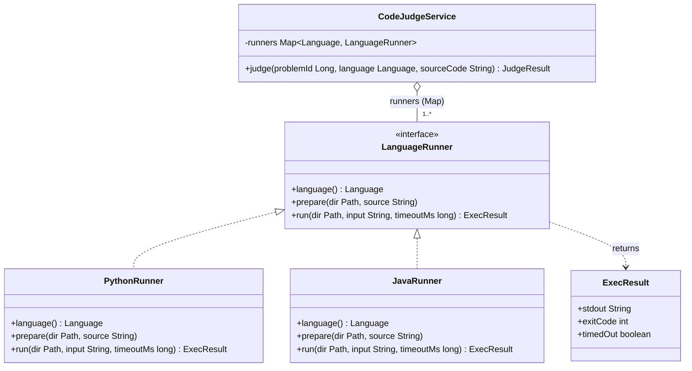
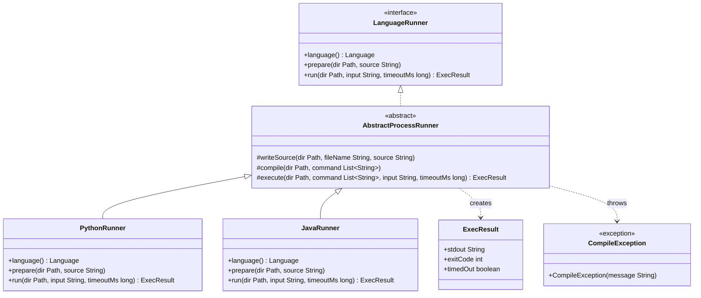
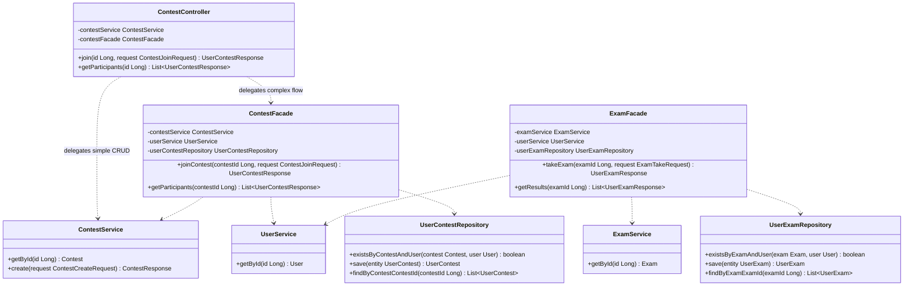
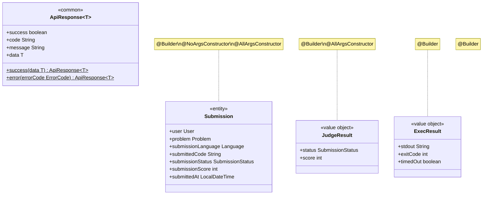
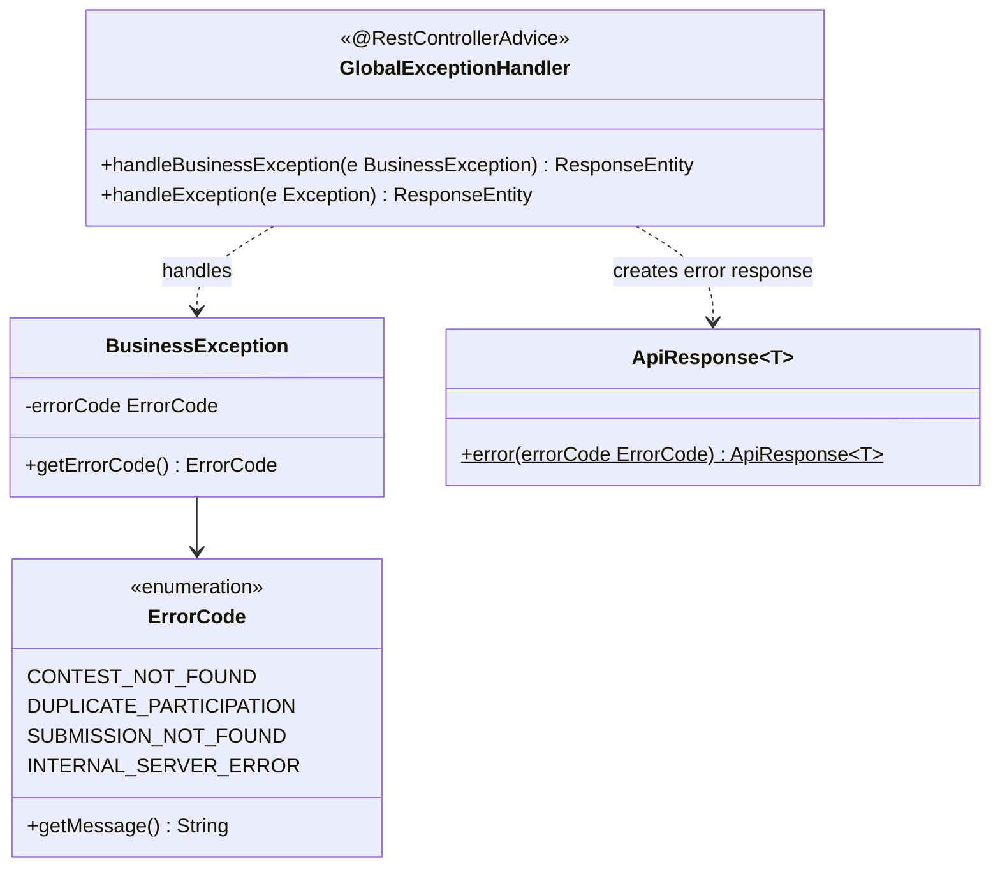
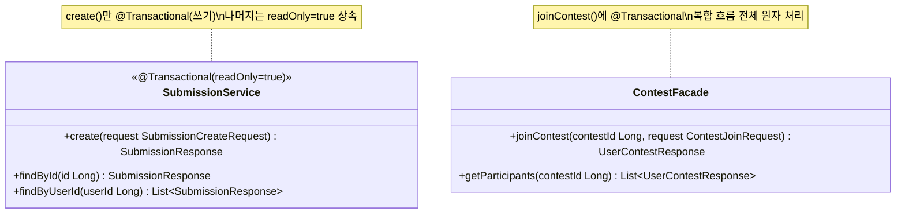
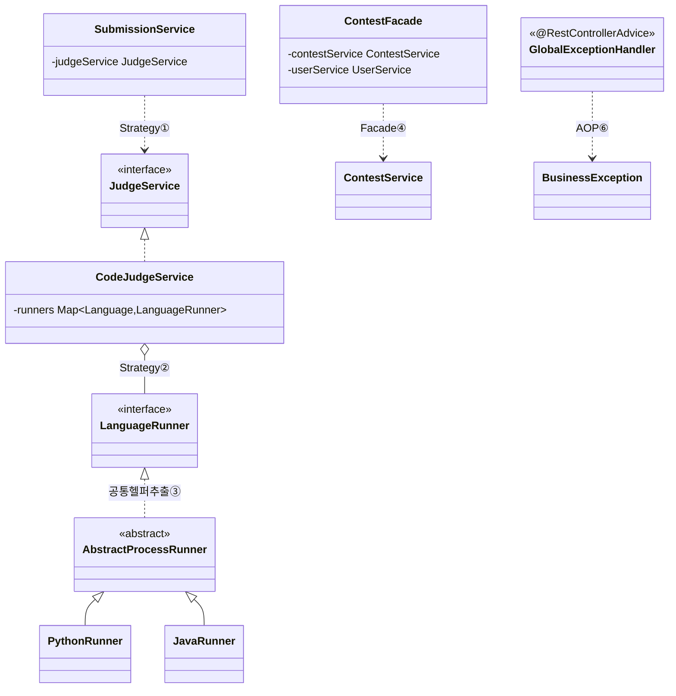

# 디자인 패턴 적용 내용 명세서

본 명세서는 [04 클래스 다이어그램 확정 명세서](04_클래스_다이어그램_확정_명세서.md)가 확정한 클래스 구조 위에서, 코딩 테스트 플랫폼 백엔드에 적용된 GoF 디자인 패턴과 Spring AOP 기반 횡단 관심사 패턴을 식별하고, 각 패턴의 적용 위치·적용 이유·효과를 실제 소스 코드를 근거로 정리한 최적화 솔루션 명세서이다.

## 0. 도입 및 목적

본 명세서는 소프트웨어 공학 단계 중 **최적화 솔루션** 활동(디자인 패턴 적용)의 산출물로서, 직전 산출물인 [04 클래스 다이어그램 확정 명세서](04_클래스_다이어그램_확정_명세서.md)가 결정한 클래스 구조를 입력으로 받아, "그 구조를 어떻게(HOW) 검증된 패턴으로 구체화하는가"를 기록하는 것을 목적으로 한다.

04 명세서가 클래스 간 관계와 인터페이스를 **확정**한 문서라면, 본 명세서는 그 결정의 **설계 노하우 근거**를 GoF 패턴 언어로 명명하고, 각 패턴이 해결한 설계 문제와 그 효과를 코드 수준에서 검증하는 문서이다. 패턴은 코드에서 실제로 확인된 것만 기술하며, 미구현 항목은 **향후**로 명시한다.

> 본 명세서의 기준은 Phase 1(영속성·Docker)부터 Phase 5(프런트엔드 연동)까지 모두 구현 완료된 상태이며, 클래스명·메서드 시그니처는 `src/main/java/com/example/swedemo/` 실제 소스에 정합한다.

## 1. 패턴 적용 개요

본 시스템에 적용된 패턴을 GoF 분류와 Spring 관용구로 나누어 정리한다.

| # | 패턴 | 분류 | 적용 영역 | 핵심 클래스 |
|---|------|------|-----------|------------|
| 1 | Strategy | 행위(Behavioral) | 채점 방식 선택 | `JudgeService`, `FakeJudgeService`, `CodeJudgeService` |
| 2 | Strategy | 행위(Behavioral) | 언어별 실행 전략 | `LanguageRunner`, `PythonRunner`, `JavaRunner` |
| 3 | Template Method (변형) | 행위(Behavioral) | 프로세스 실행 공통 헬퍼 추출 | `AbstractProcessRunner` |
| 4 | Facade | 구조(Structural) | 대회·시험 복합 흐름 | `ContestFacade`, `ExamFacade` |
| 5 | Builder | 생성(Creational) | 다필드 객체 생성 | `Submission`, `JudgeResult`, `ExecResult`, `ApiResponse<T>` 외 |
| 6 | AOP — @RestControllerAdvice | Spring 관용구 | 전역 예외 처리 | `GlobalExceptionHandler` |
| 7 | AOP — @Transactional | Spring 관용구 | 선언적 트랜잭션 | `SubmissionService`, `ContestFacade` 외 13개 Service/Facade (총 15개) |

> 패턴 1·2는 모두 Strategy이지만 서로 다른 계층에서 독립적으로 적용된다. 패턴 1은 채점 **방식**(Mock vs. 실행) 교체를 목적으로 하고, 패턴 2는 채점 **언어**(Python, Java)별 실행 명령 교체를 목적으로 하므로 별도 절에서 다룬다.

---

## 2. Strategy 패턴 — 채점 방식 선택

### 2.1 적용 위치

| 역할 | 클래스 | 패키지 |
|------|--------|--------|
| 전략 인터페이스(Context) | `JudgeService` | `com.example.swedemo.judge` |
| 전략 구현체 — Mock 채점 | `FakeJudgeService` | `com.example.swedemo.judge` |
| 전략 구현체 — 실제 실행 채점 | `CodeJudgeService` | `com.example.swedemo.judge` |
| 전략 사용 클래스 | `SubmissionService` | `com.example.swedemo.submission.service` |
| 전략 선택 메커니즘 | `@ConditionalOnProperty(name = "judge.mode")` | `application.properties` |

### 2.2 적용 이유 — 해결한 문제 상황

제출 채점은 환경에 따라 두 가지 방식이 필요하다. 로컬·테스트 환경에서는 코드를 실행하지 않고 항상 AC를 반환하는 Mock 채점이 필요하고, Docker 운영 환경에서는 실제 코드를 실행하는 채점이 필요하다. 이 차이를 `SubmissionService` 내부 `if(mode == "fake") ... else ...` 분기로 구현하면, 환경·언어가 추가될 때마다 핵심 비즈니스 로직을 직접 수정해야 하여 OCP(개방-폐쇄 원칙)를 위반한다.

Strategy 패턴으로 채점 방식을 `JudgeService` 인터페이스 뒤에 추상화하면, `SubmissionService`는 인터페이스에만 의존하므로 구현체가 교체되어도 제출 흐름이 전혀 변하지 않는다(DIP).

```
SubmissionService  →  JudgeService(interface)  ←  FakeJudgeService
                                                ←  CodeJudgeService
```

`SubmissionService`의 실제 의존 선언 (`src/.../submission/service/SubmissionService.java`):

```java
@Service
@RequiredArgsConstructor
@Transactional(readOnly = true)
public class SubmissionService {
    private final JudgeService judgeService;   // 인터페이스만 의존

    @Transactional
    public SubmissionResponse create(SubmissionCreateRequest request) {
        JudgeResult result = judgeService.judge(
            problem.getProblemId(),
            request.getSubmissionLanguage(),
            request.getSubmittedCode()
        );
        // ...
    }
}
```

전략 선택은 `@ConditionalOnProperty`로 설정 값에 따라 스프링 컨테이너가 빈을 택일한다.

- `FakeJudgeService` — `matchIfMissing = true`: `judge.mode` 미지정 또는 `fake` 일 때 활성(local/test)
- `CodeJudgeService` — `judge.mode=code` 일 때 활성(docker/운영)

```java
// FakeJudgeService.java
@Service
@ConditionalOnProperty(name = "judge.mode", havingValue = "fake", matchIfMissing = true)
public class FakeJudgeService implements JudgeService {
    @Override
    public JudgeResult judge(Long problemId, Language language, String sourceCode) {
        return JudgeResult.builder().status(SubmissionStatus.AC).score(100).build();
    }
}

// CodeJudgeService.java
@Service
@ConditionalOnProperty(name = "judge.mode", havingValue = "code")
public class CodeJudgeService implements JudgeService {
    @Override
    public JudgeResult judge(Long problemId, Language language, String sourceCode) {
        // ProcessBuilder로 실제 코드 실행 후 테스트케이스 비교
    }
}
```

### 2.3 적용 효과

| 효과 | 설명 |
|------|------|
| OCP 준수 | 새 채점 방식 추가 시 `JudgeService` 구현 빈만 추가하고, `SubmissionService`는 수정 불필요 |
| DIP 준수 | 상위 레이어(`SubmissionService`)가 하위 구현(`CodeJudgeService`)이 아닌 인터페이스에 의존 |
| 환경 분리 | 로컬(`judge.mode=fake`)과 운영(`judge.mode=code`)의 채점 동작 차이를 코드 분기 없이 설정으로 흡수 |
| LSP 준수 | `SubmissionService`는 구현체 구분 없이 `JudgeService.judge()` 계약만 신뢰하므로 구현체 대체 가능 |

### 2.4 클래스 다이어그램



---

## 3. Strategy 패턴 — 언어별 실행 전략

### 3.1 적용 위치

| 역할 | 클래스 | 패키지 |
|------|--------|--------|
| 전략 인터페이스 | `LanguageRunner` | `com.example.swedemo.judge.runner` |
| 전략 구현체 — Python | `PythonRunner` | `com.example.swedemo.judge.runner` |
| 전략 구현체 — Java | `JavaRunner` | `com.example.swedemo.judge.runner` |
| 전략 사용 클래스 | `CodeJudgeService` | `com.example.swedemo.judge` |
| 전략 수집·디스패치 | `Map<Language, LanguageRunner> runners` | `CodeJudgeService` 생성자 |

### 3.2 적용 이유 — 해결한 문제 상황

언어마다 소스 파일명, 컴파일 명령, 실행 명령이 다르다. Python은 컴파일 단계가 없고 `python3 Main.py`로 실행하지만, Java는 `javac Main.java`로 컴파일한 뒤 `java -cp . Main`으로 실행한다. 이 차이를 `CodeJudgeService` 내부에 언어별 `switch` 문으로 구현하면, C·JavaScript 등 언어 추가마다 채점 오케스트레이션 클래스 본문을 수정해야 한다.

`LanguageRunner` 인터페이스로 언어별 실행 전략을 분리하면, `@Component` 빈 추가만으로 새 언어를 확장할 수 있으며 `CodeJudgeService`는 `Map<Language, LanguageRunner>`로 자동 디스패치한다.

```java
// CodeJudgeService 생성자 — List<LanguageRunner>를 언어별 Map으로 조립
public CodeJudgeService(TestcaseRepository testcaseRepository,
                        List<LanguageRunner> runnerList,
                        @Value("${judge.time-limit-ms:2000}") long timeLimitMs) {
    this.runners = runnerList.stream()
            .collect(Collectors.toMap(LanguageRunner::language, Function.identity()));
}

// 실행 시 언어 키로 전략 디스패치
LanguageRunner runner = runners.get(language);
```

`LanguageRunner` 인터페이스가 정의하는 계약:

```java
public interface LanguageRunner {
    Language language();                                     // 담당 언어
    void prepare(Path dir, String source) throws CompileException; // 소스 작성 + 컴파일
    ExecResult run(Path dir, String input, long timeoutMs);  // 1회 실행
}
```

### 3.3 적용 효과

| 효과 | 설명 |
|------|------|
| OCP 준수 | 새 언어(`@Component CppRunner`) 추가 시 `CodeJudgeService` 수정 불필요 |
| 단일 책임 | `PythonRunner`는 Python 실행만, `JavaRunner`는 Java 컴파일·실행만 담당 |
| 자동 수집 | Spring이 `LanguageRunner` 구현 빈을 `List<LanguageRunner>`로 주입 → 수동 등록 불필요 |
| 향후 확장 | C·C++·JavaScript·Kotlin 러너는 `AbstractProcessRunner`를 상속한 `@Component` 빈 추가만으로 확장 |

### 3.4 클래스 다이어그램



---

## 4. Template Method 패턴 — 프로세스 실행 공통 골격

### 4.1 적용 위치

| 역할 | 클래스 | 패키지 |
|------|--------|--------|
| 추상 클래스(골격) | `AbstractProcessRunner` | `com.example.swedemo.judge.runner` |
| 구체 클래스(가변점) | `PythonRunner` | `com.example.swedemo.judge.runner` |
| 구체 클래스(가변점) | `JavaRunner` | `com.example.swedemo.judge.runner` |

### 4.2 적용 이유 — 해결한 문제 상황

`LanguageRunner` 구현체마다 프로세스 기동, stdin·stdout 파일 리다이렉트, 타임아웃 강제 종료(`destroyForcibly`), 파이프 데드락 회피, 출력 파일 읽기 같은 코드가 완전히 동일하다. 이를 각 러너에 복제하면 버그 수정 시 모든 러너를 동시에 수정해야 하고 일관성 유지가 어렵다.

GoF 정통 Template Method는 추상 클래스가 알고리즘 골격을 public 템플릿 메서드로 고정하고 훅 메서드를 오버라이드받는 구조이다. 그러나 `AbstractProcessRunner`는 그보다 완화된 변형을 취한다. `prepare()`와 `run()`은 추상 클래스에서 구현하지 않고 하위 클래스가 직접 구현한다. 대신 `AbstractProcessRunner`는 모든 하위 클래스가 공통으로 필요로 하는 인프라 로직(파이프 데드락 회피, 타임아웃, 출력 수집)을 `protected` 헬퍼 세 개로 캡슐화하고, 구체 클래스는 이를 호출해 자신의 흐름을 구성한다. **공통 헬퍼 추출 변형(Template Method variation)**으로 분류하는 것이 정확하다.

`AbstractProcessRunner`가 제공하는 세 가지 `protected` 헬퍼:

```java
// 공통 헬퍼: 소스 파일 작성
protected void writeSource(Path dir, String fileName, String source)

// 공통 헬퍼: 컴파일 실행 (종료코드 ≠ 0 또는 타임아웃 → CompileException)
protected void compile(Path dir, List<String> command) throws CompileException

// 공통 헬퍼: 프로세스 실행 + 타임아웃 + 출력 수집
protected ExecResult execute(Path dir, List<String> command, String input, long timeoutMs)
```

구체 클래스는 `prepare()`·`run()`을 직접 구현하며, 그 안에서 **소스 파일명과 명령**을 결정하고 헬퍼를 호출한다.

```java
// PythonRunner — 컴파일 없음
@Component
public class PythonRunner extends AbstractProcessRunner {
    @Override public Language language() { return Language.PYTHON; }
    @Override public void prepare(Path dir, String source) {
        writeSource(dir, "Main.py", source);                    // 파일명만 결정
    }
    @Override public ExecResult run(Path dir, String input, long timeoutMs) {
        return execute(dir, List.of("python3", "Main.py"), input, timeoutMs); // 명령만 결정
    }
}

// JavaRunner — 컴파일 필요
@Component
public class JavaRunner extends AbstractProcessRunner {
    @Override public Language language() { return Language.JAVA; }
    @Override public void prepare(Path dir, String source) throws CompileException {
        writeSource(dir, "Main.java", source);                  // 파일명 결정
        compile(dir, List.of("javac", "Main.java"));            // 컴파일 명령 결정
    }
    @Override public ExecResult run(Path dir, String input, long timeoutMs) {
        return execute(dir, List.of("java", "-cp", ".", "Main"), input, timeoutMs);
    }
}
```

### 4.3 적용 효과

| 효과 | 설명 |
|------|------|
| 코드 중복 제거 | 프로세스 기동·입출력 리다이렉트·타임아웃·정리 코드가 `AbstractProcessRunner` 한 곳에만 존재 |
| 일관성 보장 | 파이프 데드락 회피(`stdin/stdout → 파일 리다이렉트`) 등 안전 처리가 모든 언어에 자동 적용 |
| 확장 용이 | 새 언어 러너는 `AbstractProcessRunner`를 상속하고 파일명·명령만 지정하면 완성 |
| Strategy와 조합 | 공통 헬퍼(`AbstractProcessRunner`)가 구현 기반을 제공하고, Strategy(`LanguageRunner`)가 런타임 구현체 교체를 제공하여 두 패턴이 협력 |

### 4.4 클래스 다이어그램



> `AbstractProcessRunner`는 `LanguageRunner` 인터페이스를 추상 구현하는 위치에 있으므로, Strategy 계층(언어별 교체)과 공통 헬퍼 추출 계층(인프라 재사용)이 자연스럽게 결합된다. 구체 러너(`PythonRunner`, `JavaRunner`)는 두 관심사를 동시에 충족하는 구현체이다.

---

## 5. Facade 패턴 — 복합 도메인 흐름 단순화

### 5.1 적용 위치

| 역할 | 클래스 | 패키지 |
|------|--------|--------|
| 대회 참가·조회 Facade | `ContestFacade` | `com.example.swedemo.contest.facade` |
| 시험 응시·결과 Facade | `ExamFacade` | `com.example.swedemo.exam.facade` |
| Facade 호출부 | `ContestController`, `ExamController` | `*.contest.controller`, `*.exam.controller` |

### 5.2 적용 이유 — 해결한 문제 상황

대회 참가 신청 흐름은 단일 도메인으로 처리할 수 없는 여러 단계를 포함한다.

1. `ContestService`로 대회 존재 확인
2. `UserService`로 사용자 존재 확인
3. `UserContestRepository`로 중복 참가 검사
4. `UserContest` 엔티티 생성 및 저장

이 단계들을 `ContestController`가 직접 수행하면, 컨트롤러가 여러 서비스와 레포지토리를 직접 오케스트레이션하게 되어 컨트롤러의 단일 책임(SRP)을 위반한다. 반면 `ContestService`에 이 로직을 넣으면 서비스가 다른 도메인 서비스(`UserService`)를 직접 의존하게 되어 결합도가 높아진다.

Facade 패턴으로 복합 흐름만 담당하는 `ContestFacade`를 별도로 두면, 컨트롤러는 Facade의 단일 메서드만 호출하고 각 서비스는 자신의 도메인 로직만 담당한다.

```java
// ContestFacade.java — 복합 흐름을 하나의 진입점으로 캡슐화
@Service
@RequiredArgsConstructor
public class ContestFacade {
    private final ContestService contestService;
    private final UserService userService;
    private final UserContestRepository userContestRepository;

    @Transactional
    public UserContestResponse joinContest(Long contestId, ContestJoinRequest request) {
        Contest contest = contestService.getById(contestId);          // 1. 대회 조회
        User user = userService.getById(request.getUserId());         // 2. 사용자 조회
        if (userContestRepository.existsByContestAndUser(contest, user)) {  // 3. 중복 검사
            throw new BusinessException(ErrorCode.DUPLICATE_PARTICIPATION);
        }
        UserContest userContest = UserContest.builder()               // 4. 참가 등록
                .contest(contest).user(user)
                .joinedAt(LocalDateTime.now()).build();
        return UserContestResponse.from(userContestRepository.save(userContest));
    }
}

// ContestController.java — Facade 단일 메서드만 호출
@PostMapping("/{id}/join")
public ResponseEntity<ApiResponse<UserContestResponse>> join(@PathVariable Long id,
                                                              @RequestBody ContestJoinRequest request) {
    return ResponseEntity.ok(ApiResponse.success(contestFacade.joinContest(id, request)));
}
```

시험 `ExamFacade`도 구조가 동일하다: `ExamService` + `UserService` + `UserExamRepository` 를 조합하여 응시 신청(`takeExam`) 및 결과 조회(`getResults`)를 단일 진입점으로 제공한다.

### 5.3 적용 효과

| 효과 | 설명 |
|------|------|
| 컨트롤러 SRP 보장 | 컨트롤러는 HTTP 매핑과 응답 래핑만 담당하고 도메인 조합 로직에서 분리 |
| 서비스 간 결합도 감소 | `ContestService`는 `UserService`를 참조하지 않고 자신의 도메인만 담당 |
| 중복 검사 일관성 | 참가/응시 중복 검사가 Facade 한 곳에 집중되어 누락 위험 제거 |
| 트랜잭션 경계 명확화 | `@Transactional`이 Facade 메서드에 선언되어 복합 흐름 전체가 단일 트랜잭션으로 처리 |

### 5.4 클래스 다이어그램



---

## 6. Builder 패턴 — 다필드 객체 안전 생성

### 6.1 적용 위치

본 시스템은 Lombok `@Builder`를 사용하여 엔티티·값 객체·DTO 전반에 걸쳐 Builder 패턴을 일관되게 적용한다.

| 대상 그룹 | 적용 클래스 | 패키지 |
|----------|-----------|--------|
| 엔티티 | `Submission`, `UserProblem`, `UserContest`, `UserExam` 등 도메인 엔티티 전체 | `*.entity` |
| 값 객체 | `JudgeResult`, `ExecResult` | `com.example.swedemo.judge` / `judge.runner` |
| 공통 응답 | `ApiResponse<T>` | `com.example.swedemo.global.common` |

### 6.2 적용 이유 — 해결한 문제 상황

`Submission` 엔티티는 `user`, `problem`, `submissionLanguage`, `submittedCode`, `submissionStatus`, `submissionScore`, `submittedAt` 등 7개 이상의 필드를 가진다. 이를 생성자로 초기화하면 파라미터 순서 오류가 컴파일 시점에 잡히지 않고, 가독성이 낮아 유지보수 시 실수가 발생하기 쉽다.

`@Builder`를 적용하면 필드명을 명시하여 객체를 생성하므로 순서 오류가 없고, 필요한 필드만 선택적으로 지정할 수 있다.

```java
// Submission 엔티티 빌더 사용 (SubmissionService.java)
Submission submission = Submission.builder()
        .user(user)
        .problem(problem)
        .submissionLanguage(request.getSubmissionLanguage())
        .submittedCode(request.getSubmittedCode())
        .submissionStatus(result.getStatus())
        .submissionScore(result.getScore())
        .submittedAt(LocalDateTime.now())
        .build();

// JudgeResult 값 객체 빌더 사용 (FakeJudgeService.java)
return JudgeResult.builder()
        .status(SubmissionStatus.AC)
        .score(100)
        .build();

// ApiResponse 빌더 사용 (ApiResponse.java)
return ApiResponse.<T>builder()
        .success(true)
        .code("SUCCESS")
        .message("요청 성공")
        .data(data)
        .build();
```

### 6.3 적용 효과

| 효과 | 설명 |
|------|------|
| 생성 안전성 | 파라미터 순서 의존 없이 필드명 명시로 객체 생성 |
| 가독성 향상 | 어떤 값이 어떤 필드에 들어가는지 코드에서 즉시 파악 가능 |
| 불변 객체 지원 | `JudgeResult`·`ExecResult` 같은 값 객체를 `final` 필드로 선언하고 빌더로만 생성 |
| 일관성 | 엔티티·DTO·값 객체 모두 동일한 방식으로 생성 |

### 6.4 클래스 다이어그램



---

## 7. AOP 기반 횡단 관심사 분리

GoF 23 패턴에 속하지 않지만, Spring AOP 메커니즘으로 구현된 두 가지 횡단 관심사 패턴이 본 시스템에서 중요하게 작용한다. 두 패턴 모두 도메인 코드를 오염시키지 않고 인프라 관심사를 분리한다는 설계 목표를 공유한다.

### 7.1 @RestControllerAdvice — 전역 예외 처리

#### 7.1.1 적용 위치

| 역할 | 클래스 | 패키지 |
|------|--------|--------|
| 전역 예외 처리기 | `GlobalExceptionHandler` | `com.example.swedemo.global.exception` |
| 비즈니스 예외 | `BusinessException` | `com.example.swedemo.global.exception` |
| 에러 코드 | `ErrorCode` | `com.example.swedemo.global.exception` |

#### 7.1.2 적용 이유 — 해결한 문제 상황

예외 처리를 컨트롤러마다 `try-catch`로 구현하면, 에러 응답 형식이 컨트롤러별로 달라지고 동일한 try-catch 코드가 반복된다. 서비스 계층에서 `BusinessException`을 던질 때마다 컨트롤러가 이를 잡아야 한다는 결합이 생긴다.

`@RestControllerAdvice`로 예외 처리를 한 곳에 집중하면, 모든 컨트롤러가 예외 처리 없이 정상 흐름만 작성하고, 예외 발생 시 표준화된 `ApiResponse` 형식이 일관되게 반환된다.

```java
// GlobalExceptionHandler.java
@Slf4j
@RestControllerAdvice
public class GlobalExceptionHandler {

    @ExceptionHandler(BusinessException.class)
    public ResponseEntity<ApiResponse<Void>> handleBusinessException(BusinessException e) {
        log.error("BusinessException: {}", e.getMessage());
        return ResponseEntity.badRequest().body(ApiResponse.error(e.getErrorCode()));
    }

    @ExceptionHandler(Exception.class)
    public ResponseEntity<ApiResponse<Void>> handleException(Exception e) {
        log.error("Unexpected exception", e);
        return ResponseEntity.internalServerError()
                .body(ApiResponse.error(ErrorCode.INTERNAL_SERVER_ERROR));
    }
}
```

#### 7.1.3 적용 효과

| 효과 | 설명 |
|------|------|
| 응답 통일 | 모든 오류가 `ApiResponse.error(ErrorCode)` 형식으로 일관되게 반환 |
| 컨트롤러 SRP 보장 | 컨트롤러는 정상 흐름만 작성하고, 예외 처리 코드 없음 |
| 단일 수정 지점 | 오류 응답 형식 변경 시 `GlobalExceptionHandler` 한 곳만 수정 |
| 서비스 투명성 | `SubmissionService`, `ContestFacade` 등은 `BusinessException`만 던지고 처리 방식을 알 필요 없음 |

#### 7.1.4 다이어그램



### 7.2 @Transactional — 선언적 트랜잭션 관리

#### 7.2.1 적용 위치

트랜잭션은 소스 검증 결과 15개 Service·Facade 클래스 전체에 적용되며, 다음 두 가지 방식을 혼용한다.

| 방식 | 선언 위치 | 대상 클래스 (예시) |
|------|----------|------------------|
| 읽기 기본 + 쓰기 오버라이드 | 클래스 레벨 `@Transactional(readOnly = true)` + 메서드 레벨 `@Transactional` | `SubmissionService`, `ProblemService` 외 대부분 |
| 메서드 단위 | 메서드 레벨 `@Transactional` | `ContestFacade`, `ExamFacade` |

#### 7.2.2 적용 이유 — 해결한 문제 상황

데이터 수정 작업(제출 저장 + UserProblem 갱신, 대회 참가 등록 등)이 중간에 실패하면 일부만 반영되는 불일치 상태가 발생할 수 있다. 예를 들어 `SubmissionService.create()`에서 `Submission`은 저장됐지만 `UserProblem` 갱신이 실패하면, 채점 결과와 풀이 상태가 불일치한다.

`@Transactional`을 선언하면 메서드 전체가 하나의 트랜잭션으로 묶여 원자성(Atomicity)이 보장된다. 클래스 레벨에 `readOnly = true`를 기본으로 선언하면 조회 성능을 최적화하면서, 쓰기 메서드에만 `@Transactional`을 오버라이드하는 관용적 패턴이 적용된다.

```java
// SubmissionService.java — 읽기 기본 + 쓰기 오버라이드 패턴
@Service
@RequiredArgsConstructor
@Transactional(readOnly = true)          // 클래스 기본: 읽기 전용
public class SubmissionService {

    @Transactional                       // 메서드 오버라이드: 쓰기 트랜잭션
    public SubmissionResponse create(SubmissionCreateRequest request) {
        // Submission 저장 + UserProblem 갱신이 하나의 트랜잭션으로 처리
    }

    public SubmissionResponse findById(Long id) { ... }  // readOnly = true 상속
}

// ContestFacade.java — 복합 흐름 전체를 단일 트랜잭션으로
@Transactional
public UserContestResponse joinContest(Long contestId, ContestJoinRequest request) {
    // 대회 조회 + 사용자 조회 + 중복 검사 + UserContest 저장이 원자적으로 실행
}
```

#### 7.2.3 적용 효과

| 효과 | 설명 |
|------|------|
| 원자성 보장 | 복합 DB 작업(제출+풀이 상태, 참가 등록) 중 실패 시 전체 롤백 |
| 읽기 최적화 | `readOnly = true`는 JPA 더티 체킹을 비활성화하여 조회 성능 향상 |
| 선언적 분리 | 트랜잭션 경계가 어노테이션 선언으로 비즈니스 로직과 분리되어 코드 오염 없음 |
| Facade 협력 | `ContestFacade.joinContest()`에 선언된 트랜잭션이 내부에서 호출하는 `ContestService`, `UserService`의 읽기 작업을 같은 커넥션 안에서 수행 |

#### 7.2.4 다이어그램



---

## 8. 패턴 적용 전체 요약

본 시스템에 적용된 패턴과 그 협력 관계를 정리한다.

### 8.1 패턴 요약표

| 패턴 | 분류 | 해결한 문제 | 대표 클래스 | 관련 원칙 |
|------|------|------------|------------|----------|
| Strategy (채점 방식) | 행위 | 환경별 채점 구현체 교체 | `JudgeService` / `FakeJudgeService` / `CodeJudgeService` | OCP, DIP, LSP |
| Strategy (실행 언어) | 행위 | 언어별 컴파일·실행 명령 분리 | `LanguageRunner` / `PythonRunner` / `JavaRunner` | OCP, SRP |
| Template Method (변형) | 행위 | 프로세스 실행 공통 헬퍼 추출 | `AbstractProcessRunner` | SRP, DRY |
| Facade | 구조 | 복합 도메인 흐름의 단일 진입점 | `ContestFacade` / `ExamFacade` | SRP, 결합도 감소 |
| Builder | 생성 | 다필드 객체 안전·가독성 있는 생성 | `Submission`, `JudgeResult`, `ApiResponse<T>` 등 | 가독성, 안전성 |
| @RestControllerAdvice | Spring AOP | 전역 예외 처리 일원화 | `GlobalExceptionHandler` | SRP, 일관성 |
| @Transactional | Spring AOP | 선언적 트랜잭션으로 원자성 보장 | 15개 Service/Facade 전체 | 원자성, 관심사 분리 |

### 8.2 패턴 간 협력 구조



> **Strategy ①·②가 계층화되어 협력한다**: `SubmissionService`는 Strategy ①(`JudgeService`)로 채점 방식을 추상화하고, `CodeJudgeService`는 Strategy ②(`LanguageRunner`)로 언어를 추상화한다. 공통 헬퍼 추출 ③(`AbstractProcessRunner`)은 Strategy ② 구현체들이 공유해야 할 인프라 코드 중복을 제거하여, 두 Strategy 계층이 깔끔하게 협력할 수 있도록 돕는다.

> 본 명세서의 패턴 구조는 [04 클래스 다이어그램 확정 명세서](04_클래스_다이어그램_확정_명세서.md)의 §2.1(채점 전략 계층)·§2.2(채점 실행 계층)·§2.3(인증 계층)·§2.4(배치 계층)의 클래스 결정과 정합하며, [03 시스템 아키텍처 구조도 명세서](03_시스템_아키텍처_구조도_명세서.md)의 ADR-05(채점 Strategy 인터페이스)를 실제 패턴 언어로 구체화한 것이다.
